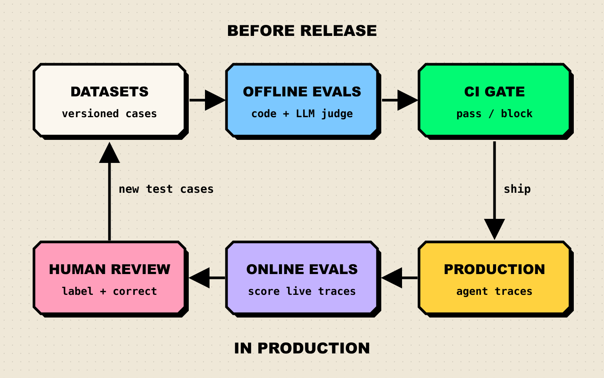
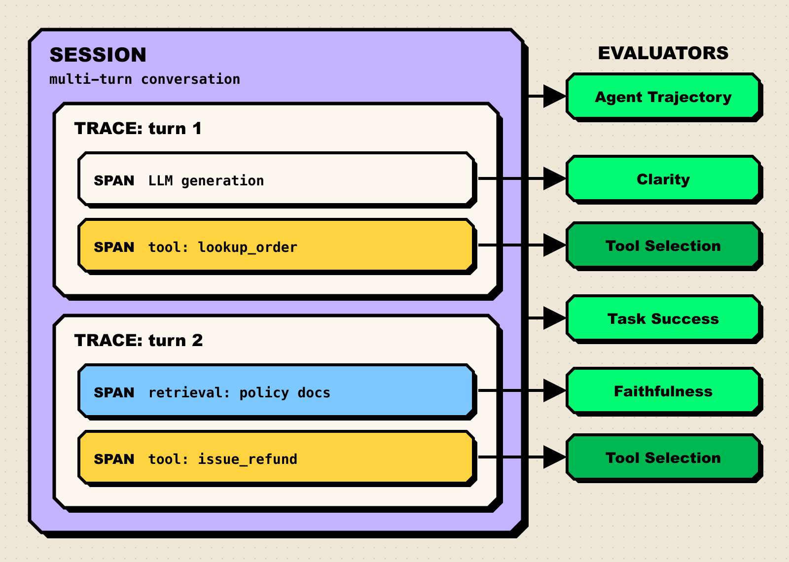

**TL;DR**

- An agent can reach the right answer through the wrong steps, so agent evaluation scores the whole trajectory: which tools it called, with what arguments, in what order, and whether the task got done.
- Maxim AI covers the full loop in one product: simulated multi-turn conversations, pre-built trajectory and tool-selection evaluators, human annotation on production logs, online evals at session, trace, and span level, and CI runs through GitHub Actions.
- LangSmith and Braintrust are strong developer-first choices; LangSmith pairs naturally with LangChain and LangGraph, while Braintrust is built around experiments and fast scoring iteration.
- Arize Phoenix, Langfuse, and DeepEval are the picks for teams that want open-source code they can run themselves; Galileo stands out for distilled evaluator models that make scoring all production traffic cheaper.
- Pick by where your pain is: pre-release regression testing, production monitoring, or expert review. Most teams eventually need all three.

A chatbot answer can be graded like an exam question. An agent run cannot. By the time an agent replies "your refund is processed," it may have looked up the wrong order, called the payments API twice, and skipped the fraud check, and the final message still reads fine. AI agent evaluation platforms record every step of a run, score the steps and the outcome with code, LLM judges, and humans, and turn failures into test cases for the next release. [Maxim AI](https://www.getmaxim.ai/products/agent-simulation-evaluation) is our top pick because it connects simulation, trajectory-level evaluators, human review, and production monitoring in a single workflow. This guide compares seven platforms on the things that matter for multi-step agents.

## What Is an AI Agent Evaluation Platform?

An AI agent evaluation platform measures whether an agent behaves correctly across the full sequence of reasoning, tool calls, and responses in a task. It usually does five jobs:

- **Datasets:** versioned test cases, often seeded from production logs.
- **Evaluators:** code, statistical, LLM-as-judge, or human scoring of outputs and trajectories.
- **Offline evals:** runs a new version against the dataset and compares it to the last one.
- **Online evals:** scores live production traces so drift shows up before users complain.
- **Human review:** routes selected runs to people for labels and corrections.

Evals are not benchmarks. A public benchmark tells you how a model does on someone else's test; an eval tells you how your agent does on your tasks, tools, and users. The habits from [reading AI benchmarks carefully](/blog/how-to-read-an-ai-benchmark/) still apply (small test sets are noisy), and so does the lesson of [why benchmarks saturate](/blog/why-benchmarks-saturate/): a test set that never changes stops finding bugs.

*Figure 1: The agent evaluation loop. Offline evals gate releases, online evals watch production, and human review turns real failures into new test cases.*

## How We Evaluated These Platforms

We judged each platform as a team shipping a tool-using agent would. Every capability below was checked against the vendor's own docs, GitHub repository, or pricing page.

| Criterion | What we looked for |
|---|---|
| Trajectory and tool-call evaluation | Evaluators that score the sequence of steps and tool choices, not just the final message |
| Evaluator range | Code, statistical, LLM-as-judge, and human evaluators, plus custom ones |
| Online evaluation | Automatic scoring of production traces with sampling, filters, and alerts |
| Human-in-the-loop | Annotation queues or in-app review that feed labels back into datasets |
| CI and developer workflow | SDKs, CI integration for regression gates, and self-hosting or VPC options |

## Compared at a Glance

| Platform | Best for | Deployment | Pricing model / open source | Standout |
|---|---|---|---|---|
| Maxim AI | Teams that want simulation, evals, human review, and monitoring in one place | Cloud, In-VPC | Commercial | Agent simulation plus session, trace, and span-level evaluators |
| LangSmith | LangChain and LangGraph teams | Cloud; self-hosted on Enterprise | Commercial, free Developer tier | Trajectory match modes and pairwise annotation queues |
| Braintrust | Experiment-driven engineering teams | Cloud; on-prem or hybrid on Enterprise | Commercial, free Starter tier | Fast experiment comparison and online scoring |
| Arize Phoenix | Self-hosted tracing plus evals | Self-hosted (Docker, Kubernetes) | Source-available (Elastic License 2.0) | OpenTelemetry-native, framework-agnostic |
| Langfuse | Open-source teams that want a full platform | Cloud or self-hosted | MIT core, paid cloud tiers | Self-hosts for free, with annotation queues and a CI action |
| DeepEval / Confident AI | Python teams that think in unit tests | Library runs locally; platform is cloud, on-prem on Enterprise | Apache 2.0 library, commercial platform | Pytest-style agent metrics |
| Galileo | High-volume production evaluation | SaaS, VPC, on-prem | Commercial, free tier | Luna models distilled from LLM judges |

## The 7 Best AI Agent Evaluation Platforms

### 1. Maxim AI

Maxim AI is an end-to-end platform for simulating, evaluating, and observing AI agents. What sets it apart is that the same evaluators run before release and in production, at every level of a run: the multi-turn session, a single trace, or one node inside it.

*Figure 2: Where evaluators attach in an agent run. Session-level evaluators judge the outcome and path; span-level evaluators isolate a single tool call or retrieval. Levels as described in [Maxim's online evaluation docs](https://www.getmaxim.ai/docs/online-evals/overview).*

**Key capabilities:**

- **Agent simulation.** [Simulations](https://www.getmaxim.ai/docs/simulations/text-simulation/overview) generate multi-turn conversations from a scenario and a user persona (a frustrated customer, a confused new user), with optional reference tools, context sources, and a turn limit. Voice agents get their own simulation mode.
- **Trajectory-level evaluators.** The pre-built library includes [Agent Trajectory](https://www.getmaxim.ai/docs/library/evaluators/pre-built-evaluators/ai-evaluators/agent-trajectory), which checks whether an agent completed all required steps; Tool Selection, which scores each tool call as correct or not and averages the result; Step Completion in strict and unordered variants for when you know the expected steps; plus Task Success and Step Utility.
- **Four evaluator types.** The [Evaluator Store](https://www.getmaxim.ai/docs/library/evaluators/pre-built-evaluators/overview) offers AI (LLM-as-judge), statistical, programmatic (Python or JavaScript), and voice evaluators, including ones from open-source libraries such as RAGAS. Custom and human evaluators sit alongside them.
- **Online evals at three levels.** Production logs can be scored automatically with filters and sampling rules at the session, trace, or span level, with alerts when quality or performance slips. Node-level evaluation through the SDK lets you attach evaluators to a specific generation, retrieval, or tool call.
- **Human annotation.** [Human evaluators on logs](https://www.getmaxim.ai/docs/online-evals/via-ui/set-up-human-annotation-on-logs) add ratings, comments, and rewritten outputs, either in-app for your team or through an email workflow for external raters such as domain experts. Reviewed logs can be curated into datasets for offline testing.
- **CI regression gates.** The [Maxim GitHub Actions](https://www.getmaxim.ai/docs/offline-evals/via-sdk/agent-http/ci-cd-integration) run a test run against a dataset and chosen evaluators on every push or pull request. SDKs cover Python, TypeScript, Java, and Go.
- **Test your agent where it lives.** Agents can be evaluated through an HTTP endpoint, a no-code builder, or locally through the SDK, with no rebuild inside the platform.

**Best for:** product and engineering teams shipping customer-facing agents who want pre-release simulation, production monitoring, and expert review to share one set of evaluators and datasets. [In-VPC deployment](https://www.getmaxim.ai/products/agent-simulation-evaluation), SSO, and role-based access cover enterprise requirements.

**Consideration:** Maxim is a commercial platform, not an open-source library, so teams that must run everything from source on their own hardware should look at Langfuse or Phoenix. Maxim's write-up on [LLM-as-a-judge in agentic applications](https://www.getmaxim.ai/articles/llm-as-a-judge-in-agentic-applications-ensuring-reliable-and-efficient-ai-evaluation/) is a useful primer.

### 2. LangSmith

[LangSmith](https://www.langchain.com/langsmith) is LangChain's platform for tracing, evaluating, and deploying agents. It works with any framework but is the natural default on LangChain or LangGraph.

**Key capabilities:**

- Offline and online evaluation with human, code, LLM-as-judge, and pairwise evaluators.
- [Trajectory evaluations](https://docs.langchain.com/langsmith/trajectory-evals) through the open-source `agentevals` package, with strict, unordered, subset, and superset match modes against a reference trajectory, or an LLM judge when no reference exists.
- [Annotation queues](https://docs.langchain.com/langsmith/annotation-queues) for single runs, full multi-turn threads, and pairwise A/B comparisons, with rubrics and one-click export to datasets.

**Best for:** LangGraph teams that want tracing and evals from the same vendor as their framework.

**Consideration:** Per the [pricing page](https://www.langchain.com/pricing), self-hosting is available only on the Enterprise plan; the Developer and Plus tiers are cloud-only.

### 3. Braintrust

[Braintrust](https://www.braintrust.dev/) is an evals-first platform built around experiments: every prompt, model, or agent change becomes a scored run you can diff against the last.

**Key capabilities:**

- An `Eval()` SDK and browser playgrounds for comparing configurations side by side, with scorers built from its open-source autoevals library, LLM-as-judge prompts, or custom code.
- [Online scoring](https://braintrust.dev/docs/evaluate/score-online) that evaluates production traces asynchronously as they are logged.
- CI integration to catch regressions before they ship, plus human review with keyboard-driven batch review and a kanban view of review progress.

**Best for:** engineering teams that iterate quickly and want a polished experiment workflow.

**Consideration:** Agent-specific evaluators such as trajectory checks are mostly something you write as custom scorers. On-prem or hybrid deployment is an Enterprise-plan feature per the [pricing page](https://www.braintrust.dev/pricing).

### 4. Arize Phoenix

[Arize Phoenix](https://arize.com/docs/phoenix) is an open-source observability and evaluation tool built on OpenTelemetry and OpenInference. Arize also sells a managed platform, Arize AX.

**Key capabilities:**

- OTLP trace ingestion with auto-instrumentation for popular agent frameworks, capturing model calls, retrieval, and tool use step by step.
- LLM-based and code-based evaluators, human labels, and integrations with Ragas, DeepEval, and Cleanlab.
- Versioned datasets and experiments for comparing application versions.

**Best for:** teams that want to self-host tracing and evals on Docker or Kubernetes and stay framework-agnostic.

**Consideration:** The [Phoenix repository](https://github.com/Arize-ai/phoenix) uses the Elastic License 2.0, which is source-available rather than OSI open source. Simulation and team review workflows are thinner than in commercial platforms.

### 5. Langfuse

[Langfuse](https://langfuse.com/docs/evaluation/overview) is an open-source LLM engineering platform whose evaluation features cover most of the loop in Figure 1.

**Key capabilities:**

- LLM-as-a-judge scoring on live production traces, plus code evaluators and user feedback collection.
- Annotation queues for manual review by human raters.
- Datasets and experiments for offline comparison, with a `langfuse/experiment-action` GitHub Action to block deploys on regressions.

**Best for:** teams that want a full evaluation platform they can self-host with no license fee.

**Consideration:** The repository is MIT licensed except for its `ee` folders, and some enterprise features sit behind paid plans. It has no built-in user simulation, so multi-turn agent tests need to be scripted.

### 6. DeepEval and Confident AI

[DeepEval](https://github.com/confident-ai/deepeval) is an Apache 2.0 Python framework that treats LLM evaluation like unit testing, and Confident AI is the commercial platform from the same team.

**Key capabilities:**

- Pytest-style test cases that run locally in the test suite you already have, with a Vitest integration for TypeScript.
- [Agent metrics](https://deepeval.com/docs/getting-started-agents) including Task Completion, Tool Correctness, Argument Correctness, Step Efficiency, Plan Adherence, and Plan Quality, plus G-Eval for custom LLM-as-judge criteria.
- Tracing that captures an agent's full trajectory so component-level metrics can target a single step.

**Best for:** Python teams that want evals as code in CI first and a dashboard second.

**Consideration:** DeepEval alone has no shared UI for reviewers; human review, production monitoring, and regression reports come from Confident AI, whose [pricing](https://www.confident-ai.com/pricing) reserves on-prem deployment for Enterprise.

### 7. Galileo

[Galileo](https://galileo.ai/) is an evaluation and observability platform aimed at running evaluators on production traffic at enterprise scale, with guardrails that act on the results.

**Key capabilities:**

- Out-of-the-box agentic metrics such as [Action Completion](https://docs.galileo.ai/concepts/metrics/agentic/action-completion), which checks whether an agent accomplished all of a user's goals in a session, and Tool Selection Quality, which checks both tool choice and arguments.
- Luna models that distill LLM-as-judge evaluators into small, low-latency models, making it cheaper to score all traffic instead of a sample.
- Guardrail policies that control agent actions and tool access, and deployment as SaaS, in a VPC, or on-premises.

**Best for:** larger teams whose main constraint is the cost of evaluating every production trace.

**Consideration:** Galileo's center of gravity is production monitoring and protection; teams focused on pre-release simulation or expert review should confirm those workflows in a trial.

## How to Choose an AI Agent Evaluation Platform

Start from your biggest gap, not the longest feature list.

| Your situation | Start with |
|---|---|
| Customer-facing agent, need to test multi-turn behavior before launch | Maxim AI (simulation plus trajectory evaluators) |
| Domain experts (support leads, clinicians, lawyers) must review outputs | Maxim AI or LangSmith, both with structured human review feeding datasets |
| Already on LangGraph and want one vendor | LangSmith |
| Engineering-led team that lives in experiments and diffs | Braintrust |
| Data must stay on your own servers and budget is tight | Langfuse or Arize Phoenix |
| Want evals to look like unit tests in CI | DeepEval, optionally with Confident AI |
| Scoring 100% of high-volume production traffic | Galileo |

A few rules of thumb hold across all of them:

1. **Score the path, not just the answer.** An agent that gets the right answer by calling the wrong API is a bug that has not fired yet.
2. **Calibrate your judges.** Have humans label a sample and check agreement before trusting an LLM judge in a CI gate.
3. **Grow the dataset from production.** A [golden dataset](https://www.getmaxim.ai/articles/building-a-golden-dataset-for-ai-evaluation-a-step-by-step-guide/) that never changes goes stale, just like public benchmarks.
4. **Mind the noise.** Agents are nondeterministic. Run each case more than once, and do not block a release on a difference smaller than run-to-run variance.

## Frequently Asked Questions

### What is the difference between offline and online agent evaluation?

Offline evaluation runs your agent against a fixed dataset before release, usually in CI, to catch regressions. Online evaluation scores real production traces as they arrive, to catch drift and failures your dataset never covered. Offline evals stop known bugs; online evals find unknown ones.

### What is trajectory evaluation?

Trajectory evaluation scores the sequence of steps an agent took, including which tools it called, the arguments it passed, and the order, rather than only the final output. It can compare against a reference path (strict or unordered match) or use an LLM judge to decide whether the steps were reasonable. Maxim's Agent Trajectory and LangSmith's `agentevals` are two examples.

### Can I trust LLM-as-a-judge for agent evals?

Partly. LLM judges scale well but can be inconsistent and share blind spots with the model under test. Use code checks wherever a rule exists (valid JSON, correct tool name), LLM judges for fuzzy qualities, and compare judge scores with human labels regularly.

### Are evals the same as benchmarks?

No. A benchmark is a shared public test for comparing models; an eval is your private test of your agent on your tasks. Benchmarks help pick a base model, evals decide whether your agent ships. Our explainer on [how to read an AI benchmark](/blog/how-to-read-an-ai-benchmark/) covers the pitfalls both share.

### Do I need an open-source evaluation tool?

Only if you must self-host or want to avoid license fees. Langfuse, Arize Phoenix, and DeepEval run on your own infrastructure, and Maxim AI and Galileo offer VPC or on-prem deployment for data residency rules.

## Get Started with Maxim AI

Agents fail in the middle of the run, so evaluation has to look there too. Maxim AI brings simulation, trajectory and tool-call evaluators, human annotation, and online evals into one workflow. The [Maxim docs](https://www.getmaxim.ai/docs/online-evals/overview) cover online evals in depth, and you can [book a demo](https://www.getmaxim.ai/book-a-demo) to see agent simulation and evaluation on your own use case.
