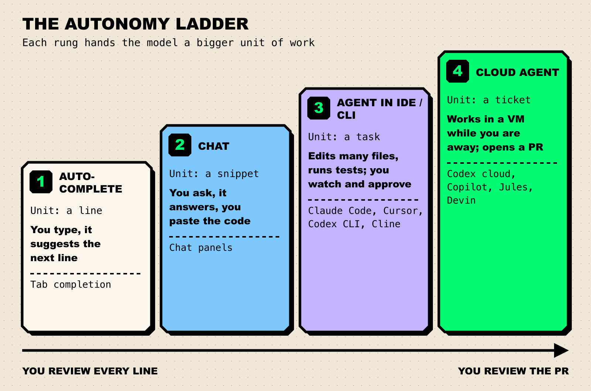
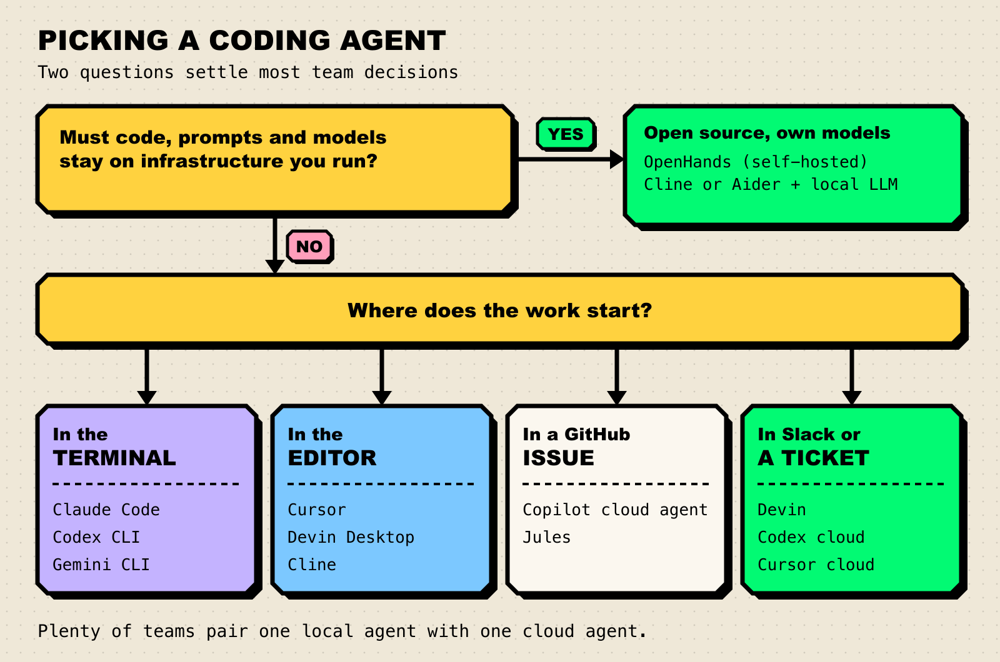

**TL;DR**

- An AI coding agent plans a change, edits several files, runs your tests, and hands back a diff or pull request. Unlike autocomplete or chat, it runs the loop itself.
- There is no single winner. Claude Code and OpenAI Codex lead for terminal-first teams, Cursor for editor-first teams, and GitHub Copilot's cloud agent for teams that live in GitHub issues.
- Devin (which now also includes the former Windsurf editor, renamed Devin Desktop) is the most "hand it a ticket" option. OpenHands and Cline are the strongest open-source picks.
- Where work starts (terminal, editor, issue tracker, Slack) and whether code may leave your infrastructure matter more than leaderboard rank.
- Agent traffic is expensive and bursty. Many teams route it through a gateway so budgets and logs live in one place.

An AI coding agent takes a task in plain language, plans, edits code across a repository, runs tests and linters, and iterates until the change works or it needs to ask you something. For most engineering teams the question is no longer whether to use one, but which ones, at which rung of autonomy, and who reviews what they produce. This guide ranks eight agents on merit, labels what each is best for, and ends with a decision flow.

## What Is an AI Coding Agent?

A coding agent is a language model in a loop with tools. The model proposes an action (open a file, run `npm test`), the harness executes it, the result goes back to the model, and the loop repeats. The model supplies the judgment. The harness supplies the hands: file access, a shell, git, and often a browser.

The useful way to compare agents is by how large a unit of work you hand over, which we call the autonomy ladder.

*Figure 1: The autonomy ladder. Moving up a rung trades line-by-line review for reviewing a finished pull request.*

The products below compete on rungs three and four. A rung-three agent runs on your machine and you watch it work; a rung-four agent runs in a cloud sandbox and you meet its output as a pull request. Most now offer both, but each still has a home rung where it is strongest.

## How We Evaluated

We read each product's official documentation, pricing, and repository, and scored against five criteria that matter to a team rather than a solo developer.

| Criterion | What we looked for |
|---|---|
| Autonomy range | Local interactive agent, background cloud agent, or both, and how cleanly work moves between them |
| Workflow fit | Where tasks can start: terminal, IDE, GitHub, Slack, Linear, or an API |
| Control and review | Approval modes, checkpoints, plan review, and whether output lands as a reviewable PR |
| Model and deployment flexibility | Choice of models, bring-your-own-key, self-hosting, open-source license |
| Team administration | SSO, pooled billing, spend limits, audit logs, and usage analytics |

We did not rank on benchmark scores. Leaderboards such as [SWE-bench](https://www.swebench.com/) and [Terminal-Bench](https://www.tbench.ai/leaderboard) mostly measure a model inside one harness, and most products below let you swap models underneath. Our guide on [how to read an AI benchmark](/blog/how-to-read-an-ai-benchmark/) explains what to check before trusting a number, and [why benchmarks saturate](/blog/why-benchmarks-saturate/) explains why today's headline score ages quickly.

## Compared at a Glance

| Tool | Best for | Deployment | Pricing model / open source | Standout |
|---|---|---|---|---|
| Claude Code | Terminal-first teams that want one agent across every surface | CLI, IDE, desktop, web, CI | Included in paid Claude plans, or API usage | Hooks, skills, subagents, and headless mode for scripting |
| OpenAI Codex | Teams standardized on ChatGPT | CLI, IDE extension, cloud | Included in ChatGPT plans, or API key; CLI is Apache 2.0 | Same agent locally and in parallel cloud containers |
| Cursor | Editor-first teams | Desktop IDE, cloud agents | Per-seat plans; cloud agents billed at API rates | Deepest in-editor agent experience with checkpoints |
| GitHub Copilot cloud agent | Issue-to-PR work inside GitHub | GitHub Actions sandbox | Paid Copilot plans | Assign an issue, get a pull request, no new tool |
| Devin | Delegating whole backlog tickets | Cloud sessions, Devin Desktop IDE, CLI | Individual and team plans | Own shell, editor, and browser per session |
| Google Jules + Gemini CLI | Low-cost entry and Google shops | Cloud VM (Jules), terminal (Gemini CLI) | Free tiers; Gemini CLI is Apache 2.0 | Generous free usage and plan-first workflow |
| Cline | Open-source IDE agent with any model | VS Code, JetBrains, CLI | Apache 2.0, bring your own key | Approval on every file edit and command |
| OpenHands | Self-hosted, customizable agent platform | Local, Docker, cloud, enterprise self-hosted | MIT, plus commercial cloud | SDK for building your own agents |

## The 8 Best AI Coding Agents

### 1. Claude Code

[Claude Code](https://code.claude.com/docs/en/overview) is Anthropic's agentic coding tool. Its documentation describes it as a tool that "reads your codebase, edits files, runs commands, and integrates with your development tools," and it runs in the terminal, VS Code, JetBrains, a desktop app, and the browser, all on the same engine.

Key capabilities:

- **Git-native workflow.** It stages changes, writes commit messages, creates branches, and opens pull requests, and it runs in CI through GitHub Actions or GitLab CI/CD.
- **Team customization.** A `CLAUDE.md` file sets project conventions, skills package repeatable workflows, and hooks run shell commands before or after agent actions (for example, formatting after every edit).
- **Parallel and scripted work.** Subagents split a task, web sessions run long jobs in the cloud, and headless mode (`claude -p`) drops it into scripts and pipelines.
- **MCP** connects it to issue trackers, docs, and internal tools.

**Best for:** terminal-first teams that want one agent that also works in the IDE, in CI, and in the cloud.

**Consideration:** it runs Anthropic's Claude models. Claude Code is [included in paid Claude plans](https://claude.com/pricing) and shares their usage limits, so heavy agent users can hit limits and need a higher tier or API billing.

### 2. OpenAI Codex

Codex is OpenAI's coding agent, available as a CLI, an IDE extension, and a cloud service. The [Codex CLI](https://github.com/openai/codex) is open source under Apache 2.0 and describes itself as a "lightweight coding agent that runs in your terminal."

Key capabilities:

- **Local and cloud in one product.** [Codex cloud](https://learn.chatgpt.com/codex/cloud) runs "coding tasks in parallel cloud environments," each in its own container, and you can inspect the diff and open a pull request when a result is ready.
- **Many starting points.** Cloud tasks can start "from the web, GitHub, GitLab, Linear, or Slack."
- **Code review.** Codex can review pull requests through its GitHub integration.

**Best for:** ChatGPT Business or Enterprise teams wanting local and cloud agents under one login.

**Consideration:** [plan tiers](https://learn.chatgpt.com/codex/pricing) differ in what they include, and cloud features such as GitHub code review start at Plus. API-key usage is billed at API rates, which makes spend harder to predict without per-user caps.

### 3. Cursor

Cursor is an AI-first code editor whose [Agent](https://cursor.com/docs/agent/overview) can search the codebase, edit files, run terminal commands, and control a browser to verify visual changes. Checkpoints save snapshots before significant changes so you can roll back when the agent wanders off.

Key capabilities:

- **[Cloud agents](https://cursor.com/docs/cloud-agent)** that run in "isolated VMs in the cloud with full development environments" and can be launched from Cursor, the web, Slack, Linear, GitHub PR comments, or an API.
- **Bugbot** for agentic code review on pull requests.
- **Team controls** on the Teams plan (SSO, privacy mode, usage analytics) and audit logs on Enterprise.

**Best for:** teams that want the agent inside the editor they type in all day.

**Consideration:** you adopt an editor, not just an agent. Cloud agents are "charged at API pricing for the selected model" on top of seats (Teams is $40 per user per month on the [pricing page](https://cursor.com/pricing)), so set spend limits early.

### 4. GitHub Copilot Cloud Agent

GitHub's [Copilot cloud agent](https://docs.github.com/en/copilot/concepts/agents/cloud-agent/about-cloud-agent), renamed from Copilot coding agent [in April 2026](https://github.blog/changelog/2026-04-01-research-plan-and-code-with-copilot-cloud-agent/), can "research a repository, create an implementation plan, and make code changes on a branch." It works in an ephemeral environment powered by GitHub Actions, runs tests and linters there, and opens a pull request for review.

Key capabilities:

- **No new tool.** Assign an issue to Copilot and a pull request comes back through your existing review process.
- **Admin visibility** through Copilot usage metrics and organization policies.
- **Broad availability.** GitHub says the cloud agent "is available for all paid Copilot plans," from Pro ($10 per month on the [plans page](https://github.com/features/copilot/plans)) through Business and Enterprise.

**Best for:** teams whose work already lives in GitHub issues and pull requests.

**Consideration:** the documented limits are real. It works in one repository and one branch at a time, sessions have "a maximum execution time of 59 minutes," and it only works with repositories hosted on GitHub.

### 5. Devin

Devin, from Cognition, is built for full delegation. [Its documentation](https://docs.devin.ai/get-started/devin-intro) describes each session as having its own shell, IDE, and browser, and suggests the scope rule "if you can do it in three hours, Devin can most likely do it." You can tag it from Slack or Teams threads, Linear or Jira tickets, and GitHub.

Windsurf now lives here too. Cognition acquired Windsurf in July 2025, and on June 2, 2026 [Windsurf became Devin Desktop](https://devin.ai/blog/windsurf-is-now-devin-desktop): the same IDE, with an agent command center that manages "every local and cloud agent from a single Kanban view." Existing Windsurf plans carried over unchanged.

**Best for:** teams that want to hand over well-scoped tickets (migrations, refactors, bug fixes) and review the result.

**Consideration:** full delegation only pays off with well-written tickets and good test coverage. A vague ticket produces a confident, wrong PR.

### 6. Google Jules and Gemini CLI

Google covers both rungs with two products. [Jules](https://jules.google/docs) is an asynchronous agent that clones your repository into a cloud VM, installs dependencies, and "generate[s] a plan" for you to approve before it touches code. [Gemini CLI](https://github.com/google-gemini/gemini-cli) is an Apache 2.0 terminal agent with MCP support, shell and file tools, Google Search grounding, and a GitHub Action for PR review and issue triage.

**Best for:** teams that want a capable agent at little or no cost, and Google Cloud shops.

**Consideration:** the free tiers are the draw (Gemini CLI allows 60 requests per minute and 1,000 per day with a personal Google account; Jules' free plan gives 15 tasks a day). But Google's docs note that paid Jules plans are "currently available only for individual Google Accounts," which complicates organization-wide rollout.

### 7. Cline

[Cline](https://github.com/cline/cline) is an Apache 2.0 autonomous coding agent for VS Code, JetBrains IDEs, and the terminal. It works in Plan or Act mode, reads project structure, watches linter and compiler errors, and asks for approval before each file edit and terminal command unless you turn on auto-approve.

Key capabilities:

- **Any model.** Claude, GPT, Gemini, local models through Ollama, self-hosted endpoints, and more through OpenRouter.
- **Bring your own key**, so spend runs through your own provider account or gateway.

**Best for:** teams that want an open-source IDE agent with explicit, step-by-step human approval and full model choice.

**Consideration:** you assemble the stack yourself. Model choice, keys, and cost controls are your job, and quality depends heavily on the model you connect.

### 8. OpenHands

[OpenHands](https://github.com/OpenHands/OpenHands) is an MIT-licensed platform for running and building coding agents. The [documentation](https://docs.openhands.dev/) lists a Software Agent SDK ("a composable Python library for building agents that work with code"), a CLI, an agent server with REST and WebSocket APIs, a managed OpenHands Cloud, and an Enterprise option for licensed self-hosting.

**Best for:** platform teams that need agents running on their own infrastructure, or want to build custom agents on an open foundation.

**Consideration:** the most flexible option here is also the most work: self-hosting means owning sandboxing, model hosting, and integration.

### Also worth a look

- **[Aider](https://aider.chat/)** is the veteran terminal pair programmer (Apache 2.0). It maps the whole repository, commits every change with a descriptive message, and can lint and test automatically after edits.
- **Amp** is a multi-model coding agent with a CLI, shareable threads, and team workspaces. It [spun out of Sourcegraph](https://ampcode.com/news/amp-inc) as an independent company in December 2025 and ships quickly, so check its current feature set before you commit.

## How to Choose

Two questions settle most team decisions. First: must code, prompts, and model calls stay on infrastructure you run? Second: where does work start?

*Figure 2: Deployment constraints decide first; after that, meet developers where tasks already begin.*

Three practical notes before you roll one out:

1. **Pair a local agent with a cloud agent.** Interactive agents are for work you want to steer; cloud agents are for work you want to review.
2. **Invest in tests before autonomy.** An agent with a good test suite fixes its own mistakes; one without hands you plausible-looking bugs.
3. **Put cost controls in front of agent traffic.** A single long agent session can burn through far more tokens than a day of chat. Many teams route coding-agent traffic through an AI gateway such as [Bifrost](https://www.getmaxim.ai/bifrost), which [supports Claude Code, Codex CLI, Gemini CLI, and Cursor](https://docs.getbifrost.ai/cli-agents/overview) and applies per-developer budgets through virtual keys. Our [Claude Code gateways](/blog/claude-code-gateways/) comparison covers setup.

Today's choice will not be permanent. The [three levers of AI progress](/blog/three-levers-of-ai-progress/) keep capability moving, so favor tools that let you switch models without switching workflows.

## Frequently Asked Questions

### What is the difference between an AI coding assistant and an AI coding agent?

An assistant suggests code (completions or chat answers) and you apply it. An agent runs the loop itself: it edits files, executes commands such as tests, reads the results, and keeps going until the task is done or it needs input. The output is a diff or a pull request rather than a suggestion.

### Which AI coding agent is best for teams?

It depends on where work starts: Claude Code or Codex for terminal-first teams, Cursor for editor-first teams, Copilot's cloud agent for GitHub-issue workflows, and OpenHands or Cline for strict data rules.

### Are there open-source AI coding agents?

Yes. OpenHands (MIT), Cline (Apache 2.0), Aider (Apache 2.0), Gemini CLI (Apache 2.0), and the Codex CLI (Apache 2.0) are all open source. Most can be pointed at the model provider of your choice, including self-hosted models in some cases.

### Should we pick a coding agent based on SWE-bench scores?

Use them as one input, not the deciding factor. Results reflect one model and harness configuration, and your own codebase and tests will move results more than a few leaderboard points. A two-week trial on real tickets tells you more.

### What happened to Windsurf?

Cognition, the company behind Devin, acquired Windsurf in July 2025. On June 2, 2026, Windsurf was renamed Devin Desktop. It is the same IDE with an added agent command center, and existing plans and pricing carried over.

## The Bottom Line

The best AI coding agent fits where your team already works, and your tests keep it honest. Trial one interactive and one cloud agent on real tickets, and put budgets and logging in front of the traffic from day one. If you want that control layer, the [Bifrost CLI agents guide](https://docs.getbifrost.ai/cli-agents/overview) shows how to point Claude Code, Codex CLI, and others at a governed endpoint and keeps per-developer budgets in one place.
