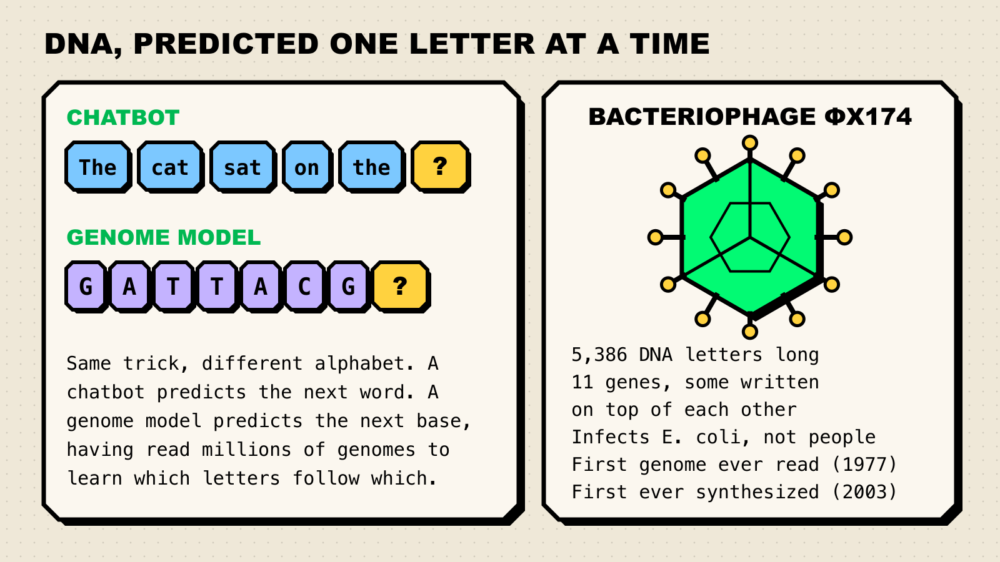
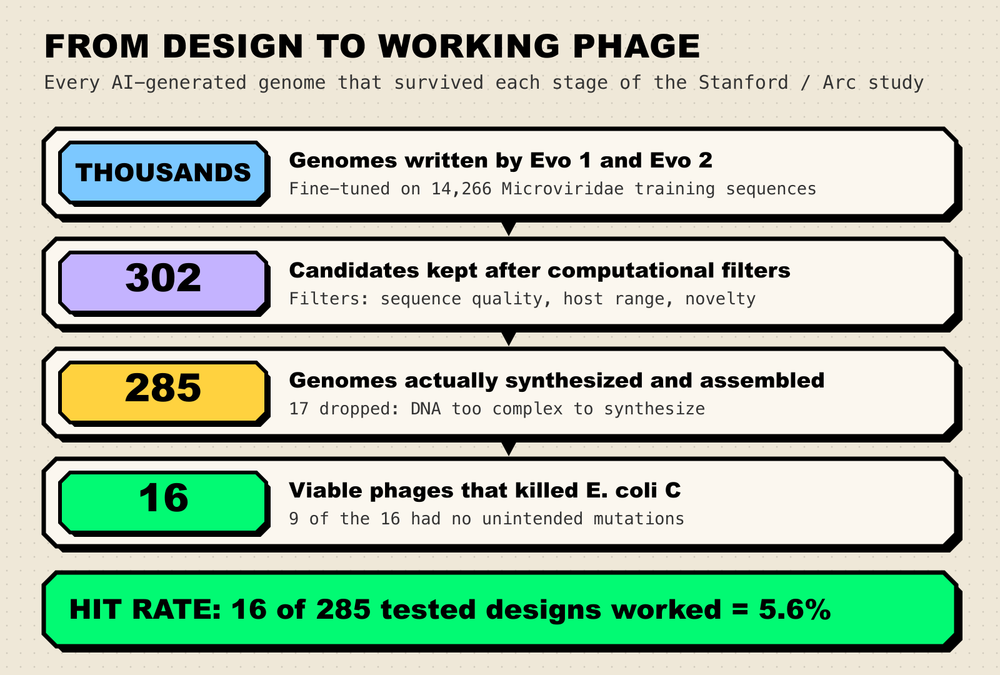
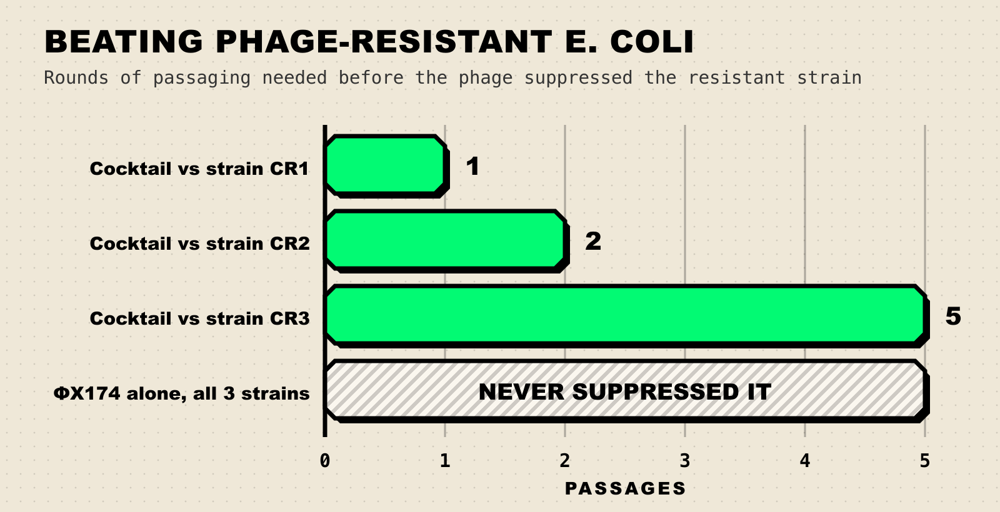

On 6 August 2026, a paper in *Science* reported that two AI models had written the complete genetic instructions for viruses that had never existed, and that sixteen of those instructions, once assembled into real DNA, produced viruses that hunted and killed bacteria. Nobody handed the models a gene library to shuffle. They were asked to produce a genome end to end, one DNA letter at a time, the way a chatbot produces a sentence.

That is a genuine first. It is also, as the accompanying commentary in the same issue of *Science* put it, a capability that has arrived ahead of the rules meant to govern it.

**TL;DR**

- Stanford and Arc Institute researchers fine-tuned the genome language models Evo 1 and Evo 2 and used them to design complete bacteriophage genomes, published in [*Science*](https://www.science.org/doi/10.1126/science.aec2657) on 6 August 2026.
- Of 302 candidate designs, 285 were successfully synthesized. **16 produced viable phages** that killed *E. coli*. Several matched or beat the natural template phage ΦX174 on fitness; a cocktail of all 16 defeated bacteria that had evolved resistance to ΦX174.
- Phages infect bacteria, not people. Evo 2's training data deliberately left out viruses that infect eukaryotes, and the 16 phages grew only on the target lab *E. coli* strain and one close relative, failing on six others.
- The hit rate was about **5.6%**, and natural evolution appears to have polished some designs. This is a proof of concept, not a manufacturing process.
- The biosecurity argument is now the loudest part of the story: the accompanying *Science* commentary calls for mandatory, legally binding screening of DNA synthesis orders and a hard line against applying this method to viruses that infect humans, animals or plants.

## What actually happened

The team, led by Stanford bioengineering graduate student Samuel King with chemical engineer Brian Hie, picked a target that is famous in molecular biology: bacteriophage ΦX174. It is tiny, 5,386 DNA letters long, with 11 genes. In 1977 it became [the first complete genome ever sequenced](https://arcinstitute.org/news/hie-king-first-synthetic-phage). In 2003 it became the first genome chemically synthesized from scratch. Reading, then writing. This study is the third verb: designing.

They fine-tuned Evo 1 and Evo 2 on a curated set of 14,466 genomes from *Microviridae*, the viral family ΦX174 belongs to (14,266 of those went into training, the rest held back for validation and testing). Then they prompted the models with a short snippet of ΦX174 sequence and let them write.

> "In this case, we wanted the model to generate the entire genome end-to-end in a single left-to-right pass. We didn't add anything. In lab tests, a few of Evo's suggestions had higher fitness than the native ΦX174."
>
> — Brian Hie, assistant professor of chemical engineering at Stanford, in the [university's announcement](https://news.stanford.edu/stories/2026/08/evo-2-ai-tool-e-coli-killer-bacteriophages)

## What a bacteriophage is, and what a genome language model does

Two ideas do most of the explanatory work here, and neither is complicated.

*Figure 1: The core analogy, and the virus at the centre of the study. Sources: [Arc Institute](https://arcinstitute.org/news/hie-king-first-synthetic-phage), [Science](https://www.science.org/doi/10.1126/science.aec2657).*

**A bacteriophage**, or "phage" for short, is a virus that infects bacteria and nothing else. Phages have been hunting bacteria for billions of years. ΦX174 is a lytic one: it gets inside an *E. coli* cell, hijacks the machinery, makes copies of itself, and bursts the cell open. As microbiologist Jasna Rakonjac of Massey University [put it](https://www.sciencemediacentre.org/expert-reaction-to-generative-design-of-bacteriophages-with-genome-language-models/), phages "exclusively attack and kill bacteria, but are completely harmless to higher organisms, from yeast to humans."

**A genome language model** is the same machinery as a chatbot pointed at a different alphabet. A text model reads a lot of writing and learns which word tends to follow which. Evo reads genomes and learns which of the four DNA bases (A, C, G, T) tends to follow which, and at a larger scale, which arrangements of genes and regulatory signals actually hold together. [Evo 2](https://arcinstitute.org/tools/evo), published in *Nature* in March 2026, has 40 billion parameters and was trained on over 9 trillion nucleotides. The [Evo 1 paper](https://www.science.org/doi/10.1126/science.ado9336) appeared in *Science* in 2024.

The distinction that matters: previous AI biology successes designed *parts*, such as a protein, an enzyme or a CRISPR component. This designed the whole instruction set, including the bits that tell the parts when to switch on. ΦX174 makes that unusually hard, because several of its genes are written on top of each other in overlapping reading frames. Change one letter and you are editing two proteins at once.

## The funnel: thousands in, sixteen out

The headline number is 16. The honest number is the whole funnel.

*Figure 2: Every stage of the design-to-viable pipeline, with the study's real numbers. Source: [King et al., Science 2026](https://www.science.org/doi/10.1126/science.aec2657) and the [bioRxiv preprint](https://www.biorxiv.org/content/10.1101/2025.09.12.675911v1).*

Thousands of generated genomes went through three tiers of computational filters: basic sequence sanity, a host-range constraint (designs had to keep a spike protein close enough to ΦX174's that they would only infect the intended *E. coli* strain), and a novelty filter that pushed the designs away from simply memorising ΦX174. That left 302 candidates. Of those, 285 could actually be synthesized; the other 17 were DNA sequences too awkward for the chemistry. And 16 of the 285 worked.

Here is the study in numbers:

| Number | What it is |
| --- | --- |
| 5,386 | DNA letters in ΦX174, the template genome |
| 11 | genes in ΦX174, several of them overlapping |
| 14,266 | *Microviridae* sequences used to fine-tune Evo 1 and Evo 2 |
| 302 | candidate genomes surviving the computational filters |
| 285 | genomes successfully synthesized and assembled |
| 16 | viable phages that killed *E. coli* C |
| 9 | of those 16 matched their designed sequence with no acquired mutations |
| 67–392 | novel mutations per viable phage, versus its nearest natural relative |
| 6 | other *E. coli* strains none of the phages could grow on, confirming narrow host range |

A 5.6% hit rate sounds low, and it is. But as with any [headline number](/blog/how-to-read-an-ai-benchmark/), the question is what it is being compared against, and nobody has ever designed a functional genome by hand. What changed is the design-and-test loop: candidates are now cheap, and the bottleneck moved to DNA synthesis cost and lab throughput.

Nerd corner: the result that surprised the authors

One generated phage, Evo-Φ36, used a DNA packaging protein borrowed from G4, a distantly related phage. The G4 version is shorter, 25 amino acids versus ΦX174's 38, and earlier attempts to swap it in by hand had failed. In the AI-generated genome it worked, because the surrounding sequence had co-adapted to accommodate it. Cryo-electron microscopy showed the shorter protein sitting at a different orientation inside the capsid.

That is the strongest single piece of evidence that the model learned something about genome-level context rather than stitching plausible genes together. The authors also found that 13 of the 16 carried mutations not present in any known natural sequence, and that one design, Evo-Φ2147, sits at 93.0% average nucleotide identity to its closest known relative, far enough out that it would count as a new species under some taxonomic thresholds.

## Why this matters: the antibiotic problem

The reason anyone outside molecular biology should care is drug resistance.

Bacterial antimicrobial resistance was [associated with more than 4.7 million deaths globally in 2021](https://www.who.int/news-room/fact-sheets/detail/antimicrobial-resistance), according to the World Health Organization. The GRAM Project's [analysis in *The Lancet*](https://pubmed.ncbi.nlm.nih.gov/39299261/) forecasts that by 2050 resistant infections will be the direct cause of 1.91 million deaths a year and involved in 8.22 million, with [more than 39 million deaths](https://www.healthdata.org/news-events/newsroom/news-releases/lancet-more-39-million-deaths-antibiotic-resistant-infections) attributable to AMR between 2025 and 2050. Meanwhile, WHO notes that "too few new antibiotics are being developed to replace those that no longer work."

Phage therapy is one of the standing alternatives, and it has an old problem: bacteria evolve resistance to phages too. The usual workaround is a cocktail of several phages at once, and the usual constraint is that you have to find those phages in nature, in sewage, soil or a hospital drain, and hope the right one exists.

This is where the study's most practical result sits. The team evolved three *E. coli* strains resistant to ΦX174, each with mutations in the *waa* operon that changes the bacterial surface. Then they challenged them.

*Figure 3: Passages of serial challenge needed before growth was suppressed. Source: [King et al., Science 2026](https://www.science.org/doi/10.1126/science.aec2657).*

The cocktail of 16 generated phages suppressed the first resistant strain after a single passage, the second after two, the third after five. ΦX174 alone never managed it. Sequencing showed the winners were mosaics: phages that had recombined genetic material from two or three of the AI designs, with the new mutations concentrated on the outer surfaces of the capsid and spike proteins, exactly where a phage touches a bacterium.

"If the bacteria gain resistance to a single phage, it's game over for the medication," Hie said. "But if you have multiple genetically distinct phages in a mixture, it would be harder for the bacteria to develop resistance to the entire cocktail."

## What this does not mean

The phrase doing the most damage in coverage of this result is "AI designed life." Four reasons to hold that at arm's length:

1. **Viruses are not usually counted as alive.** They cannot replicate without a host cell. Whatever this is, it is not synthesis of an organism.
2. **It was a template, not a blank page.** ΦX174 supplied the architecture, the prompt and the host-range constraint. The designs are novel variants, substantially so, but they live inside a known family. The paper's own phrasing is "using the lytic phage ΦX174 as our design template."
3. **Natural evolution helped.** Seven of the 16 acquired mutations after assembly. Simon Jackson, who leads the phage therapy group at the University of Waikato, [noted](https://www.sciencemediacentre.org/expert-reaction-to-generative-design-of-bacteriophages-with-genome-language-models/) that "only around 5% of the designs worked and half of the functional phages had acquired mutations, suggesting that natural evolution assisted in polishing those AI-generated designs."
4. **Humans did the hard part more than once.** King built the annotation pipeline, the scoring metrics and the screening protocol. The filters that took thousands of sequences down to 302 encoded human judgement about what a good phage genome looks like.

Jordi García Ojalvo of Pompeu Fabra University made the sharpest version of the critique: "out of thousands of genomes generated, only 16 viable phages are obtained," and, he added, "these advances do not help us understand why some genomes are viable and others are not."

That is worth sitting with, because it is the same tension that runs through arguments about [what should count as AGI](/blog/what-counts-as-agi/). A system that produces working artefacts without producing explanations is useful and unsettling in roughly equal measure. It also shows what a narrow, well-curated corpus can buy you: this was not a scaling result so much as a [data-and-fine-tuning result](/blog/three-levers-of-ai-progress/).

The other counterweight is that a wet-lab yield is a much harder thing to fake than a leaderboard score. There is no test-set contamination in a petri dish. Whatever else you think of this result, it does not have the failure modes that make [saturated benchmarks](/blog/why-benchmarks-saturate/) misleading.

## The safeguards, and the argument about them

The authors did not treat the biosecurity question as an afterthought, and the reviewers noticed.

What was actually in place:

- **Training data exclusions.** Arc's team states plainly: "Bacteriophage infect only bacteria, and we excluded eukaryotic viruses from Evo 2 training for safety reasons." They also [report](https://arcinstitute.org/news/evo-2-one-year-later) that red-teaming found generated sequences to be "effectively random" for pathogenic viral proteins.
- **A host-range constraint baked into the design filters.** Designs had to keep a ΦX174-like spike protein. In testing, all 16 grew on the target strain *E. coli* C, 15 also grew on the close relative *E. coli* W, and none grew on six other strains tested.
- **Non-pathogenic hosts and containment.** All work used laboratory *E. coli*, in dedicated biosafety cabinets, with equipment that never left the containment area.
- **A published recommendation.** The paper itself advises that "groups conducting future whole-genome design work should consult both safety and security professionals throughout the project lifecycle."

The accompanying *Science* commentary by Thomas Inglesby and Moritz Hanke of the Johns Hopkins Center for Health Security ([abstract](https://pubmed.ncbi.nlm.nih.gov/42561080/)) credits the authors for engaging "more deliberately than most developers of powerful biological AI models", then argues the surrounding system is not ready:

> "The question is no longer whether generative viral genome design will exist. It is whether society can build oversight that allows its benefits to unfold while preventing it from enabling serious harm."

Their concrete asks: a hard line against extending generative genome design to viruses that infect humans, animals or plants; legally mandatory screening by DNA synthesis providers of both the sequences ordered and the customers ordering them, rather than the voluntary practice that prevails today; and urgent work on screening methods that can flag AI-generated designs, [because](https://www.insideprecisionmedicine.com/topics/precision-medicine/ai-designed-viral-genomes-raise-biosecurity-concerns/) "AI-generated genomes can be very different from previously characterized nucleic acid sequences."

That last point is the technically interesting one. Synthesis screening largely works by comparing an order against databases of known sequences of concern. A design that is 93% identical to anything natural is, by construction, a poor match for that kind of lookup.

The [International AI Safety Report 2026](https://arxiv.org/abs/2602.21012), chaired by Yoshua Bengio and published in February, cited this work while it was still a preprint, describing it as "the first instance of genome-scale generative AI design, albeit with the important caveat that the generated virus infects bacteria rather than humans." The report's wider finding is the uncomfortable one: of 375 biological AI tools surveyed, only 3% had any form of safeguard at all, and among the highest-performing tools with high misuse potential, 61.5% were fully open source.

Hie's counter-argument, made in the Stanford announcement, is that openness is the point: existing pathogens are easier to access than AI designs, safety checks cannot be built into natural evolution, and tools like Evo 2 give defenders an advantage they would not otherwise have. Simon Clarke of the University of Reading put the opposing worry just as bluntly: "there is no guarantee that every other scientist attempting to do something similar will be so careful."

Both can be true, which is what makes this a governance problem rather than a technical one. As a [Conversation piece](https://phys.org/news/2026-08-aidesigned-viruses-biosecurity-pace.html) argued on 12 August, waiting for more dangerous capabilities before building protections leaves everyone developing defences after they are already needed.

## What to track next

Concrete signposts, roughly in the order you could check them:

- **Whether synthesis screening becomes mandatory.** Watch for moves in the US, UK and EU that convert voluntary customer-and-sequence screening into a legal requirement, and for screening tools that flag divergent AI-generated designs rather than database matches.
- **The next host.** The authors name *Pseudomonas aeruginosa* (hospital-acquired infections) and *Xanthomonas campestris* (black rot in crops) as near-term targets. A generated phage that works against a real clinical pathogen would be a much bigger deal than one that works against lab *E. coli*.
- **Genome size.** ΦX174 is 5.4 kilobases. The stated next step is larger DNA phages, then small bacterial genomes. Each jump multiplies both the synthesis cost and the number of interacting constraints.
- **Whether the hit rate moves.** If a follow-up reports 30% viability instead of 5.6%, the "you still have to test them one by one in a lab" safety argument weakens considerably.
- **Replication elsewhere.** Evo 2 is open weights, downloaded more than 88,000 times on GitHub. The first independent group to repeat a whole-genome design tells you whether this is a capability or a lab.

None of this settles where genome design sits on anyone's timeline. It does say something about the shape of progress: the systems that surprise people are increasingly the ones pointed at a narrow, well-curated slice of reality rather than at everything at once. If you keep score on broader [AGI forecasts](/blog/field-guide-to-agi-forecasts/), file this under capability arriving where verification is brutally objective, and note it took a wet lab and 285 tubes to find out.
