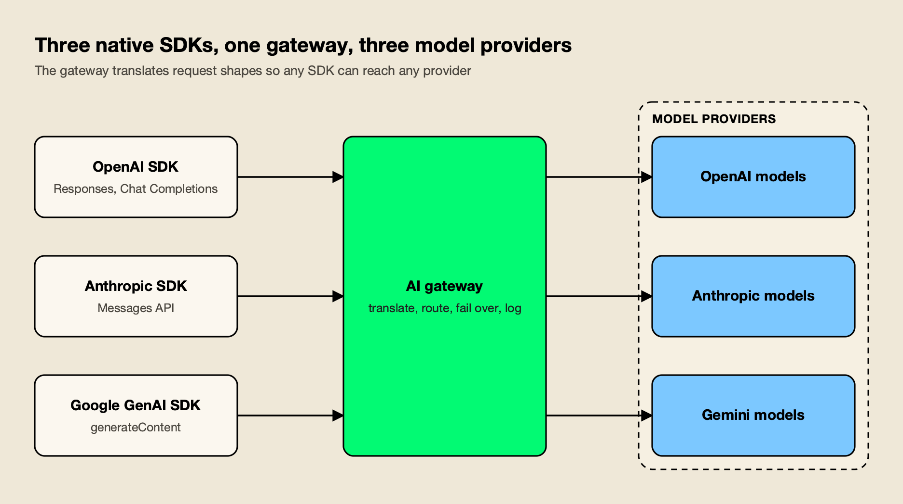
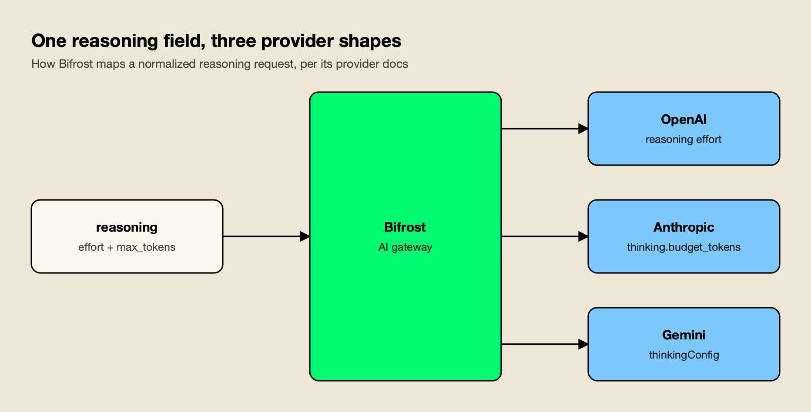
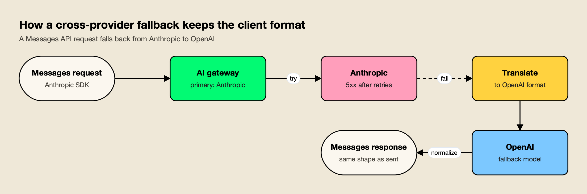

**TL;DR**
- Anthropic, OpenAI, and Google each ship a different native API (Messages, Responses and Chat Completions, generateContent), and their compatibility layers do not carry every feature across, so teams using all three put an AI gateway in front of them.
- The features that separate AI gateways for this job are native-SDK endpoints for all three formats, translation of reasoning and prompt-caching parameters, and fallback that returns the response in the format the client sent.
- Bifrost ranks first: it exposes OpenAI, Anthropic, and Google GenAI endpoints that each reach any configured provider, normalizes reasoning controls across the three labs, and its published benchmark reports 11 µs of added overhead per request at 5,000 RPS.
- LiteLLM is the closest self-hosted alternative for Python teams; Cloudflare AI Gateway and Vercel AI Gateway are the fastest managed options; Kong AI Gateway suits teams that already run Kong.
- Pick on where the gateway runs and which SDKs your code already uses, then test fallback with a real provider outage drill before trusting it.

An AI gateway for Anthropic, OpenAI, and Gemini is a proxy that lets applications reach all three model families through one endpoint, one set of credentials, and one failover policy. The need is practical: Claude, GPT, and Gemini models now trade the lead on different tasks every few months, and most production teams call at least two of them. This comparison ranks five AI gateways on how well they handle the three labs' native APIs, translate provider-specific features, and fail over between them without breaking client code.

## Why the Three Native APIs Need a Gateway

The three frontier labs expose incompatible native APIs: Anthropic's Messages API, OpenAI's Responses and Chat Completions APIs, and Google's generateContent API. Each lab offers an OpenAI-compatible shim, but the shims drop features, so a team that wants full functionality from all three either maintains three integrations or uses a gateway that translates between them.

The differences are not cosmetic. OpenAI's [migration guide](https://developers.openai.com/api/docs/guides/migrate-to-responses) states that Responses is recommended for all new projects while Chat Completions remains supported. Anthropic's [Messages API](https://platform.claude.com/docs/en/api/messages) uses content blocks, a top-level system field, and `thinking` objects with token budgets. Google's [generateContent API](https://ai.google.dev/api/generate-content) uses `contents` and `parts`, and controls reasoning through `thinkingConfig`.

The labs' compatibility layers cover the common path but not the edges:

- **Anthropic's OpenAI SDK compatibility** is, in Anthropic's own words, "primarily intended to test and compare model capabilities, and is not considered a long-term or production-ready solution for most use cases." The [compatibility page](https://platform.claude.com/docs/en/cli-sdks-libraries/libraries/openai-sdk) also notes that the `strict` parameter for function calling is ignored and prompt caching is not supported through it.
- **Google's OpenAI compatibility** lets Gemini models be called from the OpenAI libraries "by updating three lines of code," but the [Gemini OpenAI compatibility docs](https://ai.google.dev/gemini-api/docs/openai) recommend calling the Gemini API directly for teams not already on the OpenAI libraries.

*Figure 1: The gateway owns the translation between API shapes, so application code keeps its native SDK.*

As Figure 1 shows, a gateway moves that translation out of application code. A service written against the Anthropic SDK can keep its Messages calls, a data pipeline on the OpenAI SDK keeps its Responses calls, and both can reach any of the three model families. For background on how this layer differs from a conventional API gateway, see the explainer on [AI gateway vs API gateway](/blog/ai-gateway-vs-api-gateway/).

## How the AI Gateways Were Evaluated

Each AI gateway was scored on five criteria specific to running Anthropic, OpenAI, and Gemini side by side. General gateway features such as logging and budgets matter, but they are covered in the broader [top 10 AI gateways comparison](/blog/top-ai-gateways/); this list weights the multi-lab problem. Broader shortlists of [multi-provider AI gateways](https://www.getmaxim.ai/articles/top-5-multi-provider-ai-gateways-in-2026/) and [gateways for multi-provider LLM routing](https://www.getmaxim.ai/articles/the-best-ai-gateways-for-multi-provider-llm-routing/) cover adjacent ground.

| Criterion | What was assessed | Why it matters for three labs |
|---|---|---|
| Native SDK endpoints | Whether the gateway accepts OpenAI, Anthropic Messages, and Google GenAI formats, and whether each can reach any provider | Existing code keeps its SDK; no rewrite to one format |
| Feature translation | Mapping of reasoning controls, prompt-cache markers, tool calls, and usage fields between formats | Reasoning and caching are where the three APIs differ most |
| Cross-provider fallback | Whether a failed call to one lab can retry on another and still return the client's format | Outages and rate limits rarely hit all three labs at once |
| Key and quota handling | Multiple keys per provider, rotation on rate limits, and per-team budgets | Each lab enforces its own rate limits per key and account |
| Deployment and overhead | Self-hosted or managed, and the latency the gateway adds | The gateway sits on every request to every lab |

Claims for each gateway come from that vendor's own documentation, read for this comparison. Where a vendor does not document a capability, the table says "Not published" rather than guessing.

## AI Gateways for Anthropic, OpenAI, and Gemini at a Glance

The table below compares the five AI gateways on the criteria above. Bifrost and LiteLLM accept all three native formats and translate between them; Cloudflare and Kong pass native formats through to the matching provider; Vercel offers OpenAI and Anthropic formats across its full model catalog.

| Gateway | OpenAI format | Anthropic Messages format | Google GenAI format | Cross-provider fallback | Reasoning translation | Deployment |
|---|---|---|---|---|---|---|
| Bifrost | Yes, Chat Completions and Responses | Yes, routes to any provider | Yes, routes to any provider | Yes, fallback chain with per-provider retries | Yes, one `reasoning` field mapped per provider | Self-hosted, Apache 2.0 |
| LiteLLM | Yes, Chat Completions and Responses | Yes, `/v1/messages` to any provider | `/generateContent` endpoint and Google AI Studio pass-through | Yes, router fallbacks | Yes, `reasoning_effort` mapped to Gemini and Claude | Self-hosted Python proxy |
| Cloudflare AI Gateway | Yes, unified OpenAI-compatible API | Pass-through to Anthropic | Pass-through to Google AI Studio | Yes, Universal endpoint | Not published | Managed edge service |
| Vercel AI Gateway | Yes, Chat Completions and OpenResponses | Yes, across the gateway's catalog | Not published | Yes, ordered model fallbacks | Reasoning guide published | Managed service |
| Kong AI Gateway | Yes, default format | Native `anthropic` format, no transformation | Native `gemini` format, no transformation | Yes, across targets in any format (3.10+) | Not published | Self-hosted Kong Gateway |

## 1. Bifrost

Bifrost is an open-source AI gateway written in Go that exposes 25+ providers and 10,000+ models through one OpenAI-compatible API, and also accepts the Anthropic and Google GenAI SDK formats natively. [Bifrost](https://www.getmaxim.ai/bifrost) is built by Maxim AI and released under Apache 2.0 in its [GitHub repository](https://github.com/maximhq/bifrost). It gets the longest entry here because its documentation covers every criterion in the table, including per-provider mapping of reasoning and caching fields, and because it is open source and self-hostable, so each claim can be checked against the code. A separate write-up on [routing between OpenAI, Anthropic, and Gemini](https://www.getmaxim.ai/articles/best-ai-gateway-for-routing-between-openai-anthropic-and-gemini/) walks through the same setup.

**Native SDK endpoints.** The [drop-in replacement docs](https://docs.getbifrost.ai/features/drop-in-replacement) show OpenAI, Anthropic, and Google GenAI clients switching to the gateway by changing only the base URL, to `/openai`, `/anthropic`, or `/genai`. Each endpoint reaches any configured provider: a Messages call with the model `openai/gpt-4o-mini` or `vertex/gemini-pro` is translated and routed, so a codebase on the Anthropic SDK can call GPT and Gemini models without a second client. A walkthrough on [configuring GPT, Gemini, and Claude behind one gateway](https://www.getmaxim.ai/bifrost/blog/access-gpt-gemini-claude-mistral-etc-through-1-gateway-configure-providers-in-bifrost/) shows the full flow.

Provider setup for each lab is covered in the [Anthropic](https://www.getmaxim.ai/bifrost/guides/providers/anthropic), [OpenAI](https://www.getmaxim.ai/bifrost/guides/providers/openai), and [Gemini](https://www.getmaxim.ai/bifrost/guides/providers/gemini) provider guides, including key setup and model naming.

**Reasoning and caching translation.** The gateway accepts one `reasoning` object (effort plus a token budget) and, according to its reasoning reference, maps it to OpenAI's reasoning effort, Anthropic's `thinking.budget_tokens`, and Gemini's `thinkingConfig`, then returns reasoning in a common `reasoning_details` field. Anthropic cache usage is reported in OpenAI-style `prompt_tokens_details`. A separate auto prompt caching option, off by default, injects cache breakpoints for clients such as Codex that send none; requests that already carry `cache_control` are forwarded unchanged.

*Figure 2: Reasoning controls differ by provider; a gateway that maps them lets one request body work across all three model families.*

**Retries and fallbacks.** The [retries and fallbacks docs](https://docs.getbifrost.ai/features/retries-and-fallbacks) describe two layers. Retries rotate to a different API key on 401, 402, 403, or 429 responses and apply exponential backoff with jitter on 5xx and network errors. Fallbacks move to the next `provider/model` entry in a chain once retries are exhausted, and each fallback gets its own retry budget. For Azure streams that report errors inside an HTTP 200 response, the gateway buffers startup events so those errors can still trigger recovery. A practical guide to [enabling automatic fallback when a primary provider fails](https://www.getmaxim.ai/bifrost/blog/your-primary-llm-provider-failed-enable-automatic-fallback-with-bifrost/) covers the configuration step by step.

Other capabilities that matter for a three-lab setup:

- **Weighted key pools** per provider, so separate Anthropic, OpenAI, and Gemini keys share load and rotate on rate limits; the enterprise build adds [adaptive load balancing](https://www.getmaxim.ai/bifrost/blog/beyond-latency-based-routing-adaptive-load-balancing-in-bifrost/) based on live provider health.
- **Virtual keys** with per-key budgets, rate limits, and model allow-lists, so a team can be limited to specific Claude or Gemini models.
- **Overhead.** Bifrost's published benchmark reports 11 µs of added overhead per request at 5,000 RPS on an AWS t3.xlarge, documented on the [t3.xlarge benchmark page](https://docs.getbifrost.ai/benchmarking/t3.xl) and summarized on the [Bifrost benchmarks page](https://www.getmaxim.ai/resources/benchmarks).

**Best for:** teams that run Claude, GPT, and Gemini models in production, want every existing SDK to keep working, and need fallback and reasoning controls that behave the same across all three labs.

**Enterprise tier.** Clustering, guardrails, RBAC with SSO, audit logs, and adaptive load balancing are part of Bifrost Enterprise; the open-source build covers routing, the native SDK endpoints, fallbacks, virtual keys, budgets, and caching; the [Bifrost LLM gateway overview](https://www.getmaxim.ai/llm-gateway) lists the full feature set.

## 2. LiteLLM

LiteLLM is an open-source Python SDK and proxy server that calls 100+ LLM APIs through one interface, and it has the broadest set of native-format endpoints after Bifrost. [LiteLLM](https://docs.litellm.ai/docs/anthropic_unified) documents a `/v1/messages` endpoint that lets clients "call all your LLM APIs in the Anthropic v1/messages format," with supported providers that include OpenAI, Anthropic, Bedrock, Vertex AI, Gemini, and Azure.

For Google's format, LiteLLM lists a `/generateContent` endpoint and a Google AI Studio pass-through that forwards native requests without translation. It also serves the OpenAI Responses API. On reasoning, its Gemini provider docs state that LiteLLM translates OpenAI's `reasoning_effort` to Gemini's thinking parameter, and to `thinking_level` on Gemini 3 models, while Anthropic's `thinking` object with `budget_tokens` passes through on Messages requests.

Fallbacks are configured in the router: the [LiteLLM reliability docs](https://docs.litellm.ai/docs/proxy/reliability) show `fallbacks` mapping one model group to another, with load balancing across deployments inside each group. Because the same library runs as an in-process SDK and as a proxy, Python teams can prototype and deploy with one dependency.

**Best for:** Python-first teams that want a self-hosted proxy with native Messages and Gemini endpoints and are comfortable operating a Python service with its database and cache dependencies.

**Trade-offs:** the proxy runs on a Python process model, so high-concurrency deployments scale by adding workers and pods; the analysis of [LiteLLM alternatives for teams outgrowing a Python proxy](/blog/litellm-alternatives/) covers when that becomes a factor, and a [LiteLLM-to-Bifrost migration guide](https://www.getmaxim.ai/resources/migrating-from-litellm) and a roundup of [LiteLLM alternatives in 2026](https://www.getmaxim.ai/articles/top-5-litellm-alternatives-in-2026/) cover the move itself.

## 3. Cloudflare AI Gateway

Cloudflare AI Gateway is a managed service that proxies AI traffic through Cloudflare's network, with provider-specific endpoints for Anthropic, OpenAI, and Google AI Studio plus a unified OpenAI-compatible API. Its [provider endpoints](https://developers.cloudflare.com/ai-gateway/usage/providers/google-ai-studio/) keep each lab's native format: a Messages call goes to the `/anthropic` path and a Gemini call to the `/google-ai-studio` path, with the gateway adding logging, caching, and rate limiting in between.

For one request shape across labs, Cloudflare offers an OpenAI-compatible endpoint where the model is set as `{provider}/{model}`. Its docs mark the older `/compat/chat/completions` path as deprecated for single-model calls and point new integrations to the REST API at `/ai/v1/chat/completions`, while dynamic routes keep working through the compat path.

[Fallbacks](https://developers.cloudflare.com/ai-gateway/configuration/fallbacks/) are defined on the Universal endpoint: Cloudflare triggers the next provider when a request returns an error or hits a configured timeout, and the `cf-aig-step` response header records which step served the request.

**Best for:** teams already on Cloudflare that want caching, analytics, and fallback across the three labs with no infrastructure to run.

**Trade-offs:** native-format endpoints pass through to the matching provider rather than translating to another lab, so cross-lab fallback uses the unified or Universal request shapes; all traffic transits Cloudflare's network. Teams weighing a self-hosted option can compare [Cloudflare AI Gateway alternatives](https://www.getmaxim.ai/articles/top-5-cloudflare-ai-gateway-alternatives-in-2026/).

## 4. Vercel AI Gateway

Vercel AI Gateway is a managed gateway that gives one endpoint and one API key for models across many providers, usable from the AI SDK, the OpenAI Chat Completions API, an OpenResponses API, and an Anthropic Messages API. The [Anthropic Messages API docs](https://vercel.com/docs/ai-gateway/sdks-and-apis/anthropic-messages-api) state that the Anthropic SDK and tools like Claude Code work through the gateway "with only a URL change," and the same Messages endpoint can address models from other providers in the gateway's catalog.

Prompt caching examples on that page pass `cache_control` blocks through for Claude models. [Model fallbacks](https://vercel.com/docs/ai-gateway/models-and-providers/model-fallbacks) define backup models that are tried in order if the primary fails, and provider options control which upstream serves a given model. Vercel's documentation also covers bring-your-own-key, budgets, and request logs, and the gateway is available on all Vercel plans.

**Best for:** frontend and full-stack teams building with the AI SDK or Next.js that want Claude, GPT, and Gemini models through one key with no infrastructure to operate.

**Trade-offs:** Vercel does not publish a native Google GenAI SDK endpoint, so Gemini models are reached through the OpenAI, Anthropic, or AI SDK formats; there is no self-hosted option, a gap the roundup of [Vercel AI Gateway alternatives](https://www.getmaxim.ai/articles/best-vercel-ai-gateway-alternatives-in-2026/) addresses.

## 5. Kong AI Gateway

Kong AI Gateway extends Kong Gateway with AI plugins, and its AI Proxy Advanced plugin routes to OpenAI, Azure OpenAI, Amazon Bedrock, Anthropic, Gemini, Vertex AI, and about a dozen other providers. By default the [AI Proxy Advanced plugin](https://developer.konghq.com/plugins/ai-proxy-advanced/) accepts OpenAI-format requests and transforms them for the configured provider.

For native SDKs, the plugin's `llm_format` setting accepts `anthropic`, `gemini`, `bedrock`, `cohere`, `huggingface`, or `openai`. With a native format set, Kong passes requests upstream without transformation, so Anthropic or Google SDK clients keep their exact request shape.

Kong's load balancer is the most configurable of the five, with round-robin, consistent-hashing, least-connections, lowest-latency, lowest-usage, and semantic algorithms. Since version 3.10, fallback works across targets with any supported format, so an OpenAI-format route can fail over from one lab to another. Existing Kong plugins for authentication, rate limiting, and observability apply to AI routes too.

**Best for:** organizations that already run Kong for API management and want Claude, GPT, and Gemini traffic under the same policies, teams, and tooling.

**Trade-offs:** native formats are passed through rather than translated across labs, and Kong does not publish reasoning-parameter mapping between providers; teams new to Kong take on a full API management platform. A list of [Kong AI Gateway alternatives](https://www.getmaxim.ai/articles/top-5-kong-ai-gateway-alternatives-in-2026/) covers lighter options.

## Cross-Provider Fallback Between Anthropic, OpenAI, and Gemini

Cross-provider fallback is the main reason teams put a gateway in front of all three labs, and it only works if the gateway translates the request for the backup provider and the response back into the client's format. Without that translation, a fallback from Claude to GPT returns a response the Anthropic SDK cannot parse.

*Figure 3: Failover only helps if the response comes back in the shape the client sent, which is why translation and fallback belong in the same layer.*

As Figure 3 shows, a working fallback has four steps: retry on the primary provider, decide the failure is not transient, translate the request into the backup provider's shape, and normalize the backup's response into the original format. The five gateways split into two groups on the last two steps. Comparisons of [AI gateways with automatic failover](https://www.getmaxim.ai/articles/top-ai-gateway-platforms-with-automatic-failover-in-2026/) and [LLM failover routing gateways](https://www.getmaxim.ai/articles/top-5-llm-failover-routing-gateways-in-2026-2/) go further on failover alone.

| Gateway | Fallback from a native Messages request to another lab | How fallback is configured |
|---|---|---|
| Bifrost | Yes, translated and normalized back to Messages | `fallbacks` chain of `provider/model` entries; each gets its own retries |
| LiteLLM | Yes, between model groups on supported models | `fallbacks` in router settings |
| Cloudflare AI Gateway | Through the Universal endpoint | Ordered steps triggered by errors or timeouts |
| Vercel AI Gateway | Yes, across models in the gateway catalog | Ordered model fallbacks |
| Kong AI Gateway | Across targets in any format (3.10+); native formats pass through | Load balancer targets with retries |

Two details decide whether fallback helps in practice. First, rate limits: a 429 from one Anthropic key should rotate to another key before falling back to another lab, because the second lab may produce noticeably different output. Second, reasoning parameters: a Claude request with a 2,048-token thinking budget needs an equivalent setting on the fallback model, or the backup answers with a different reasoning depth. Gateways that map reasoning fields handle this without application code. For the cost side of routing between labs, see the analysis of [model routing and inference cost](/blog/model-routing-inference-cost/).

## Reasoning and Prompt Caching Across Labs

Reasoning controls and prompt caching are the two features where the three native APIs differ most, and they are also where unmanaged differences cost the most money. A gateway that only forwards text leaves these to application code.

The reasoning parameters do not line up one to one. OpenAI exposes effort levels; Anthropic uses an enabled `thinking` block with `budget_tokens`, documented with a 1,024-token minimum; Gemini 2.5 models use a thinking budget and Gemini 3 models add thinking levels, per Google's [thinking guide](https://ai.google.dev/gemini-api/docs/thinking). A gateway that accepts one field and maps it per provider lets a fallback chain keep the same reasoning intent.

Prompt caching differs too. Anthropic requires explicit `cache_control` markers on the blocks to cache, as described in its [prompt caching docs](https://platform.claude.com/docs/en/build-with-claude/prompt-caching), while OpenAI and Gemini cache eligible prefixes automatically. That creates three practical rules for a multi-lab setup:

- **Keep Messages-format clients on Messages endpoints** when Claude caching matters, since Anthropic's own OpenAI compatibility layer does not support prompt caching.
- **Check usage fields after translation.** Cache-read and cache-write token counts must survive the format conversion, or cost dashboards undercount savings. A comparison of [gateways with semantic caching for OpenAI and Anthropic costs](https://www.getmaxim.ai/articles/top-5-ai-gateways-with-semantic-caching-to-reduce-openai-and-anthropic-api-costs/) covers the caching layer that sits on top.
- **Watch agentic clients.** Coding agents that send no cache markers pay full input price on every turn against Claude models unless something adds the markers, which is the case the [Claude Code gateways comparison](/blog/claude-code-gateways/) covers in more depth. For running Claude Code against GPT or Gemini models, see this list of [gateways for non-Anthropic models in Claude Code](https://www.getmaxim.ai/articles/top-enterprise-ai-gateways-to-use-non-anthropic-models-in-claude-code/).

## Self-Hosted vs Managed for Multi-Provider Routing

A self-hosted gateway keeps prompts, responses, and all three labs' API keys inside your network; a managed gateway removes operations work but routes traffic and credentials through a third party. For teams calling three labs, the choice also decides who controls retry and fallback behavior during a provider incident.

| Model | Gateways in this list | Strengths | Costs |
|---|---|---|---|
| Self-hosted | Bifrost, LiteLLM, Kong AI Gateway | Data and keys stay in-house; full control of retries, timeouts, and key pools | You run, scale, and patch the service |
| Managed | Cloudflare AI Gateway, Vercel AI Gateway | Nothing to operate; fast to adopt | Traffic transits the vendor; fewer tuning options |

Overhead matters more when self-hosting because the gateway's own runtime is on the critical path. The guide to [measuring LLM gateway overhead](/blog/llm-gateway-benchmark/) explains how to benchmark a gateway on your own hardware before committing, and the shortlist of [best LLM gateways for enterprises](/blog/best-llm-gateways/) adds governance criteria for regulated teams. A guide to the [best self-hosted AI gateway in 2026](https://www.getmaxim.ai/articles/best-self-hosted-ai-gateway-in-2026/) covers the deployment side.

## Choosing an AI Gateway for Anthropic, OpenAI, and Gemini

The right AI gateway for Anthropic, OpenAI, and Gemini depends on which SDKs your code already uses and where the gateway is allowed to run. If every service already uses the OpenAI format, any of the five will route it; the differences appear when Messages or GenAI clients are in the mix and when a fallback has to cross labs.

Bifrost is the top pick in this comparison. It is the only gateway here whose documentation covers all three native SDK formats routing to any provider, a single reasoning field mapped to each lab's parameters, and fallback chains that return the client's original format, in an open-source, self-hosted package. LiteLLM is the nearest alternative for Python teams. Cloudflare AI Gateway and Vercel AI Gateway are the quickest way to reach all three labs without running anything, and Kong AI Gateway is the natural extension for teams already on Kong. Whichever gateway a team picks, it should run a fallback drill against a real provider error before production traffic depends on it, and readers comparing more options can start from the full [AI gateway rankings for 2026](/blog/top-ai-gateways/).
