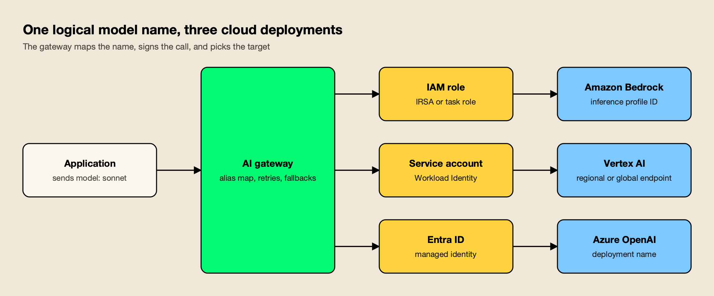
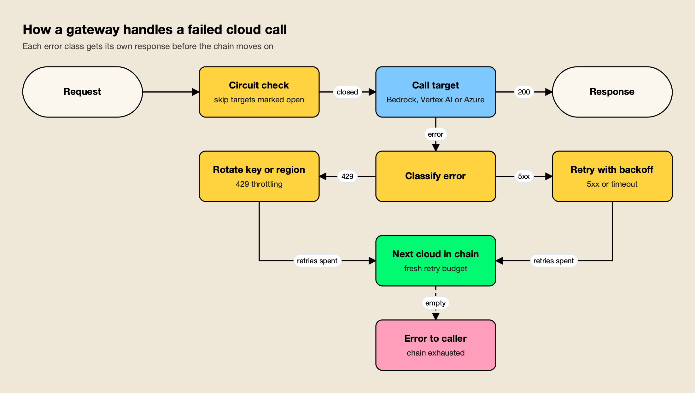

**TL;DR**
- The same frontier models now run on several clouds: Claude on Amazon Bedrock and Vertex AI, OpenAI's GPT models on Azure OpenAI and Bedrock. An AI gateway can turn those duplicate deployments into a fallback chain.
- Cloud failover is harder than provider failover. Each cloud names the model differently, authenticates differently (IAM roles, service accounts, Entra ID), and signals throttling differently.
- Bifrost ranks first here: it classifies 429, 5xx, and auth errors separately, maps one model name to Bedrock, Vertex, and Azure identifiers, and supports cloud-native auth on all three clouds.
- LiteLLM and Kong AI Gateway are strong self-hosted alternatives; Azure API Management suits Azure-first estates; Cloudflare AI Gateway is the managed option.
- Cloud-native capacity features (Bedrock cross-region inference, Vertex AI's global endpoint, Azure spillover) still matter; the gateway handles what happens when a whole cloud is throttled.

An AI gateway for automatic failover across Amazon Bedrock, Google Vertex AI, and Azure OpenAI routes each request to whichever cloud deployment of a model can serve it, retrying and switching clouds when one returns throttling or server errors. Enterprises increasingly buy the same model through more than one cloud commitment, and each cloud enforces its own quotas. This guide compares five AI gateways on how well they turn those parallel deployments into one reliable endpoint, using criteria published before any ranking.

## Why Multi-Cloud LLM Failover Is Different

Multi-cloud LLM failover means treating one model family hosted on several clouds as interchangeable targets. It differs from switching between model vendors because the model stays the same; what changes is the model identifier, the authentication method, the quota system, and the error format that each cloud uses. A longer treatment of [failover routing strategies for enterprise LLM applications](https://www.getmaxim.ai/articles/failover-routing-strategies-for-llms-in-enterprise-ai-applications/) covers the general patterns.

The overlap between clouds is now large. Anthropic's Claude models are offered on [Google Vertex AI](https://cloud.google.com/vertex-ai/generative-ai/docs/partner-models/claude/use-claude) as well as Amazon Bedrock, and AWS lists [OpenAI models on Bedrock](https://aws.amazon.com/bedrock/openai/) alongside the GPT deployments that Azure OpenAI has always offered. A team with commitments on two or three clouds can therefore serve the same model from several places, which makes cross-cloud failover practical rather than a quality compromise.

Each cloud throttles in its own way:

- **Amazon Bedrock.** Model inference is controlled by token-based quotas per account and Region, and AWS notes that the [quotas applied to an account](https://docs.aws.amazon.com/bedrock/latest/userguide/quotas.html) can be lower than the published defaults depending on account age and usage history. The bedrock-runtime and bedrock-mantle endpoints carry separate quota allocations even for the same model, and the Claude-specific limits are summarized in a guide to [managing Claude rate limits](https://www.getmaxim.ai/articles/how-to-manage-claude-rate-limits-in-2026/).
- **Vertex AI.** Google's documentation for [error code 429](https://cloud.google.com/vertex-ai/generative-ai/docs/error-code-429) returns "Resource exhausted, please try again later" on pay-as-you-go capacity, and recommends the global endpoint, truncated exponential backoff, and smoothing traffic spikes.
- **Azure OpenAI.** Microsoft's [quotas and limits page](https://learn.microsoft.com/en-us/azure/ai-foundry/openai/quotas-limits) notes that callers can receive 429 responses even when token usage appears below quota, and it is consolidating quota into shared pools per subscription for Global Standard and per data zone for Data Zone deployments. A separate walkthrough covers [managing OpenAI rate limits](https://www.getmaxim.ai/articles/how-to-manage-openai-rate-limits-in-2026/) on both the OpenAI and Azure sides.

Each cloud also offers capacity tools that stay inside its own boundary. Bedrock's [cross-region inference](https://docs.aws.amazon.com/bedrock/latest/userguide/cross-region-inference.html) routes requests across AWS Regions through inference profiles, with geographic profiles for data residency and global profiles that AWS prices at roughly 10% less. Azure's [spillover traffic management](https://learn.microsoft.com/en-us/azure/ai-foundry/openai/how-to/spillover-traffic-management) moves overage from a provisioned throughput deployment to a standard deployment when the provisioned one returns non-200 responses such as a 429. None of these crosses a cloud boundary, which is the gap an AI gateway fills. For the cost side of the same routing decision, see the analysis of [model routing and inference cost](/blog/model-routing-inference-cost/).

*Figure 1: Failover across clouds is mostly a mapping problem: each cloud names the model differently and authenticates differently.*

## How the Gateways Were Evaluated

Each gateway was assessed on six criteria that decide whether cross-cloud failover works under real quota pressure. The criteria favor gateways that run inside the team's own cloud accounts, because cloud-native authentication is only possible when the gateway runs where the IAM roles and managed identities live.

| Criterion | What was assessed |
|---|---|
| Three-cloud coverage | Native support for Amazon Bedrock, Vertex AI (including Claude on Vertex), and Azure OpenAI |
| Cloud-native authentication | IAM roles and role assumption on AWS, service accounts and Workload Identity on Google Cloud, Entra ID and managed identity on Azure |
| Error-aware retries | Whether 429 throttling, 5xx errors, and credential failures are handled differently, with backoff |
| Fallback chains and model mapping | Ordered failover across clouds, with one logical model name mapped to each cloud's identifier |
| Circuit breaking and health | Whether degraded targets are removed from rotation for a cooldown instead of being retried on every request |
| Deployment and overhead | Self-hosted or managed, and the latency the gateway adds to every request |

The error-handling criterion carries the most weight. The [circuit breaker pattern](https://learn.microsoft.com/en-us/azure/architecture/patterns/circuit-breaker), as Microsoft's architecture guidance describes it, moves a failing dependency through Closed, Open, and Half-Open states so callers stop sending traffic to it until a probe succeeds. Applied to LLM traffic, that pattern is what stops a gateway from spending its retry budget on a cloud that has already signalled it is out of capacity. A production guide to [retries, fallbacks, and circuit breakers in LLM apps](https://www.getmaxim.ai/articles/retries-fallbacks-and-circuit-breakers-in-llm-apps-a-production-guide/) walks through how the three mechanisms fit together.

## Cross-Cloud Failover Gateways at a Glance

The five AI gateways below all reach Bedrock, Vertex AI, and Azure OpenAI in some form, but they differ in how they authenticate, how they react to throttling, and where they run. The table summarizes the differences before the individual entries.

| Gateway | Bedrock / Vertex AI / Azure OpenAI | Cloud-native auth | Retry and fallback model | Circuit breaking | Deployment |
|---|---|---|---|---|---|
| Bifrost | All three, including Claude on Vertex | IAM role and AssumeRole, service account and ADC, Entra ID and managed identity | Error-class-aware retries with jittered backoff, ordered cross-provider fallbacks | Header-based circuit breaker and adaptive load balancing (Enterprise tier) | Self-hosted, VPC, on-prem |
| LiteLLM | All three | AWS role and web identity, Vertex credentials or ADC, Azure AD tokens | Model groups, ordered fallbacks, num_retries | Deployment cooldowns after allowed failures | Self-hosted Python proxy |
| Kong AI Gateway | Bedrock, Azure, Gemini (Standard and Enterprise) | AWS credential chain and assume role, GCP service accounts, Azure managed identity | Balancer retries and fallbacks by failover criteria | Algorithms such as priority groups and lowest latency | Self-hosted or Konnect |
| Azure API Management | Azure OpenAI natively; Bedrock and Vertex AI as backends | Managed identity | Backend pools: round-robin, weighted, priority | Circuit breaker rules honoring Retry-After | Managed Azure service |
| Cloudflare AI Gateway | All three as supported providers | Stored provider keys (BYOK) or client-side signing | Up to five retries; dynamic routes with fallbacks | Not published | Managed edge service |

## 1. Bifrost

[Bifrost](https://www.getmaxim.ai/bifrost) is an [open-source AI gateway](https://github.com/maximhq/bifrost) written in Go and licensed under Apache 2.0, which exposes 25+ providers and 10,000+ models through one OpenAI-compatible API. It receives the longest write-up here because its public documentation addresses every criterion in the table, and because it is the only gateway assessed that pairs self-hosting with documented cloud-native authentication on all three clouds and error-class-specific retry rules.

The [retries and fallbacks documentation](https://docs.getbifrost.ai/features/retries-and-fallbacks) describes behavior that maps closely onto the way the three clouds throttle:

- **Transient server errors** (5xx, DNS, connection refused) retry on the same key with exponential backoff and jitter, starting at 500 ms and capped at 5 seconds by default.
- **429 rate limits** rotate to another key in the pool but still apply backoff, because the documentation notes that providers often enforce account-level quotas shared across keys.
- **Credential failures** (401, 402, 403) mark the key dead for that request and rotate immediately with no backoff; if every key fails, Bifrost returns `502 upstream_credentials_exhausted` so the caller can tell a provider credential problem from its own.
- **Fallbacks** run only after the primary's retries are exhausted, in the order listed, and each fallback provider gets its own full retry budget.

The project's own write-ups on [enabling automatic fallback when a primary provider fails](https://www.getmaxim.ai/bifrost/blog/your-primary-llm-provider-failed-enable-automatic-fallback-with-bifrost/) and on [how its adaptive routing and fallback logic works](https://www.getmaxim.ai/articles/how-bifrosts-adaptive-model-routing-and-fallback-logic-works/) show the same sequence with configuration examples.

Two details matter specifically for Azure. Azure's streaming endpoints can report an error inside an HTTP 200 stream after sending startup metadata; Bifrost buffers those startup events so the error still reaches retry and fallback logic. And because each fallback is treated as a fresh request, governance, caching, and logging run again against the new cloud.

Model-name mapping is handled by [static aliases](https://docs.getbifrost.ai/providers/aliasing-models) on each provider key. One logical name such as `claude-sonnet` can resolve to a Bedrock inference profile ID on the AWS key, a Claude model ID on the Vertex key, and a deployment name on the Azure key, so applications never carry cloud-specific identifiers. Virtual keys add [automatic fallback chains](https://docs.getbifrost.ai/features/governance/routing): when several providers are attached to a virtual key, Bifrost sorts them by weight and fills in the fallback list for any request that does not specify one.

Authentication follows each cloud's preferred pattern. The [Bedrock provider](https://docs.getbifrost.ai/providers/supported-providers/bedrock) supports the default AWS credential chain (IRSA on EKS, ECS task roles, EC2 instance profiles) plus an optional AssumeRole ARN and external ID. Vertex AI accepts service account JSON or Application Default Credentials, including Workload Identity, and Azure supports `DefaultAzureCredential` (workload identity and managed identity) or an Entra ID service principal. No static cloud keys need to be stored for any of the three.

Per-cloud setup guides cover [Bedrock](https://www.getmaxim.ai/bifrost/guides/providers/bedrock), [Vertex AI](https://www.getmaxim.ai/bifrost/guides/providers/vertex-ai), and [Azure](https://www.getmaxim.ai/bifrost/guides/providers/azure) individually.

For capacity-aware routing, the Enterprise [circuit breaker](https://docs.getbifrost.ai/enterprise/circuit-breaker) trips on response headers rather than error-rate windows. Its documented example opens the circuit on Azure's `X-Ms-Is-Spilled-Over` header, so traffic moves off a saturated provisioned deployment for a cooldown that can be read from a header such as `retry-after-ms`. Adaptive load balancing scores providers and keys on error rate and latency, tracks Healthy, Degraded, Failed, and Recovering states, and shares rate-limit signals across nodes in a region. The design is explained in a post on [adaptive load balancing beyond latency-based routing](https://www.getmaxim.ai/bifrost/blog/beyond-latency-based-routing-adaptive-load-balancing-in-bifrost/) and in a primer on [what adaptive load balancing is](https://www.getmaxim.ai/articles/what-is-adaptive-load-balancing/).

Overhead matters because a failover gateway sits on every request. Bifrost's [published benchmark](https://docs.getbifrost.ai/benchmarking/t3.xl) reports 11 µs of added overhead per request at 5,000 RPS on an AWS t3.xlarge. Teams standardizing on AWS can also read the [Bifrost resource page for Amazon Bedrock](https://www.getmaxim.ai/resources/aws-bedrock).

**Best for:** platform teams with Claude or GPT commitments on two or three clouds that want one self-hosted endpoint, cloud-native credentials, and failover rules that treat throttling and outages differently.

**Enterprise tier.** The header-based circuit breaker, adaptive load balancing, clustering, and in-VPC deployment packages are part of Bifrost Enterprise (see [cluster mode for high availability](https://www.getmaxim.ai/articles/bifrost-cluster-mode-high-availability-for-enterprise-ai-deployments/) and the [enterprise scalability overview](https://www.getmaxim.ai/resources/enterprise-scalability)); retries, key rotation, fallback chains, aliases, and cloud-native authentication are in the open-source gateway.

## 2. LiteLLM

LiteLLM is an open-source Python SDK and proxy that reaches 100+ providers through an OpenAI-format API, and it supports all three clouds in this comparison. Its routing model groups several deployments under one model name, so an Azure GPT deployment and a Bedrock GPT deployment can sit in the same group and share traffic.

The [LiteLLM reliability documentation](https://docs.litellm.ai/docs/proxy/reliability) describes `num_retries` per model group, ordered fallbacks across model groups ("gpt-4o-mini first, then gpt-4o"), and default fallbacks for misconfigured groups. Deployments that fail more than `allowed_fails` times in a minute are put into cooldown for `cooldown_time` seconds, which gives a basic form of circuit breaking. Routing strategies include weighted pick (the default), rate-limit aware, latency-based, least-busy, and cost-based.

Cloud authentication is covered: Bedrock supports `aws_role_name`, web identity tokens, and AWS profiles; Vertex AI takes service account credentials or Application Default Credentials; Azure accepts Azure AD tokens and Entra ID client credentials. LiteLLM's Vertex documentation also notes that Google now lists Vertex AI under the Gemini Enterprise Agent Platform name.

**Best for:** Python-first teams that want broad provider coverage and model-group failover in a gateway they can read and extend in Python.

**Trade-offs:** the proxy is a Python service, and LiteLLM's routing documentation recommends Redis in production to share cooldown and usage state across instances, which adds components to operate; teams weighing that footprint can compare the [LiteLLM alternatives for teams outgrowing a Python proxy](/blog/litellm-alternatives/).

## 3. Kong AI Gateway

Kong AI Gateway extends the Kong API gateway with AI plugins, and its AI Proxy Advanced plugin provides multi-provider routing with built-in retries and fallbacks. Kong lists Amazon Bedrock, Azure AI, and Gemini (in Standard and Enterprise variants) among its supported providers.

Kong's [load-balancing documentation](https://developer.konghq.com/ai-gateway/load-balancing/) describes six algorithms: weighted round-robin, consistent hashing for sticky sessions, lowest latency, lowest usage by token count or cost, semantic routing, and priority groups. Priority groups fit cross-cloud failover well: higher-priority targets receive all traffic until they fail, and lower-priority groups act as fallbacks only. `failover_criteria` controls which failures trigger a move to another target (for example `http_429` or `http_500`), and `retries` sets how many attempts are made before the client sees an error. A general guide to [load balancing in an AI gateway](https://www.getmaxim.ai/articles/load-balancing-in-ai-gateway-a-comprehensive-guide/) compares these algorithm families across products.

Authentication supports the AWS default credential chain with an optional `assume_role_arn`, GCP service account JSON or workload IAM roles, and Azure managed identity or user-assigned identity, so all three clouds can be reached without static keys when Kong runs inside them.

**Best for:** organizations already running Kong for API traffic that want cross-cloud LLM failover under the same plugins, teams, and tooling.

**Trade-offs:** Kong's documentation states that AI Proxy Advanced is available only as part of its AI Gateway Enterprise offering, and the gateway carries the operational weight of a full API platform; the breakdown of [Kong alternatives for AI traffic](/blog/kong-alternatives/) covers when that trade is worth making.

## 4. Azure API Management

Azure API Management includes an AI gateway layer that governs OpenAI-compatible, Anthropic Messages (on v2 tiers), and Vertex AI API schemas, and Microsoft's [AI gateway overview](https://learn.microsoft.com/en-us/azure/api-management/genai-gateway-capabilities) states that models can be deployed in Microsoft Foundry or with non-Microsoft providers such as Amazon Bedrock. A unified model API, in preview, exposes multiple backends behind one OpenAI-compatible endpoint.

Failover is built from [backends and backend pools](https://learn.microsoft.com/en-us/azure/api-management/backends). Pools support round-robin, weighted, and priority-based load balancing, and each backend can carry a circuit breaker rule. Microsoft's documentation flags a cross-cloud-relevant detail: an Azure OpenAI backend under load can return a 429 with a Retry-After value as large as one day, so circuit breaker rules should accept the Retry-After duration rather than retrying. Teams weighing Azure's gateway against cross-cloud options can compare [Azure AI gateway alternatives for multi-cloud LLM traffic](https://www.getmaxim.ai/articles/top-5-azure-ai-gateway-alternatives-for-multi-cloud-llm-traffic-in-2026/).

Authentication to Azure OpenAI uses managed identity, configured through import wizards. Reaching Bedrock and Vertex AI means defining those endpoints as backends and supplying their credentials through API Management's own mechanisms.

**Best for:** Azure-first enterprises that already run API Management and want Azure OpenAI capacity, with Bedrock or Vertex as secondary backends, governed in one policy framework.

**Trade-offs:** the control plane is Azure, policies are XML-based, and cross-cloud targets need more manual backend configuration than in gateways that treat Bedrock and Vertex AI as first-class providers; the comparison of [AI gateways and API gateways](/blog/ai-gateway-vs-api-gateway/) covers that distinction.

## 5. Cloudflare AI Gateway

Cloudflare AI Gateway is a managed service that proxies AI requests through Cloudflare's network, and its provider list includes Amazon Bedrock, Google Vertex AI, and Azure OpenAI. It suits teams that want retries and fallbacks without operating any infrastructure.

The [request handling documentation](https://developers.cloudflare.com/ai-gateway/configuration/request-handling/) supports automatic retries with up to five attempts, a configurable delay of up to 60 seconds, and constant, linear, or exponential backoff, set per request through headers or at the gateway level. [Dynamic routing](https://developers.cloudflare.com/ai-gateway/features/dynamic-routing/), currently in beta, composes versioned flows that evaluate conditions, enforce budgets and rate limits, and choose models with fallbacks, so the fallback order can change without redeploying application code.

For Bedrock, Cloudflare recommends storing provider keys with the gateway (bring your own key) or signing requests client-side with SigV4. A roundup of [AWS Bedrock gateway alternatives](https://www.getmaxim.ai/articles/best-aws-bedrock-gateway-alternatives-in-2026/) lists other ways to front Bedrock.

**Best for:** teams already on Cloudflare that want managed retries, fallbacks, caching, and analytics in front of all three clouds with no servers to run.

**Trade-offs:** the gateway runs on Cloudflare's network rather than inside the team's cloud accounts, so IAM roles, Workload Identity, and managed identities cannot be used directly, and all prompts transit a third party.

*Figure 2: Retries absorb short faults inside one target; the fallback chain only engages once that target's retry budget is spent.*

## Retries, Backoff, and Circuit Breakers Compared

The gateways differ most in what they do between the first error and the switch to another cloud. A gateway that treats every failure the same way either retries a throttled cloud too often or abandons a cloud too early after a single transient 503.

Figure 2 shows the decision path a cross-cloud gateway should follow. The table compares how each gateway implements it, using only behavior described in each vendor's documentation.

| Gateway | 429 handling | 5xx handling | Credential failures | Cooldown for degraded targets |
|---|---|---|---|---|
| Bifrost | Rotate key, apply backoff | Same key, exponential backoff with jitter | Key marked dead, immediate rotation | Header-triggered circuit with dynamic cooldown (Enterprise tier) |
| LiteLLM | Retry, then fallback to next group | Retry, then fallback | Not published as a separate class | Cooldown after `allowed_fails` per minute |
| Kong AI Gateway | Configurable via `failover_criteria` | Configurable via `failover_criteria` | Not published as a separate class | Priority groups fail over when targets fail |
| Azure API Management | Circuit breaker honoring Retry-After | Circuit breaker rules | Not published as a separate class | Per-backend circuit breaker |
| Cloudflare AI Gateway | Up to five retries with backoff | Up to five retries with backoff | Not published as a separate class | Not published |

Exponential backoff is the common denominator, and Google recommends truncated exponential backoff explicitly for Vertex AI 429s. The differences are in classification: rotating a key on a 429 helps only when the quota is per key, while waiting helps only when the quota window is shared, which is why separating the two cases (and still backing off on 429 rotation) is the stronger design. The same reasoning appears in a guide to [handling LLM rate limits and outages with an AI gateway](https://www.getmaxim.ai/articles/handle-llm-rate-limits-and-outages-with-an-ai-gateway/).

## Model Name Mapping and Cloud Authentication

Cross-cloud failover only works when the gateway can translate one model name into each cloud's identifier and sign each call correctly. Without that layer, applications end up carrying Bedrock ARNs, Vertex model IDs, and Azure deployment names, and every new deployment becomes an application change.

The three clouds use different identifiers for the same model family:

- **Bedrock** uses model IDs or inference profile IDs, with a geography prefix such as `us.` when cross-region inference is in use.
- **Vertex AI** uses publisher model IDs on regional, multi-region, or global endpoints.
- **Azure OpenAI** routes by deployment name, which is chosen by the customer and rarely matches the model name.

Gateways handle the mapping in different places. Bifrost puts aliases on each provider key, LiteLLM puts several deployments under one model group name, Kong maps aliases through routing rules on its AI Model entity, and Azure API Management maps through backend definitions. Any of these keeps cloud identifiers out of application code; the difference is how much configuration each new cloud deployment needs. A worked example of [Bedrock, Vertex, Gemini, and Anthropic models served through one Bifrost endpoint](https://www.getmaxim.ai/articles/using-bedrock-vertex-gemini-and-anthropic-ai-models-through-bifrost/) shows the alias approach end to end.

Authentication is the second half. Running the gateway inside the team's own cloud accounts lets it use short-lived credentials: IRSA or ECS task roles on AWS, Workload Identity on GKE, and managed identity on AKS. Managed gateways have to hold long-lived provider keys or require client-side signing instead. The trade-off between running a gateway and buying one is covered in more depth in the guide to [self-hosted vs managed LLM gateways](/blog/self-hosted-vs-managed-llm-gateway/).

## How to Choose a Failover Gateway

The right gateway depends on which cloud is primary, where the gateway may run, and how much of the failover logic the team wants to configure rather than build. The overview of the [top AI gateways in 2026](/blog/top-ai-gateways/) covers the broader feature set; for cross-cloud failover specifically, four questions settle most decisions. A wider list of [AI gateway platforms with automatic failover](https://www.getmaxim.ai/articles/top-ai-gateway-platforms-with-automatic-failover-in-2026/) is a useful second reference.

| If the team needs... | Consider |
|---|---|
| One self-hosted endpoint across all three clouds with cloud-native auth and error-aware retries | Bifrost |
| Python extensibility and model-group failover | LiteLLM |
| Cross-cloud LLM failover inside an existing Kong estate | Kong AI Gateway |
| Azure OpenAI as primary, with Azure-native policy and monitoring | Azure API Management |
| Managed retries and fallbacks with no infrastructure | Cloudflare AI Gateway |

Before committing, teams should measure two things in their own environment. The first is overhead under realistic concurrency, since the gateway sits on every request; the method in the guide to [benchmarking LLM gateway overhead](/blog/llm-gateway-benchmark/) applies directly. The second is failover behavior under real throttling, by lowering a quota in a test project and confirming that 429s rotate or back off rather than cascading straight to the most expensive fallback. Teams that also want routing decisions based on prompt difficulty can pair any of these with the approaches in the roundup of [LLM routers for auto-routing](/blog/llm-routers-for-auto-routing/).

## The Verdict on Cross-Cloud Failover

Running the same model on Bedrock, Vertex AI, and Azure OpenAI only improves availability when something above the clouds decides where each request goes. Cloud-native features such as cross-region inference, the Vertex global endpoint, and Azure spillover should stay switched on, because they add capacity inside each cloud. The gateway's job is the layer they cannot cover: classifying the error, waiting or rotating appropriately, and moving to another cloud when one is exhausted.

On the published criteria, Bifrost is the top pick among the AI gateways assessed here for multi-cloud failover. It is the one option that combines self-hosting, cloud-native credentials on all three clouds, per-key model mapping, and retry rules that treat throttling, outages, and bad credentials as different problems. LiteLLM and Kong AI Gateway are credible self-hosted alternatives for teams already invested in Python or Kong, Azure API Management fits Azure-first organizations, and Cloudflare AI Gateway is the right call when nobody on the team wants to operate another service. For a wider view of the category, the [comparison of the top AI gateways](/blog/top-ai-gateways/) ranks the field beyond failover.
