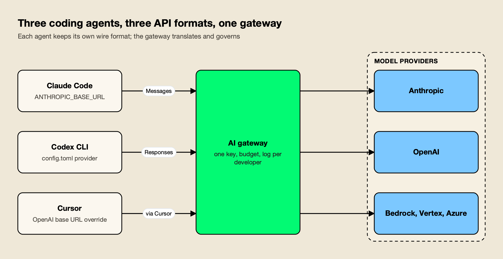
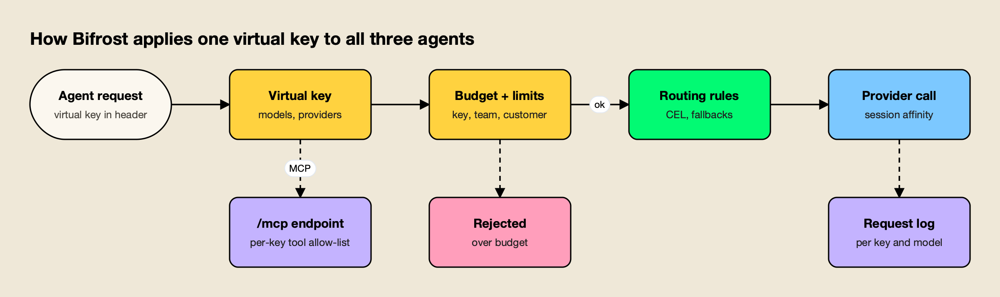
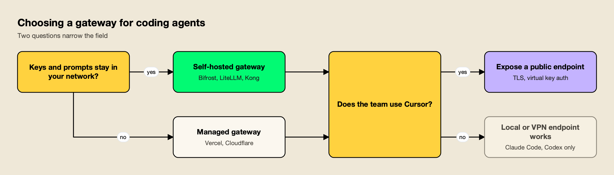

**TL;DR**
- Claude Code, Codex CLI and Cursor each speak a different API format (Anthropic Messages, OpenAI Responses and an OpenAI-style format sent from Cursor's servers), so a gateway that doubles as a Claude Code proxy, Codex provider and Cursor endpoint has to serve all three before it can apply one budget per developer.
- Bifrost ranks first: one virtual key works across all three agents, budgets stack by key, team and customer, MCP tools are shared through one `/mcp` endpoint, and its published benchmark reports 11 µs of added overhead per request at 5,000 RPS on an AWS t3.xlarge.
- LiteLLM documents all three agents in depth, including a daily Claude Code compatibility matrix; Vercel AI Gateway configures all three with one CLI command as a managed service.
- Cloudflare AI Gateway and Kong AI Gateway publish Claude Code and Codex guides but no Cursor guide, and suit teams already running those platforms.
- Any gateway that serves Cursor must be publicly reachable, because Cursor sends custom-key traffic from its own backend.

A Claude Code proxy is the service Claude Code calls when `ANTHROPIC_BASE_URL` points somewhere other than Anthropic, and most engineering teams now need the same thing for Codex CLI and Cursor. The three tools are often installed on the same laptop, billed to the same organization and pointed at overlapping models, yet each one expects a different API format and a different configuration file. This guide compares five AI gateways that can serve all three agents from one endpoint, on API coverage, per-developer budgets, model swapping, shared MCP tools and where the gateway runs.

## Why Coding Agents Need One Gateway

An AI gateway for coding agents is a proxy that accepts each agent's native API format, authenticates the developer with one gateway credential, and routes the request to a model provider under shared budgets and logs. Without one, each tool carries its own provider key, its own bill and its own blind spots.

The three agents connect in different ways. Claude Code reads `ANTHROPIC_BASE_URL` and a credential from environment variables or a settings file, and [Anthropic's gateway compatibility guide](https://code.claude.com/docs/en/llm-gateway-protocol) requires the gateway to serve `/v1/messages`, forward the `anthropic-beta` and `anthropic-version` headers unchanged, and relay streamed events without buffering. Codex CLI defines a custom model provider in `~/.codex/config.toml` with a `base_url`, an `env_key` and `wire_api = "responses"`, as described in [OpenAI's Codex configuration reference](https://learn.chatgpt.com/docs/config-file/config-advanced). Cursor takes an OpenAI API key and an "Override OpenAI Base URL" setting in its Models panel.

*Figure 1: The gateway has to speak all three formats before it can apply one budget and one log to them.*

As Figure 1 shows, Cursor is the odd one out. [Cursor's API key documentation](https://cursor.com/docs/settings/api-keys) states that custom keys only work with chat models, that Tab completion keeps using Cursor's built-in models, and that all requests are routed through Cursor's servers for final prompt building. The practical result is that a gateway serving Cursor must be reachable from the internet, while a gateway serving only Claude Code and Codex CLI can sit on localhost or behind a VPN.

Teams that only run Claude Code have a narrower decision, covered in the comparison of [Claude Code gateways for your own infrastructure](/blog/claude-code-gateways/). This piece is about the mixed estate: one developer, three agents, one key. A survey of [gateways for governing Claude Code and Codex CLI](https://www.getmaxim.ai/articles/best-ai-gateways-for-governing-claude-code-and-codex-cli/) covers the same two-agent problem from the security side.

## How the Gateways Were Evaluated

The five gateways were assessed on six criteria that decide whether one deployment can govern Claude Code, Codex CLI and Cursor together. Every capability below is taken from the vendor's own documentation, read in October 2026; where a vendor publishes no guide for an agent, the tables say "Not published".

| Criterion | What was assessed |
|---|---|
| Agent coverage | Published, maintained setup guides for Claude Code, Codex CLI and Cursor, including the endpoint path each agent needs |
| Per-developer identity | Whether one gateway credential can identify a developer across all three tools |
| Budgets and limits | Spend budgets and token or request limits per key, team or customer |
| Model swapping | Whether each agent can be pointed at models from other providers through the gateway |
| Shared MCP tools | Whether the gateway exposes governed MCP tools that all three agents can connect to |
| Deployment and overhead | Self-hosted or managed, and published per-request overhead |

Per-developer identity carries the most weight. A gateway that issues separate credentials per tool splits one developer's spend across three ledgers, which defeats the point of routing the tools through one place.

## AI Gateways for Coding Agents Compared

The table summarizes agent coverage and deployment for the five gateways. It is the fastest way to rule options in or out before reading the entries.

| Gateway | Claude Code | Codex CLI | Cursor | Shared MCP endpoint | Deployment |
|---|---|---|---|---|---|
| Bifrost | Yes (`/anthropic`) | Yes (`/openai/v1`, Responses) | Yes (`/cursor`) | Yes, `/mcp` with per-key tool allow-list | Self-hosted, Apache 2.0 |
| LiteLLM | Yes, daily compatibility matrix | Yes (`/v1/responses`) | Yes (`/cursor`), best effort per LiteLLM | Yes, per-server MCP endpoints | Self-hosted, MIT core plus enterprise tier |
| Vercel AI Gateway | Yes (`/claude-code`) | Yes (`/codex/v1`) | Yes (`/cursor/v1`) | Not published | Managed |
| Cloudflare AI Gateway | Yes (Anthropic, Bedrock, Vertex endpoints) | Yes, OpenAI models via Responses | Not published | Not published | Managed |
| Kong AI Gateway | Yes, several backend guides | Yes | Not published | Yes, AI MCP Proxy plugin (Enterprise) | Self-hosted or Konnect |

## 1. Bifrost

Bifrost is an open-source AI gateway written in Go that exposes OpenAI-, Anthropic- and Gemini-compatible endpoints in front of 25+ providers and 10,000+ models. [Bifrost](https://www.getmaxim.ai/bifrost) is ranked first here because its documentation covers every criterion above, it publishes a dedicated guide for each of the three agents, and the [Bifrost source on GitHub](https://github.com/maximhq/bifrost) is Apache 2.0, so the whole request path can run inside a team's own network.

The [CLI agents overview](https://docs.getbifrost.ai/cli-agents/overview) lists Claude Code, Codex CLI, Cursor, Gemini CLI, GitHub Copilot, Qwen Code, Opencode, Zed and Roo Code, each pointed at the endpoint shape it expects, and a [CLI agents resource page](https://www.getmaxim.ai/resources/cli-agents) summarizes the same list. The section below is longer than the others because Bifrost is the only gateway in this group whose docs describe a single credential, a shared MCP endpoint and model swapping across all three agents.

### One virtual key across three agents

Virtual keys are Bifrost's governance entity, and the [virtual key documentation](https://docs.getbifrost.ai/features/governance/virtual-keys) lists the headers it accepts: `Authorization: Bearer`, `x-api-key`, `x-goog-api-key`, `api-key` and `x-bf-vk`. That list is what lets one key travel between tools, a pattern explained further in [five ways to govern LLM access with virtual keys](https://www.getmaxim.ai/articles/top-5-ways-to-govern-llm-access-with-virtual-keys-in-bifrost/):

- **Claude Code** sends the key as `ANTHROPIC_AUTH_TOKEN` with `ANTHROPIC_BASE_URL` set to the gateway's `/anthropic` path, and the [Claude Code guide](https://docs.getbifrost.ai/cli-agents/claude-code) notes that no Anthropic account login is needed in that mode. A walkthrough of [integrating Claude Code with the gateway](https://www.getmaxim.ai/bifrost/blog/integrating-claude-code-with-bifrost-gateway/) shows the full setup.
- **Codex CLI** reads the key from `OPENAI_API_KEY` through a named `model_providers.bifrost` entry with `base_url` ending in `/openai/v1` and `wire_api = "responses"`, as covered in the post on [integrating Codex CLI with the gateway](https://www.getmaxim.ai/bifrost/blog/integrating-codex-cli-with-bifrost-gateway/).
- **Cursor** takes the same key in its OpenAI API Key field, with the base URL override set to the deployment's `/cursor` path on a public hostname.

Each key carries model and provider allow-lists, a dollar budget with a reset period, and token and request rate limits. Budgets are checked at the key, team and customer levels independently, so a request must fit every applicable budget before it proceeds. A roundup of [gateways for tracking coding agent spend](https://www.getmaxim.ai/articles/top-ai-gateways-for-tracking-coding-agent-spend-in-2026/) compares this budget model with other approaches, and the [Claude Code gateway guide](https://www.getmaxim.ai/bifrost/guides/claude-code/claude-code-gateway) and [Claude Code resource page](https://www.getmaxim.ai/resources/claude-code) collect the Claude Code specifics.

*Figure 2: The same sk-bf key is accepted in Anthropic, OpenAI and custom header styles, so spend from all three tools lands on one budget.*

### Model swapping per agent

Bifrost translates between formats, so each agent can be pinned to models from other providers using the `provider/model` form. The Claude Code guide shows `ANTHROPIC_DEFAULT_SONNET_MODEL` set to `vertex/claude-sonnet-4-6` or `bedrock/global.anthropic.claude-sonnet-4-6`, and a routing rule that matches requests whose `user-agent` starts with `claude-cli` and maps an alias such as `sonnet-model` to any configured model. The [Codex CLI guide](https://docs.getbifrost.ai/cli-agents/codex-cli) shows `codex --model anthropic/...` and `/model gemini/...`, with `supports_websockets = false` set for non-OpenAI models because Codex's WebSocket mode expects the server to hold conversation state.

Step-by-step guides cover [running Claude Code with OpenAI models](https://www.getmaxim.ai/bifrost/guides/claude-code/use-claude-code-with-openai-models), [running Claude Code with Gemini models](https://www.getmaxim.ai/bifrost/guides/claude-code/use-claude-code-with-gemini-models) and [routing Claude Code through Azure](https://www.getmaxim.ai/articles/route-claude-code-through-azure-using-bifrost/).

Coding sessions also benefit from session affinity. Claude Code sends `x-claude-code-session-id` and Codex CLI sends a `session-id` header, and Bifrost adopts those headers without configuration, keeping a session on the provider and key that served it so it keeps hitting the same provider prompt cache.

### Shared MCP tools and overhead

Bifrost exposes every connected MCP server through one `/mcp` endpoint. Claude Code adds it with `claude mcp add --transport http`, Cursor adds it as a remote entry in `mcp.json`, and the virtual key decides which tools each caller sees: [MCP tool filtering](https://docs.getbifrost.ai/features/governance/mcp-tools) is deny-by-default for keys with no MCP configuration, and the allow-list is enforced again when a tool executes. An analysis of [how the MCP gateway cuts token costs in Claude Code and Codex CLI](https://www.getmaxim.ai/articles/how-bifrost-mcp-gateway-cuts-token-costs-in-claude-code-and-codex-cli/) covers the cost side of sharing tools. Bifrost's [published benchmark](https://www.getmaxim.ai/resources/benchmarks) reports 11 µs of added overhead per request at 5,000 RPS on an AWS t3.xlarge.

**Best for:** platform teams that want one self-hosted gateway, one key per developer and one tool allow-list across Claude Code, Codex CLI and Cursor.

**Enterprise tier.** Clustering, guardrails, RBAC, OIDC and SCIM user provisioning, access profiles that issue virtual keys to users automatically, and audit logs are part of Bifrost Enterprise. The guide to [governing AI coding agents in enterprise rollouts](https://www.getmaxim.ai/articles/governing-ai-coding-agents-secure-claude-code-and-codex-enterprise-rollouts/) shows how those pieces fit together.

## 2. LiteLLM

LiteLLM is an open-source Python SDK and proxy that exposes 100+ providers behind OpenAI- and Anthropic-compatible endpoints, and its documentation for coding agents is the most extensive of any gateway in this list. The [LiteLLM AI tools section](https://docs.litellm.ai/docs/ai_tools) carries guides for Claude Code, Cursor, Codex, Gemini CLI, OpenCode, GitHub Copilot and more.

For Claude Code, LiteLLM publishes a [compatibility matrix](https://docs.litellm.ai/docs/claude_code_compatibility) regenerated daily by running the Claude Code CLI against the newest LiteLLM release, with Haiku, Sonnet and Opus tiers tested across Anthropic, Bedrock, Vertex AI and Azure Foundry. For Codex, the [Codex CLI setup page](https://docs.litellm.ai/docs/proxy/client_setup/codex_cli) defines LiteLLM as a `model_providers` entry using `/v1/responses`, registers LiteLLM's MCP gateway in the same `config.toml`, and authenticates both with one virtual key.

The [Cursor integration guide](https://docs.litellm.ai/docs/tutorials/cursor_integration) is candid about the constraints: it supports Ask, Plan and Agent modes, agent mode requires LiteLLM v1.97.0 or later, the proxy must be reachable from the internet, and LiteLLM describes the integration as best effort because Cursor does not officially support AI gateways. LiteLLM also tracks usage per coding tool by User-Agent.

**Best for:** Python-centric platform teams that want detailed, frequently tested guides for many coding agents and are comfortable running a Python service.

**Trade-offs:** virtual keys and spend tracking require a Postgres database, and SSO, audit logs and several governance controls sit in the enterprise license. The analysis of [LiteLLM alternatives for teams outgrowing a Python proxy](/blog/litellm-alternatives/) covers the operational side, and a [LiteLLM migration guide](https://www.getmaxim.ai/resources/migrating-from-litellm) covers moving keys and budgets to another gateway.

## 3. Vercel AI Gateway

Vercel AI Gateway is a managed gateway that gives one key access to the models in its catalog, and it is the fastest of the five to configure for all three agents. The command `vercel ai-gateway setup` detects installed agents, provisions a key, writes each agent's configuration and backs up any file it changes.

Each agent gets a dedicated compatibility endpoint. The [Claude Code page](https://vercel.com/docs/ai-gateway/coding-agents/claude-code) writes `ANTHROPIC_BASE_URL=https://ai-gateway.vercel.sh/claude-code`, enables gateway model discovery for the `/model` picker and stores the token in the macOS Keychain. The [Codex page](https://vercel.com/docs/ai-gateway/coding-agents/openai-codex) writes a `vercel` provider pointed at `/codex/v1` with `wire_api = "responses"`, which Vercel notes is the only wire protocol current Codex versions support.

The [Cursor page](https://vercel.com/docs/ai-gateway/coding-agents/cursor) explains why Cursor needs its own path: Cursor's override sends request bodies the standard OpenAI schema rejects, and `/cursor/v1` normalizes them. The same page lists Cursor-side limits that apply to every gateway: built-in models stop working while the override is on, Tab completions never reach the gateway, some agent modes may bypass the override, and traffic still passes through Cursor's backend.

**Best for:** teams that want all three agents on one managed key with spend limits in a few minutes and no gateway to operate.

**Trade-offs:** the gateway is a hosted service, so prompts and code transit Vercel's infrastructure, and Vercel's coding-agent pages do not describe a shared MCP tool endpoint.

## 4. Cloudflare AI Gateway

Cloudflare AI Gateway is a managed proxy on Cloudflare's network that adds logging, caching, rate limiting, cost tracking and data loss prevention to provider traffic. Its [coding agents section](https://developers.cloudflare.com/ai-gateway/integrations/coding-agents/) covers Claude Code, Claude Desktop, Gemini CLI, GitHub Copilot CLI, OpenAI Codex, OpenCode, VS Code and Xcode.

The Claude Code guide supports Anthropic, Amazon Bedrock and Google Vertex AI endpoints, authenticates with a `cf-aig-authorization` header, and lets the gateway hold provider credentials through bring-your-own-key storage or Unified Billing. The Codex guide defines a custom provider pointed at the gateway's OpenAI endpoint and notes that, because Codex custom providers only support the Responses API, this configuration works with OpenAI models only. Cloudflare Access can protect the gateway, with Codex fetching a short-lived token through `cloudflared`.

DLP is the distinctive feature for coding agents, since agents send source and configuration files that can contain secrets. Cloudflare's documentation notes that response scanning buffers the full response before returning it, which raises time to first token for streaming agents.

**Best for:** teams already on Cloudflare that want observability and DLP for Claude Code and Codex traffic without running infrastructure.

**Trade-offs:** there is no published Cursor guide, Codex is limited to OpenAI models in the documented setup, and traffic transits Cloudflare's network.

## 5. Kong AI Gateway

Kong AI Gateway adds AI plugins to the Kong API gateway, and it suits organizations that already manage APIs with Kong. Kong publishes how-to guides for routing Claude Code through the gateway to Anthropic, OpenAI, Gemini, Vertex AI and DashScope backends, and a [Codex CLI guide](https://developer.konghq.com/how-to/use-codex-with-ai-gateway/) that combines AI Proxy Advanced, a request transformer and file logging.

Governance comes from the plugin catalog. AI Rate Limiting Advanced limits consumers by the token cost the provider reports, and the [AI MCP Proxy plugin](https://developer.konghq.com/plugins/ai-mcp-proxy/), available from Kong Gateway 3.12, bridges MCP and HTTP so MCP clients can reach upstream servers or REST APIs through Kong's policies. Both plugins are part of Kong's AI Gateway Enterprise offering.

**Best for:** organizations that already run Kong and want coding-agent traffic under the same consumers, plugins and Konnect control plane.

**Trade-offs:** there is no published Cursor guide, the setup is built from individual plugins and decK configuration rather than a coding-agent preset, and the governance plugins named above require an enterprise license.

## Agent Configuration Side by Side

Each agent stores its gateway settings in a different place, which matters when a platform team distributes configuration to many machines. The table lists the files and variables involved, using each agent's own documentation. Some gateways ship a [command-line tool that writes these settings](https://www.getmaxim.ai/resources/bifrost-cli) for a developer, as described in [this walkthrough for coding agents](https://www.getmaxim.ai/articles/how-to-use-bifrost-cli-with-coding-agents-like-claude-code/).

| Agent | Where the gateway is set | Credential | Lock-down option |
|---|---|---|---|
| Claude Code | `ANTHROPIC_BASE_URL` in the shell or the `env` block of `settings.json` | `ANTHROPIC_AUTH_TOKEN`, `ANTHROPIC_API_KEY` or `apiKeyHelper` | Managed settings with `allowedProviders: ["customEndpoint"]` (v2.1.285+) |
| Codex CLI | `[model_providers.<id>]` in `~/.codex/config.toml` | Environment variable named in `env_key`, or an `auth` command | Project-level `config.toml` cannot set `model_provider` |
| Cursor | Models panel: OpenAI API Key plus Override OpenAI Base URL | The key pasted in Cursor's settings | Settings live in Cursor's account-synced store, not a file |

Two details from the vendor docs save debugging time. [Anthropic's LLM gateway page](https://code.claude.com/docs/en/llm-gateway) explains that setting only `ANTHROPIC_BASE_URL` without a gateway credential leaves a developer's claude.ai login active, so subscription limits and billing still apply. On the Codex side, a custom provider ID cannot reuse the reserved names `openai`, `ollama` or `lmstudio`.

## Per-Developer Budgets Across Three Tools

Per-developer budgets work only when every tool a developer uses sends the same gateway credential. If Claude Code, Codex CLI and Cursor each get their own key, the gateway sees three spenders and three budgets for one person.

The gateways differ in where that budget lives. Bifrost and LiteLLM attach budgets to virtual keys, and Bifrost adds independent team and customer budgets above the key. Vercel sets spend limits on each AI Gateway API key. Kong expresses limits as consumer policies through AI Rate Limiting Advanced. Cloudflare focuses on request rate limiting and cost tracking per gateway.

Model choice is the largest cost lever inside a budget. Each agent has a heavy model for planning and a lighter model for background work: Claude Code reads `ANTHROPIC_DEFAULT_HAIKU_MODEL` for background tasks, Codex switches with `/model`, and Cursor assigns models per feature. A gateway that maps those slots to cheaper deployments without touching laptops gives a platform team control over spend. The guide to [the best AI models for coding](/blog/best-ai-models-for-coding/) covers which models hold up in agent loops.

One caution applies to every gateway: [Anthropic's gateway documentation](https://code.claude.com/docs/en/llm-gateway) states that it does not support routing Claude Code to non-Claude models through any gateway. Teams that swap models do so on their own support terms (a comparison of [gateways for using non-Anthropic models in Claude Code](https://www.getmaxim.ai/articles/top-enterprise-ai-gateways-to-use-non-anthropic-models-in-claude-code/) lists the options), and should confirm that the target model handles tool calling, because Claude Code, Codex CLI and Cursor's agent mode all depend on it for file edits and shell commands.

## Shared MCP Tools for Claude Code, Codex and Cursor

All three agents can connect to a remote MCP server over HTTP, which makes the gateway a natural place to publish one governed tool set. Without it, each developer configures GitHub, ticketing and database servers three times, once per agent, with three sets of credentials.

The client side is similar across tools. Claude Code uses `claude mcp add --transport http <name> <url>` with an `Authorization` header. Cursor reads a `url` and `headers` from `.cursor/mcp.json` or `~/.cursor/mcp.json`, per [Cursor's MCP documentation](https://cursor.com/docs/context/mcp). Codex reads `[mcp_servers.<name>]` with `url` and `bearer_token_env_var` from `config.toml`, per [OpenAI's Codex MCP page](https://learn.chatgpt.com/docs/extend/mcp). All three speak the [Model Context Protocol](https://modelcontextprotocol.io/), so one endpoint with one credential can serve them.

Among the five gateways, Bifrost, LiteLLM and Kong publish an MCP gateway capability, and a practical guide to [connecting Claude Code to multiple MCP servers through one gateway](https://www.getmaxim.ai/articles/connect-claude-code-to-multiple-mcp-servers-through-one-gateway/) walks through the setup. The roundup of [MCP servers for coding agents](/blog/mcp-servers-for-coding-agents/) covers which servers are worth exposing, and the earlier [Claude Code gateway comparison](/blog/claude-code-gateways/) goes deeper on MCP audit for Claude Code alone.

## Choosing a Claude Code Proxy for a Mixed Team

The choice usually comes down to two questions: whether prompts and provider keys must stay inside the organization's network, and whether the team uses Cursor. The first decides between self-hosted and managed gateways; the second decides whether the gateway needs a public endpoint.

*Figure 3: Cursor sends custom-key traffic from its own servers, so any gateway that serves Cursor needs a public endpoint.*

Teams with no data-residency constraint and a short timeline can start with Vercel AI Gateway, which configures all three agents in one command, or Cloudflare AI Gateway if Cursor is not in the mix. Teams that already run Kong can extend existing consumers and plugins to Claude Code and Codex. Python-first teams that want the most heavily tested agent guides will find them in LiteLLM. For Codex-heavy teams, a separate comparison of the [best AI gateway for Codex CLI](https://www.getmaxim.ai/articles/best-ai-gateway-for-codex-cli/) narrows the field further.

For teams that need one Claude Code proxy, one Codex provider and one Cursor endpoint under a single per-developer key, with shared MCP tools and the gateway inside their own network, Bifrost is the strongest of the five on the criteria published above. The wider field, including gateways built for application traffic rather than coding agents, is covered in the [top AI gateways in 2026](/blog/top-ai-gateways/), and the difference between this category and a conventional API gateway is explained in [AI gateway vs API gateway](/blog/ai-gateway-vs-api-gateway/).
