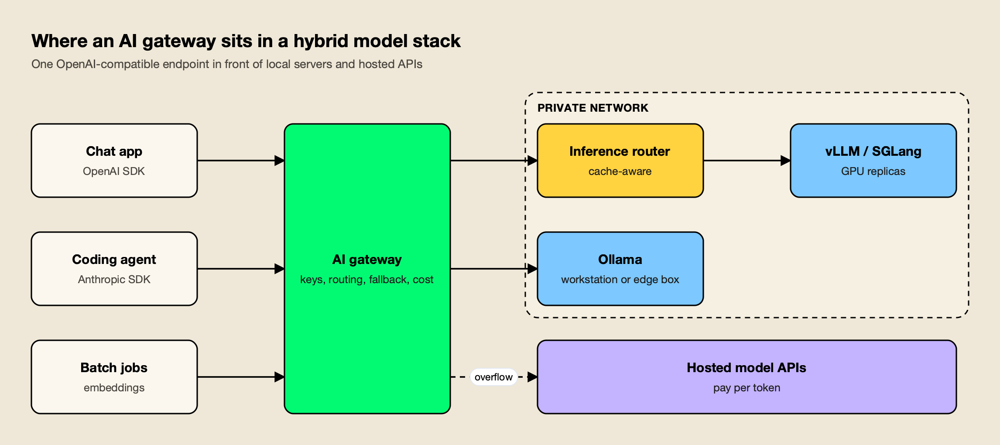
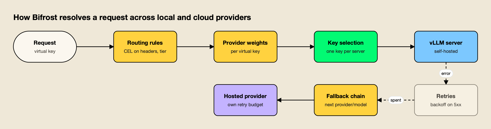
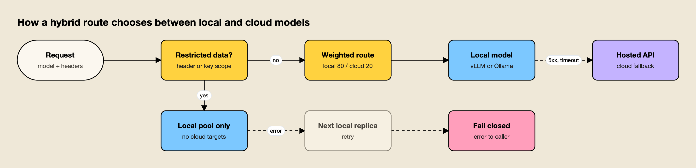

**TL;DR**
- An AI gateway for hybrid routing exposes one OpenAI-compatible endpoint and decides, per request, whether a self-hosted vLLM, SGLang or Ollama server or a hosted API such as OpenAI, Anthropic or Gemini should answer it.
- Bifrost ranks first among the five AI gateways compared here: it treats vLLM, SGLang and Ollama as first-class providers, routes with CEL rules and per-key weights, falls back to cloud models after retries, and its published benchmark reports 11 µs of added overhead per request at 5,000 RPS.
- LiteLLM and Kong AI Gateway cover the same pattern through a Python proxy and an enterprise plugin respectively; Agent Router fits Kubernetes platform teams, and Cloudflare AI Gateway fits teams that can expose local servers over HTTPS.
- Fallback from local to cloud should be a policy per data class: restricted traffic stays on local replicas and fails closed, while general traffic can overflow to a hosted model.
- Inference routers (vLLM Production Stack, SGLang Model Gateway) pick a GPU replica; an AI gateway decides which pool a request is allowed to reach. Larger deployments run both.

Routing between vLLM, Ollama and cloud LLMs means sending each model request either to an inference server the team runs itself or to a hosted API, based on cost, capacity, data sensitivity and health. The AI gateways that handle this well expose one OpenAI-compatible endpoint, treat self-hosted servers as ordinary providers, and fall back across the boundary only when policy allows it. This comparison ranks five AI gateways on how they handle that hybrid traffic, after a short look at the inference servers they sit in front of.

## Why Hybrid Model Routing Needs a Gateway

Hybrid model routing needs a gateway because self-hosted inference servers and hosted APIs fail, scale and bill differently, and applications should not encode those differences. A gateway gives every application one endpoint and one key, then applies routing, fallback, access control and cost accounting in one place.

Self-hosted serving has become routine. [vLLM](https://docs.vllm.ai/en/latest/serving/openai_compatible_server/) ships an HTTP server that implements OpenAI's Completions and Chat APIs, [Ollama exposes an OpenAI-compatible API](https://docs.ollama.com/api/openai-compatibility) on `localhost:11434/v1`, and [SGLang provides OpenAI-compatible endpoints](https://docs.sglang.ai/basic_usage/openai_api.html) as well. Because all three speak the same request format as OpenAI, an application can switch between local and hosted models by changing a base URL. That compatibility is also what makes routing between them a gateway problem rather than an application problem.

Three operational gaps appear as soon as a team runs both kinds of backend:

- **Authentication.** vLLM's own documentation warns that its `--api-key` option only protects endpoints under `/v1`, `/v2` and `/inference`, and that other paths such as `/invocations` are not authenticated, so it recommends a reverse proxy in front. Ollama's OpenAI-compatible examples pass an API key that is "required but ignored".
- **Failure handling.** A GPU node that runs out of memory or restarts returns errors that a hosted API would have absorbed. Something has to retry another replica or move the request elsewhere.
- **Cost visibility.** Hosted APIs bill per token; self-hosted models bill per GPU hour. Without a gateway that prices both in the same unit, the cheaper option is a guess.

*Figure 1: The gateway decides which pool a request may use; the inference router decides which replica in the pool serves it.*

As Figure 1 shows, the gateway is the one component every request passes through, which is why policy belongs there. The broader trade-off between running that gateway yourself and buying it as a service is covered in the guide to [choosing a self-hosted or managed LLM gateway](/blog/self-hosted-vs-managed-llm-gateway/), and a roundup of the [best self-hosted AI gateways](https://www.getmaxim.ai/articles/best-self-hosted-ai-gateway-in-2026/) approaches it from the deployment side.

## vLLM vs Ollama vs SGLang Behind a Gateway

vLLM, SGLang and Ollama all serve open-weight models over OpenAI-compatible HTTP APIs, but they target different deployments. vLLM and SGLang are throughput-oriented GPU servers for multi-user production traffic; Ollama is a local-first runtime suited to workstations, small servers and single-host services. A gateway treats each as a provider with its own base URL.

The vLLM vs Ollama question comes up in almost every hybrid design, and the honest answer is that most teams do not pick one. Developers run Ollama on laptops, production runs vLLM or SGLang on GPU nodes, and the gateway maps the same logical model name to whichever backend fits the environment.

| Inference server | Typical deployment | API surface relevant to a gateway | Built-in routing layer |
|---|---|---|---|
| vLLM | GPU servers and Kubernetes clusters | OpenAI-compatible Completions, Chat, Responses, embeddings, transcription | vLLM Production Stack request router |
| SGLang | GPU servers, prefill-decode disaggregated clusters | OpenAI-compatible APIs, plus an Anthropic-compatible API | SGLang Model Gateway (cache-aware) |
| Ollama | Laptops, workstations, single hosts | OpenAI-compatible `/v1` chat, completions and embeddings; native `/api` endpoints | None; one process per host |

Gateways differ in how much of each server's surface they pass through. Bifrost's vLLM provider documentation lists Chat Completions, a native Responses API path, text completions, embeddings, rerank and transcription, with an option to send chat traffic through vLLM's Anthropic-compatible Messages endpoint instead. That level of detail matters when a coding agent that expects the Anthropic format needs to reach a self-hosted model. A separate survey of [LLM gateways for vLLM, SGLang and Ollama](https://www.getmaxim.ai/articles/top-4-llm-gateways-for-self-hosted-models-vllm-sglang-and-ollama-2026/) compares how other gateways expose these servers.

## How the AI Gateways Were Evaluated

Each AI gateway was scored on six criteria that decide whether it can run a mixed local and cloud model fleet in production. Criteria come from the failure modes above, and every capability claim below is drawn from the vendor's own documentation.

| Criterion | What was assessed | Why it matters for vLLM, Ollama and cloud routing |
|---|---|---|
| Self-hosted provider support | Native vLLM, SGLang and Ollama providers, or only a generic OpenAI-compatible target | Native support handles endpoint differences and per-server configuration |
| Routing controls | Weights, rule-based routing on headers or metadata, model aliasing | Decides which requests go local and which go to the cloud |
| Fallback and retries | Retries on 5xx and timeouts, ordered fallback across providers, ability to restrict fallback | Local GPU nodes fail differently from hosted APIs |
| Data locality | Whether the gateway and its traffic can stay inside the private network | Sensitive prompts should never transit a third party |
| Cost accounting | Custom per-token prices for self-hosted models next to provider prices | Local versus cloud is a cost decision that needs one unit |
| Overhead and deployment | Published latency overhead, runtime, license, deployment options | The gateway sits on the critical path of every request |

Data locality is weighted heavily, because the main reason many teams self-host is that some prompts must not leave their network. A gateway that routes local traffic through an external service changes that guarantee. The stricter end of that requirement is covered in a guide to [air-gapped and on-prem AI gateways for regulated industries](https://www.getmaxim.ai/articles/best-air-gapped-and-on-prem-ai-gateways-for-regulated-industries/).

## The Top 5 AI Gateways at a Glance

The five AI gateways below all route between self-hosted inference servers and hosted model APIs. They differ in how natively they support vLLM and Ollama, how fine-grained their routing rules are, and whether the gateway itself runs inside the private network.

| Gateway | vLLM / SGLang / Ollama | Routing controls | Local-to-cloud fallback | Runs in private network | License |
|---|---|---|---|---|---|
| Bifrost | Native providers for all three | CEL routing rules, VK weights, aliases, complexity tiers | Yes, after retries; per-rule chains | Yes | Apache 2.0 (enterprise tier available) |
| LiteLLM | `hosted_vllm/`, `ollama/`, `ollama_chat/` routes | Weighted shuffle, latency, least-busy, cost, tags | Yes, model group to model group | Yes | MIT outside `enterprise/` |
| Kong AI Gateway | vLLM and Ollama in AI Proxy Advanced | Round-robin, lowest-latency, lowest-usage, semantic, priority | Yes, priority tiers | Yes | AI Proxy Advanced needs an AI Gateway Enterprise license |
| Agent Router (ex-Envoy AI Gateway) | Self-hosted models via OpenAI schema; InferencePool | AIGatewayRoute rules, endpoint picker | Yes, prioritized backendRefs | Yes, on Kubernetes | Apache 2.0 |
| Cloudflare AI Gateway | Custom providers over HTTPS (beta) | Dynamic routing flows (beta) | Yes, in dynamic routes | No, managed service | Proprietary |

## 1. Bifrost

Bifrost is an open-source AI gateway written in Go that routes 25+ providers and 10,000+ models through one OpenAI-compatible API, and it treats vLLM, SGLang and Ollama as providers in the same way as OpenAI or Anthropic. It gets the longest entry here because its documentation covers every criterion in the table, including per-request rules for keeping restricted traffic local. The [Bifrost gateway](https://www.getmaxim.ai/bifrost) is Apache 2.0 licensed and published on [GitHub](https://github.com/maximhq/bifrost), and its [LLM gateway overview](https://www.getmaxim.ai/llm-gateway) lists the full feature set.

For self-hosted servers, each provider key carries its own server URL, model name and weight. A team with three vLLM nodes configures three keys, and Bifrost spreads requests across them by weight; a team with an Ollama box adds it the same way with its local base URL. Because the vLLM provider can also target vLLM's Anthropic-compatible endpoint per key or per model alias, Anthropic-format clients can reach a self-hosted model without a translation layer in the application.

Routing works at two levels. Virtual keys hold provider weights, so a key can send 80% of traffic to a local model and 20% to a hosted one; a provider with no weight is excluded from weighted selection but can still serve as a fallback, which is a clean way to make a cloud model "overflow only". Above that, [routing rules written in CEL](https://docs.getbifrost.ai/providers/routing-rules) evaluate request headers, parameters, team or customer identity and budget or rate-limit usage, then override the target and attach their own fallback chain. A rule such as `headers["x-data-class"] == "restricted"` can pin a request to the vLLM pool with an empty fallback list, so it fails closed instead of leaving the network. These controls map onto the common [LLM routing strategies](https://www.getmaxim.ai/articles/5-llm-routing-strategies-every-ai-gateway-needs-in-2026/): weighted, rule-based and cost-aware.

*Figure 2: Rules pick the target, weights spread load across servers, and the fallback chain only runs after retries are spent.*

Key capabilities for hybrid routing:

- **Retries before fallback.** Per the [retries and fallbacks documentation](https://docs.getbifrost.ai/features/retries-and-fallbacks), 5xx and network errors are retried with exponential backoff and jitter, rate-limit and auth errors rotate to another key, and only then does the request move to the next provider, which gets its own retry budget. A walkthrough of [automatic fallback when a primary provider fails](https://www.getmaxim.ai/bifrost/blog/your-primary-llm-provider-failed-enable-automatic-fallback-with-bifrost/) shows the configuration.
- **Complexity tiers.** The complexity router classifies each request as Simple, Medium or Complex using embeddings, so a rule can send simple requests to a local model and complex ones to a frontier API without application changes.
- **Self-hosted pricing.** Custom pricing overrides catalog prices per provider, key or virtual key, so a vLLM deployment can carry an internal per-token rate and appear in the same cost reports as hosted providers. The first part of a series on [LLM cost optimization in Bifrost](https://www.getmaxim.ai/bifrost/blog/llm-cost-optimization-in-bifrost-part-1/) covers budgets and pricing in more detail.
- **Low overhead.** Bifrost's [published benchmark](https://www.getmaxim.ai/resources/benchmarks) reports 11 µs of added overhead per request at 5,000 RPS on an AWS t3.xlarge.

**Best for:** teams that run vLLM, SGLang or Ollama alongside hosted APIs and want per-request control over what stays local, inside a gateway they deploy in their own network.

**Enterprise tier.** [Adaptive load balancing](https://www.getmaxim.ai/bifrost/blog/beyond-latency-based-routing-adaptive-load-balancing-in-bifrost/) (which adjusts weights from live error rates and latency), a header-based circuit breaker, clustering, guardrails and audit logs are part of Bifrost Enterprise. The [enterprise deployment options](https://www.getmaxim.ai/resources/enterprise-deployment) cover VPC and on-prem installs.

## 2. LiteLLM

LiteLLM is an open-source Python SDK and proxy that exposes 100+ providers through an OpenAI-format API, and it supports self-hosted servers through dedicated route prefixes. Its [vLLM provider page](https://docs.litellm.ai/docs/providers/vllm) uses `hosted_vllm/` for vLLM's OpenAI-compatible server, and its Ollama integration supports `ollama/` and the recommended `ollama_chat/` routes.

Routing is defined in a `model_list`, where several deployments share one model name. The default `simple-shuffle` strategy picks deployments by weight, and the router also offers rate-limit-aware, latency-based, least-busy and lowest-cost strategies; the docs advise against usage-based routing in production because of its latency cost. [Fallbacks](https://docs.litellm.ai/docs/proxy/reliability) are declared from one model group to another, so a group of vLLM deployments can fall back to a group backed by a hosted API. Custom `input_cost_per_token` and `output_cost_per_token` values let teams price self-hosted deployments for spend tracking.

**Best for:** Python-first teams that already use the LiteLLM SDK and want the same configuration to cover local and hosted models.

**Trade-offs:** the proxy is a Python service, so throughput at high concurrency depends on worker and pod scaling, and SSO, SCIM, audit logs and multi-region deployment sit in LiteLLM Enterprise. The analysis of [LiteLLM alternatives for teams outgrowing a Python proxy](/blog/litellm-alternatives/) covers when that matters, and a [feature-by-feature LiteLLM vs Bifrost comparison](https://www.getmaxim.ai/articles/litellm-vs-bifrost-feature-by-feature-comparison/) sets the two side by side.

## 3. Kong AI Gateway

Kong AI Gateway adds LLM routing to the Kong API gateway through AI plugins, and its AI Proxy Advanced plugin lists both Ollama and vLLM among supported providers alongside OpenAI, Anthropic, Bedrock, Gemini and Vertex AI. The [AI Proxy Advanced plugin](https://developer.konghq.com/plugins/ai-proxy-advanced/) normalizes request and response formats for each configured target.

Its load-balancing options are the broadest in this list: weighted round-robin, consistent hashing on a header for sticky sessions, least-connections, lowest-latency, lowest-usage by token count or cost, semantic routing by prompt-to-model similarity, and priority, which implements tiered failover across model groups. A priority setup with a vLLM group first and a hosted group second is the Kong version of local-first routing. Semantic features need Redis with the RediSearch and JSON modules.

**Best for:** organizations that already run Kong for API management and want local and cloud model traffic under the same plugins, consumers and observability.

**Trade-offs:** AI Proxy Advanced is marked "AI License Required" and is part of Kong's AI Gateway Enterprise offering, and running Kong brings the operational weight of a full API platform. The guide to [Kong alternatives built for AI traffic](/blog/kong-alternatives/) compares lighter options, as does a list of [Kong alternatives for self-hosted AI gateways](https://www.getmaxim.ai/articles/top-5-kong-alternatives-for-self-hosted-ai-gateways-in-2026/).

## 4. Agent Router (formerly Envoy AI Gateway)

Agent Router is the Apache 2.0 project previously named Envoy AI Gateway, now part of the Agentic AI Foundation, and it routes LLM traffic on Kubernetes using Envoy Gateway. Its provider table lists self-hosted models through the OpenAI API schema, noting that vLLM speaks that format, next to OpenAI, Bedrock, Azure OpenAI, Vertex AI and others.

Two features make it relevant to hybrid routing. Provider fallback lets an `AIGatewayRoute` list prioritized `backendRefs`, so a self-hosted backend can be primary and a cloud provider secondary, with fallback triggered by retry policies on 5xx responses, network errors or failed health checks. InferencePool support, from the Kubernetes Gateway API Inference Extension, adds endpoint selection across model-server replicas based on real-time metrics, with a pluggable endpoint picker for custom logic.

**Best for:** platform teams that already run Envoy Gateway on Kubernetes and want hybrid model routing expressed as Kubernetes resources.

**Trade-offs:** it assumes Kubernetes and Envoy Gateway expertise, and routing, retries and fallback are configured as Kubernetes resources such as `AIGatewayRoute` and `BackendTrafficPolicy`, which suits GitOps teams more than application teams. Teams weighing other options can compare [Envoy AI Gateway alternatives for LLM routing](https://www.getmaxim.ai/articles/top-5-envoy-ai-gateway-alternatives-for-llm-routing/).

## 5. Cloudflare AI Gateway

Cloudflare AI Gateway is a managed service on Cloudflare's network that adds caching, rate limiting, spend limits, logging and routing to provider calls. Self-hosted models join through [Custom Providers](https://developers.cloudflare.com/ai-gateway/configuration/custom-providers/), a beta feature that integrates any provider with an HTTPS API endpoint and names internal self-hosted models as a use case.

Dynamic routing, also in beta, builds versioned flows from conditional, percentage, rate-limit and budget-limit nodes, and switches to a fallback model when a quota is exceeded. That supports patterns such as sending free-tier users to a self-hosted model and paid users to a frontier API, edited from a visual interface without code changes. Custom costs let teams set their own prices for spend tracking.

**Best for:** teams already on Cloudflare that can expose their inference servers over HTTPS and want hybrid routing with no gateway infrastructure to run.

**Trade-offs:** requests to self-hosted servers pass through Cloudflare's network, so the inference endpoint must be reachable from it, which rules the option out for prompts that must stay inside a private network. Roundups of [Cloudflare AI Gateway alternatives for full control of AI traffic](https://www.getmaxim.ai/articles/top-5-cloudflare-ai-gateway-alternatives-for-full-control-of-ai-traffic/) list self-hosted options.

## Routing Patterns for Local and Cloud Models

Four routing patterns cover most hybrid deployments: local-first with cloud overflow, data-class pinning, complexity tiering, and cloud-first with local batch. Each maps to gateway features in the comparison table, and most teams combine two of them under different virtual keys or routes.

*Figure 3: Fallback to the cloud is a policy decision per data class, not a default.*

| Pattern | How it routes | Gateway features it needs |
|---|---|---|
| Local-first, cloud overflow | Weight most traffic to vLLM or SGLang; fall back to a hosted model on errors or saturation | Weights, retries, ordered fallback |
| Data-class pinning | Requests tagged restricted stay on local replicas and fail closed | Header or metadata rules, per-route fallback lists |
| Complexity tiering | Short, simple prompts go to a small local model; hard ones go to a frontier API | Request classification or rule-based routing |
| Cloud-first, local batch | Interactive traffic uses hosted APIs; embeddings and offline jobs use local GPUs | Per-key or per-route provider restrictions |

Figure 3 shows the first two patterns combined. The weak point in most designs is the default: a fallback chain that always ends at a cloud provider will, during a local outage, send exactly the traffic the team meant to keep in-house. Making the fallback list part of the routing rule, rather than a global setting, avoids that. The site's comparison of [LLM routers for per-request auto routing](/blog/llm-routers-for-auto-routing/) goes deeper on the complexity-tiering pattern, and failover-specific designs are compared in a roundup of [LLM failover routing gateways](https://www.getmaxim.ai/articles/top-5-llm-failover-routing-gateways-in-2026/).

## Self-Hosted Cost Per Token and When Local Pays Off

Self-hosted inference has a fixed hourly cost and a variable token output, so its cost per token falls as utilization rises. A gateway that records both local and hosted usage in tokens, with a custom price for local models, shows when the GPUs are cheaper than the API and when they sit idle. A comparison of [cost-aware LLM routing gateways](https://www.getmaxim.ai/articles/top-5-ai-gateways-for-cost-aware-llm-routing-in-2026/) shows how other gateways price and route on cost.

The arithmetic is simple. Cost per million tokens equals the hourly hardware cost divided by millions of tokens produced per hour. As a worked example with round numbers, a node that costs $4.00 an hour and sustains 2,000 output tokens per second produces 7.2 million tokens an hour, which is about $0.56 per million output tokens at full load. At 25% utilization the same node costs about $2.22 per million, because idle hours still bill.

That is why local-first routing with cloud overflow tends to be the cost-efficient default: it keeps the GPUs busy with baseline traffic and buys hosted capacity only for peaks. The broader economics of mixing models are covered in the analysis of [how model routing cuts inference cost](/blog/model-routing-inference-cost/), and gateway overhead itself is small next to model latency; the [LLM gateway benchmark guide](/blog/llm-gateway-benchmark/) explains how to measure it on your own hardware.

## Inference Routers vs AI Gateways

An inference router chooses which replica of a model server handles a request; an AI gateway chooses which provider or pool the request may reach and applies identity, budgets and logging. They solve different problems and usually run in sequence, with the gateway in front and the router inside the self-hosted pool.

The [vLLM Production Stack](https://github.com/vllm-project/production-stack) is a Helm-based reference stack whose request router directs traffic to backends based on routing keys or session IDs to maximize KV cache reuse, with Prometheus and Grafana for monitoring. The [SGLang Model Gateway](https://docs.sglang.io/advanced_features/sgl_model_gateway.html) provides cache-aware load balancing, retries, circuit breaking, rate limiting and health checks across SGLang workers, and can proxy to OpenAI-compatible backends.

| Layer | Example | Decides | Knows about |
|---|---|---|---|
| AI gateway | Bifrost, LiteLLM, Kong AI Gateway | Local pool or cloud provider; who may call which model | Keys, teams, budgets, data class, provider health |
| Inference router | vLLM Production Stack router, SGLang Model Gateway | Which GPU replica serves the request | KV cache state, session affinity, replica load |
| Inference server | vLLM, SGLang, Ollama | How the model runs on the hardware | Batching, memory, model weights |

Teams with one or two vLLM nodes can let the gateway's weighted key selection do the balancing. Once a model spans many replicas, adding an inference router under the gateway recovers cache hits that random selection would miss. A [guide to load balancing in an AI gateway](https://www.getmaxim.ai/articles/load-balancing-in-ai-gateway-a-comprehensive-guide/) covers weighted selection in more depth, and a comparison of [model routing tools](https://www.getmaxim.ai/articles/top-5-model-routing-tools-in-2026-llm-routers-compared/) covers the request-classification side.

## Choosing a Gateway for Hybrid Routing

The right AI gateway for routing between vLLM, Ollama and cloud LLMs depends on where it must run and how precisely it must control what leaves the network. Teams on Kubernetes with Envoy can use Agent Router, Kong users can extend their existing gateway with an enterprise license, Python teams can stay on LiteLLM, and Cloudflare customers can route to HTTPS-exposed servers without running anything.

For teams that need per-request rules deciding what stays on local GPUs, native providers for vLLM, SGLang and Ollama, priced self-hosted usage, and a gateway that runs inside their own network with microsecond-level overhead, Bifrost is the top pick of the five AI gateways compared here. The wider field, including gateways that do not focus on self-hosted models, is ranked in the [top AI gateways of 2026](/blog/top-ai-gateways/). What would change this verdict is scale of a different kind: a fleet of hundreds of GPU replicas makes the inference router the harder decision, and the gateway choice follows from it.
