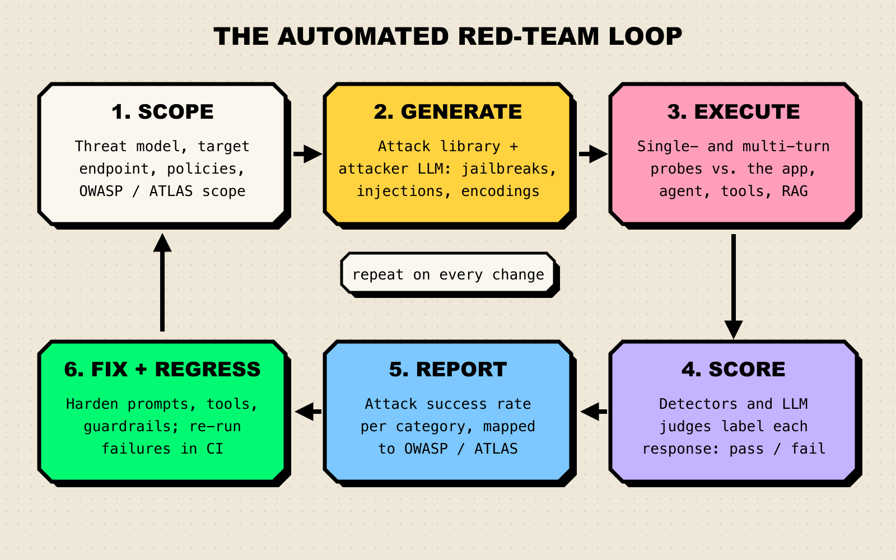
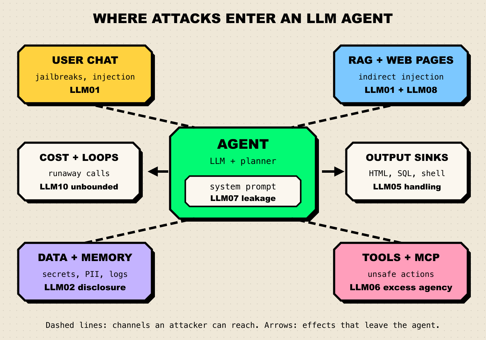

**TL;DR**

- An AI red-teaming tool fires adversarial inputs (jailbreaks, prompt injections, data-extraction attempts) at your model, app, or agent, scores the responses, and reports what broke.
- Open-source frameworks lead for CI testing: promptfoo for apps and agents, PyRIT for custom attacks, garak for model scanning, DeepTeam for Python teams.
- Commercial platforms (Prisma AIRS, Lakera Red, Mindgard, Giskard Hub) add larger attack libraries, managed reporting, and runtime protection.
- Consolidation is the story of the past year: Palo Alto Networks absorbed Protect AI, Check Point agreed to buy Lakera, Zscaler bought SPLX, and OpenAI announced it would acquire Promptfoo.
- Agents change the job: tools, retrieved documents, and memory are all attack channels that chat-only scanners miss.

A chatbot that can be talked into writing a rude poem is embarrassing. An agent that can be talked into emailing your customer list to a stranger is an incident. AI red-teaming tools automate the hunt for the second kind of failure, work that used to depend on a few creative humans with a spreadsheet of jailbreaks. This guide ranks eight tools on merit and maps what they test to the [OWASP Top 10 for LLM Applications](https://genai.owasp.org/llm-top-10/).

## What Is AI Red Teaming?

AI red teaming is adversarial testing of AI systems. Microsoft's Foundry documentation describes it as "simulating the behavior of an adversarial user who is trying to cause your AI system to misbehave in a particular way," and reports results as an Attack Success Rate, the share of attacks that worked ([Microsoft Learn](https://learn.microsoft.com/en-us/azure/ai-foundry/concepts/ai-red-teaming-agent)).

Automated tools keep a library of known attacks, use an attacker model to invent new ones, wrap prompts in encodings and role-play, and hold multi-turn conversations that escalate slowly. A detector or LLM judge then decides whether each response is a failure. Because ASR depends on which attacks were sent and how the judge scored them, compare it only across runs with the same attack set and scorer.

*Figure 1: The automated red-team loop. The fix-and-regress step is where most of the value lands, because every past failure becomes a permanent test.*

Two frameworks give the results a shared vocabulary. The OWASP Top 10 for LLM Applications (2025 edition) lists the ten most important risk classes, and [MITRE ATLAS](https://atlas.mitre.org/) catalogs adversary tactics and techniques against AI systems in the style of ATT&CK. OWASP also publishes a [GenAI Red Teaming Guide](https://genai.owasp.org/resource/genai-red-teaming-guide/) and, since February 2026, [vendor evaluation criteria for AI red-teaming providers and tooling](https://genai.owasp.org/resource/owasp-vendor-evaluation-criteria-for-ai-red-teaming-providers-tooling-v1-0/), worth reading before any procurement call.

## How We Evaluated

We read each tool's official docs, repository, or product page and scored it on what a team shipping an LLM app or agent needs.

| Criterion | What we looked for |
|---|---|
| Attack coverage | Jailbreaks, direct and indirect injection, encodings, data extraction, harmful content |
| Adaptive and multi-turn attacks | Attacker models that iterate, and multi-turn strategies such as Crescendo |
| Agent and application testing | Tool use, retrieval, authorization, and HTTP endpoints, not only a bare model |
| Framework mapping and reporting | Results tagged to OWASP LLM Top 10, MITRE ATLAS, or NIST AI RMF, with reports a reviewer can read |
| Workflow fit | CLI or SDK for CI/CD, self-hosting, licensing, re-running past failures |

## Compared at a Glance

| Tool | Best for | Deployment | Pricing model / open source | Standout |
|---|---|---|---|---|
| Promptfoo | App and agent teams testing in CI | Local CLI, self-hosted, enterprise | Open source (MIT) plus enterprise | `owasp:llm` preset and framework mappings |
| Microsoft PyRIT | Security researchers composing custom attacks | Python library, CLI, GUI | Open source (MIT) | Multi-turn attacks, converters, scorers, memory |
| NVIDIA garak | Scanning models and endpoints | Python CLI | Open source (Apache 2.0) | Large probe library, "nmap for LLMs" |
| DeepTeam | Python teams wanting framework presets | Python library, Confident AI cloud | Open source (Apache 2.0) plus cloud | OWASP, NIST, and MITRE ATLAS presets, agentic risks |
| Prisma AIRS AI Red Teaming | Palo Alto Networks customers | SaaS platform | Commercial | Agentic profiler plus attacker agent |
| Lakera Red | Enterprises also using Lakera Guard | Managed service and platform | Commercial | Attack data from the Gandalf game |
| Mindgard | Security teams mapping the AI attack surface | SaaS platform | Commercial | Recon plus attack, research-driven library |
| Giskard | Testing conversational agents for quality and security | Open source SDK, Hub (cloud or on-prem) | Open source (Apache 2.0) plus Hub | Security and hallucination tests together |

## The 8 Best AI Red-Teaming Tools

### 1. Promptfoo

[Promptfoo](https://www.promptfoo.dev/docs/red-team/) is an open-source CLI and library for evaluating prompts and red-teaming LLM applications. It generates adversarial inputs, runs them against your target, and grades the results, with separate "plugins" for what to attack and "strategies" for how to deliver the attack. In March 2026 [OpenAI announced it would acquire Promptfoo](https://openai.com/index/openai-to-acquire-promptfoo/); the GitHub repository says the project is now part of OpenAI and remains MIT licensed.

- **Framework presets:** `owasp:llm` targets the whole [OWASP LLM Top 10](https://www.promptfoo.dev/docs/red-team/owasp-llm-top-10/), or pick single entries such as `owasp:llm:01`; the docs also list NIST AI RMF, MITRE ATLAS, ISO 42001, and EU AI Act mappings.
- **Application-layer plugins:** tests for PII leaks, broken object- and function-level authorization (BOLA, BFLA), excessive agency, hijacking, RBAC, and system prompt extraction.
- **Strategies:** static encodings (Base64, homoglyphs, leetspeak), iterative and tree-based jailbreaks, and multi-turn attacks including Crescendo and GOAT.

**Best for:** product teams that want red teaming next to their evals, configured in YAML and run on every pull request.

**Consideration:** the new parent company is also a model provider, so teams testing competing models should watch the roadmap.

### 2. Microsoft PyRIT

[PyRIT](https://github.com/microsoft/PyRIT) (Python Risk Identification Tool) is Microsoft's open-source framework "to empower security professionals and engineers to proactively identify risks in generative AI systems." It is a toolkit more than a scanner: you assemble targets, attacks, converters, and scorers into your own campaigns. The old Azure/PyRIT repository was archived in March 2026 and points to microsoft/PyRIT.

- **Attacks:** single- and multi-turn strategies, including Crescendo, TAP, and Skeleton Key, per the documentation.
- **Targets:** OpenAI, Azure, Anthropic, Google, and Hugging Face models, custom HTTP or WebSocket endpoints, and web apps driven through Playwright.
- **Scorers:** true/false, Likert, and classification scorers powered by LLMs, Azure AI Content Safety, or your own logic.
- **Memory and interfaces:** results are stored in SQLite or Azure SQL, with a CLI scanner and a GUI (CoPyRIT).

Microsoft's managed [AI Red Teaming Agent in Foundry](https://learn.microsoft.com/en-us/azure/ai-foundry/concepts/ai-red-teaming-agent) builds on PyRIT's attack strategies for teams that prefer a hosted scan.

**Best for:** internal red teams and researchers who want to compose novel attacks rather than run a fixed checklist.

**Consideration:** flexibility costs setup time, and OWASP-style compliance reporting is not the focus.

### 3. NVIDIA garak

[garak](https://github.com/NVIDIA/garak) is NVIDIA's open-source LLM vulnerability scanner. Its README puts it plainly: "garak checks if an LLM can be made to fail in a way we don't want," and compares it to nmap or Metasploit for language models.

- **Probes:** prompt injection, jailbreaks (including DAN variants), encoding-based injection, data leakage, toxicity, malware generation, misinformation, and hallucination, combining static, dynamic, and adaptive probes.
- **Generators:** Hugging Face, OpenAI, AWS Bedrock, NVIDIA NIM, Replicate, Cohere, Groq, and "pretty much anything accessible via REST."
- **Reporting:** a JSONL run report, a hit log of successful attacks, and an HTML report, with documentation covering setup and first scans.

**Best for:** quickly scanning a model or chat endpoint, such as when comparing base models or checking a fine-tune.

**Consideration:** garak is strongest at the model layer; tool misuse and authorization bypass need another tool or custom probes.

### 4. DeepTeam

[DeepTeam](https://github.com/confident-ai/deepteam) is Confident AI's open-source red-teaming framework, built on the company's DeepEval evaluation library.

- **Coverage:** 50+ vulnerabilities across data privacy, responsible AI, security, safety, business, and agentic categories, and 20+ attack methods.
- **Multi-turn:** linear, tree, and Crescendo jailbreaking, sequential jailbreaks, and Bad Likert Judge.
- **Frameworks:** OWASP Top 10 for LLMs 2025, the OWASP Top 10 for agentic applications, NIST AI RMF, and MITRE ATLAS.
- **Guardrails:** built-in input and output guardrails.

**Best for:** Python teams already using DeepEval who want red teaming in the same test suite.

**Consideration:** centralized dashboards and PDF reports live in the commercial Confident AI platform, not the open-source library.

### 5. Palo Alto Networks Prisma AIRS AI Red Teaming

[Prisma AIRS AI Red Teaming](https://www.paloaltonetworks.com/ai-security/ai-red-teaming) is the testing module of Palo Alto Networks' AI security platform. Palo Alto [completed its acquisition of Protect AI](https://www.paloaltonetworks.com/company/press/2025/palo-alto-networks-completes-acquisition-of-protect-ai) in July 2025 and folded its red teaming, model scanning, and posture management into Prisma AIRS.

- **Attack library:** 50+ techniques mapped to OWASP Top 10 and NIST AI RMF, backed by Unit 42 and the Huntr research community.
- **Agent-led testing:** an agentic profiler maps the target's tools and configuration, then an attacker agent runs context-aware attacks.
- **Modes:** pre-built attacks, dynamic agent-led attacks, and custom attacks, with multi-turn and multi-agent support.

**Best for:** enterprises standardized on Palo Alto Networks that want red teaming, model scanning, and runtime protection from one vendor.

**Consideration:** it is a platform purchase; teams that only need a CI scanner will find open-source tools lighter.

### 6. Lakera Red

[Lakera Red](https://www.lakera.ai/lakera-red) is Lakera's automated red-teaming product, the pre-deployment companion to its Lakera Guard runtime protection. Check Point [announced it would acquire Lakera](https://www.checkpoint.com/press-releases/check-point-acquires-lakera-to-deliver-end-to-end-ai-security-for-enterprises/) in September 2025, and Lakera's site now describes it as part of Check Point.

- **Risk-based testing:** scopes the system, simulates adversarial interactions, and reports application-specific risks, compliance gaps, and regressions.
- **Attack intelligence:** Check Point cites 80 million+ adversarial patterns from Gandalf, Lakera's public prompt-injection game.
- **Coverage:** direct and indirect prompt injection across safety, security, and responsible AI categories.

**Best for:** enterprises that want a managed red-teaming engagement with a matching runtime guard from the same vendor.

**Consideration:** framework mapping and self-hosting options are not spelled out on the product page.

### 7. Mindgard

[Mindgard](https://mindgard.ai/) is an AI security platform spun out of more than a decade of research at Lancaster University.

- **Discover and recon:** AI agent evaluation, attack-surface enumeration, agent profiling, and guardrail analysis.
- **Attack:** automated red teaming and agent security testing from an AI recon and attack library.
- **Integrations:** CI/CD pipelines, Burp Suite, OpenAI, Anthropic, AWS, and Docker.

**Best for:** security teams that want a pentester-style view of AI agents.

**Consideration:** framework mappings and deployment options are not detailed on the pages we reviewed.

### 8. Giskard

[Giskard](https://www.giskard.ai/) tests conversational agents for both security and quality. Its open-source library (Apache 2.0) runs pytest-style scenarios, and the [docs](https://docs.giskard.ai/) describe a vulnerability scan that "generates hostile inputs and reports the inputs your agent answered when it should have refused."

- **Categories:** prompt injection, data disclosure, sycophancy, hallucination, and inappropriate content.
- **Giskard Hub:** continuous scanning, custom checks, and scheduled evaluations, with on-premise installation available.

**Best for:** teams that want red teaming and hallucination testing of a customer-facing agent in one workflow.

**Consideration:** Giskard's own docs warn that scan results "are not a safety or compliance guarantee," and they do not detail OWASP mapping.

**Also worth a look:** [HiddenLayer](https://www.hiddenlayer.com/) offers AI Attack Simulation alongside supply chain scanning and runtime security, with SIEM and SOAR integrations. [SPLX](https://splx.ai/), now part of Zscaler, cites 5,000+ attack simulations and publishes Agentic Radar, an open-source scanner for agent workflows.

## Mapping Attacks to the OWASP LLM Top 10

Anything that shows up in a prompt or response is testable from outside; risks in training data or the supply chain need scanning and review instead.

*Figure 2: The attack surface of an LLM agent, labeled with the OWASP LLM Top 10 (2025) entries each channel exposes. Source: [OWASP](https://genai.owasp.org/llm-top-10/).*

| OWASP entry | What red-teamers try | How tools test it |
|---|---|---|
| LLM01 Prompt Injection | Direct jailbreaks, role-play, encodings, instructions hidden in documents or web pages | Core of every tool: garak probes, PyRIT converters, promptfoo jailbreak and indirect-injection strategies |
| LLM02 Sensitive Information Disclosure | Coaxing out PII, credentials, or other users' data | promptfoo PII plugins, Giskard data disclosure, DeepTeam privacy checks |
| LLM03 Supply Chain | Tampered or backdoored models and packages | Mostly model scanning (Prisma AIRS, HiddenLayer), not prompt attacks |
| LLM04 Data and Model Poisoning | Triggers planted in training or fine-tuning data | Hard to find by probing; needs data provenance and model scanning |
| LLM05 Improper Output Handling | Making the model emit HTML, SQL, or shell payloads that downstream code runs | Custom plugins and checks on outputs before they reach a sink |
| LLM06 Excessive Agency | Tricking an agent into unauthorized tool calls | promptfoo excessive-agency, BOLA, and BFLA plugins; Prisma AIRS agent profiling |
| LLM07 System Prompt Leakage | Extracting hidden instructions | promptfoo prompt-extraction plugin |
| LLM08 Vector and Embedding Weaknesses | Poisoned documents in a retrieval index | Indirect injection through retrieved content |
| LLM09 Misinformation | Pushing the model into confident falsehoods | garak hallucination probes, Giskard hallucination and sycophancy tests |
| LLM10 Unbounded Consumption | Prompts that trigger runaway loops or huge outputs | Rarely covered well; pair tests with rate and budget limits |

Note that OWASP treats jailbreaking as "a form of prompt injection where the attacker provides inputs that cause the model to disregard its safety protocols entirely" ([LLM01](https://genai.owasp.org/llmrisk/llm01-prompt-injection/)).

## How to Choose

- **You ship an LLM app or agent and want tests in CI:** start with promptfoo. Add garak if you also compare base models.
- **You run an internal AI red team:** PyRIT gives researchers the most control over novel multi-turn attacks.
- **Your stack is Python and you already use DeepEval:** DeepTeam keeps red teaming in the same test suite.
- **Security owns the budget and wants one vendor:** Prisma AIRS, Lakera (Check Point), or SPLX (Zscaler) pair red teaming with runtime protection.
- **You need an attacker's map of your agents:** Mindgard.
- **You also care about accuracy:** Giskard.

Treat attack libraries like benchmarks: once models train against a public attack set, passing it says less, the dynamic we described in [why benchmarks saturate](/blog/why-benchmarks-saturate/). Adaptive attackers and your own past failures age better. And like any [AI forecast](/blog/field-guide-to-agi-forecasts/), an attack success rate is a snapshot, not a guarantee.

**Where evaluation platforms fit.** Red-teaming tools find the break; simulation and evaluation platforms help prove the fix holds. [Maxim AI](https://www.getmaxim.ai/docs/simulations/text-simulation/overview), for example, runs multi-turn agent simulations, and its [custom simulation](https://www.getmaxim.ai/docs/simulations/text-simulation/custom-simulation) mode lets you write the simulated user's persona, goal, and behavior, so a team can script an adversarial user and replay it after each change, scored with evaluators such as [PII detection](https://www.getmaxim.ai/docs/library/evaluators/pre-built-evaluators/ai-evaluators/pii-detection) and toxicity. Maxim does not document an attack library or OWASP mapping, so it complements a dedicated red-teaming tool rather than replacing one. Background reading: Maxim's post on [jailbreaking and prompt injection](https://www.getmaxim.ai/blog/jailbreaking-prompt-injection/).

## Frequently Asked Questions

### What is the difference between AI red teaming and guardrails?

Red teaming is testing: it attacks your system before and after release to find weaknesses. Guardrails are runtime controls that filter prompts and responses in production. Vendors such as Lakera sell both, because red-team findings tell you which guardrails to tune.

### How do I red-team an AI agent rather than a chatbot?

Test every channel the agent reads from and every action it can take. That means indirect injection through retrieved documents and web pages, authorization tests on tool calls, and multi-turn attacks. Run agent tests in a non-production environment with mock or sandboxed tools, as [Microsoft recommends](https://learn.microsoft.com/en-us/azure/ai-foundry/concepts/ai-red-teaming-agent) for its own agent scans.

### How often should we run red-teaming scans?

On every meaningful change: a new model, prompt edit, tool, or data source. Automated scans in CI catch regressions; periodic manual red teaming finds attack classes the libraries do not yet include.

## The Bottom Line

No single tool covers the whole OWASP list. For most teams the practical stack is an open-source framework in CI, a regression suite built from every failure it finds, and, where risk justifies it, a commercial platform that pairs its attack library with runtime protection. Map each finding to OWASP or MITRE ATLAS so launch approvers can read the report, and re-run everything whenever the agent learns a new trick.
