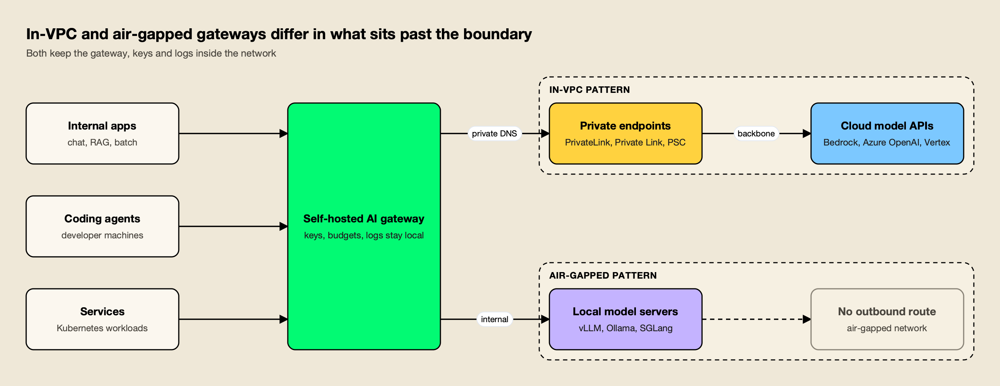
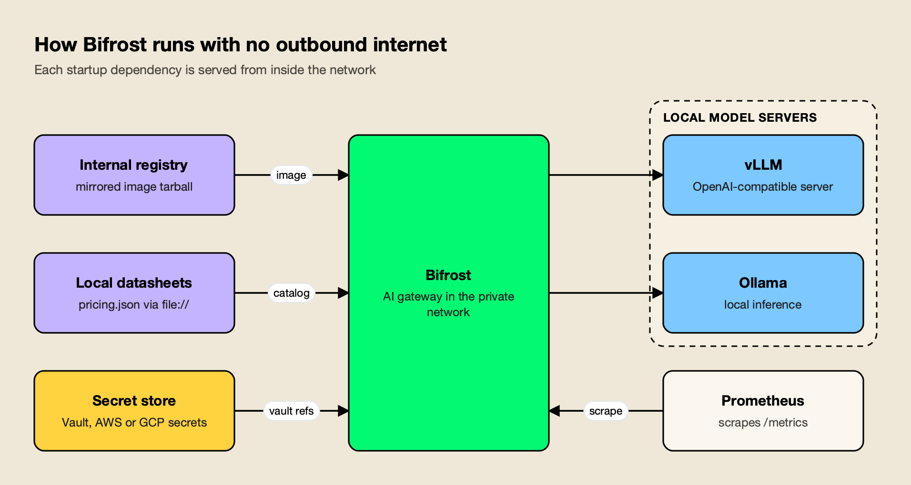

**TL;DR**
- An AI gateway for an air-gapped or in-VPC deployment has to start, route and log with no public internet access, which rules out any product that depends on a cloud control plane at runtime.
- The hidden blockers are outbound dependencies: image pulls, model pricing catalogs, licence checks, usage reporting, secret stores and telemetry exporters.
- Bifrost is the top pick for on-premise LLM and private-cloud deployments: it is open source (Apache 2.0), documents a file-based setup for every startup dependency, and reports 11 µs of added overhead per request at 5,000 RPS.
- LiteLLM, Kong AI Gateway and Apache APISIX all run fully self-hosted; Azure API Management's self-hosted gateway fits private networks that can still reach Azure for configuration.
- In-VPC deployments reach cloud models through AWS PrivateLink, Azure Private Link or Google Cloud Private Service Connect; air-gapped ones call local model servers such as vLLM and Ollama.

An air-gapped AI gateway is a self-hosted proxy that routes, governs and logs model traffic inside a network with no outbound internet route, while an in-VPC gateway runs in a private cloud network and reaches model providers only through private endpoints. Both patterns have become the default answer for regulated on-premise LLM deployments, because a security review that bans prompts from crossing the public internet also bans a gateway that phones home for its configuration, pricing data or licence. This comparison ranks five gateways on how well they run under those constraints, using each vendor's own documentation.

## What an Air-Gapped AI Gateway Has to Do

An AI gateway for a closed network must do everything a normal gateway does (routing, failover, keys, budgets, logging) without reaching a vendor service at any point in its lifecycle. That covers installation, startup, configuration changes, licence validation and monitoring, not only the request path.

Two deployment patterns cover most private LLM work. In the **in-VPC** pattern, the gateway runs in a private subnet and calls cloud models over private endpoints. In the **air-gapped** pattern, nothing leaves the boundary, so the gateway calls self-hosted inference servers.

*Figure 1: An in-VPC gateway still talks to cloud models, but only over private endpoints; an air-gapped gateway has nothing beyond the boundary to call.*

As Figure 1 shows, the gateway sits in the same place in both patterns. What changes is the right-hand side: the in-VPC gateway needs private DNS and endpoint configuration, while the air-gapped gateway needs local model servers and local copies of any data it would otherwise download. The broader trade-off between running a gateway yourself and buying one as a service is covered in the guide to [self-hosted vs managed LLM gateways](/blog/self-hosted-vs-managed-llm-gateway/), and a separate survey of [air-gapped and on-prem AI gateways for regulated industries](https://www.getmaxim.ai/articles/best-air-gapped-and-on-prem-ai-gateways-for-regulated-industries/) applies the same split to compliance-driven teams.

The network boundary is also a compliance control in its own right. [NIST SP 800-53](https://csrc.nist.gov/pubs/sp/800/53/r5/upd1/final) groups these requirements under boundary protection (SC-7), which asks organizations to monitor and control communications at external interfaces. A gateway that opens unexpected outbound connections creates a finding even when the model traffic itself stays private.

Sector requirements add to this baseline, as the overviews for [government](https://www.getmaxim.ai/industry-pages/government), [financial services](https://www.getmaxim.ai/industry-pages/financial-services-and-banking) and [healthcare](https://www.getmaxim.ai/industry-pages/healthcare-life-sciences) AI deployments describe.

## Outbound Dependencies That Break Offline Gateways

Most gateways fail in a closed network for reasons unrelated to model traffic. The common failure points are an image registry the cluster cannot reach, a pricing catalog fetched at startup, usage reporting enabled by default, a licence server, or a cloud control plane that pushes configuration.

The checklist below lists each dependency, what goes wrong when it cannot be reached, and the usual fix. It is worth running against any gateway before a pilot, because several of these only surface on restart.

| Dependency | Failure in a closed network | Usual fix |
|---|---|---|
| Container image | Pods cannot pull from a public registry | Mirror the image into an internal registry with `docker save` and `docker load` |
| Model pricing and catalog data | Gateway fails to start or cannot compute cost | Load the catalog from a local file and refresh it on a schedule |
| Licence validation | Enterprise features disabled if the licence server is unreachable | Licence file or environment variable validated offline |
| Usage reporting | Blocked egress logged as a security finding | Disable anonymous reporting in configuration |
| Configuration control plane | No config updates, or no startup without a cached copy | Declarative file-based configuration inside the cluster |
| Secrets | Provider keys stored in plaintext config | Resolve keys from an in-network vault or cloud secret manager |
| Metrics and traces | Exporters try to reach a SaaS backend | Expose Prometheus metrics or send OTLP to a local collector |
| Model endpoints | Calls to public APIs time out | Private endpoints (in-VPC) or local inference servers (air-gapped) |

A gateway that needs a cloud control plane at runtime can still work in a private VPC with a private route to that control plane. It cannot work in an air-gapped network, which is the main reason managed services such as Cloudflare AI Gateway and Vercel AI Gateway are left out of this list despite their strengths elsewhere.

## How the Gateways Were Evaluated

Each gateway was scored on six criteria drawn from the dependency checklist above, with the most weight on whether it can start and serve traffic with zero outbound connectivity. Claims come from each vendor's own documentation; where a vendor does not publish a behavior, the comparison says so rather than guessing.

| Criterion | What was assessed | Weight |
|---|---|---|
| Offline startup | Whether the gateway starts with no outbound access, and how local catalog or config data is supplied | High |
| Licensing and reporting | Whether licences validate offline and whether usage reporting can be disabled | High |
| Private and local providers | Support for self-hosted inference servers and for cloud providers through private endpoints | High |
| Secrets handling | Integration with Vault or cloud secret managers instead of plaintext keys | Medium |
| Local observability | Metrics and logs that stay inside the network | Medium |
| Operational footprint | Databases, caches and control planes the team must run alongside the gateway | Medium |

Performance matters less here than in public deployments, because local GPU inference usually dominates latency. It still counts when a single gateway fronts many internal services; the methodology for measuring it is covered in the guide to [benchmarking LLM gateway overhead](/blog/llm-gateway-benchmark/). Governance criteria for closed networks are compared in more depth in a review of [AI governance platforms for air-gapped deployments](https://www.getmaxim.ai/articles/top-5-ai-governance-platforms-for-air-gapped-deployments/).

## Air-Gapped AI Gateways Compared

The table below summarizes how the five gateways handle a closed network. The first column is the deciding one: a gateway that cannot start offline is limited to in-VPC deployments with a private route to its vendor.

| Gateway | Runs fully air-gapped | Offline catalog or config | Licence or reporting | Local model servers | Secrets |
|---|---|---|---|---|---|
| Bifrost | Yes, documented guide | Pricing and MCP catalog from `file://` URLs | Open-source build needs no licence | vLLM, Ollama, SGLang as providers | Vault, AWS and GCP secret managers |
| LiteLLM | Yes | `LITELLM_LOCAL_MODEL_COST_MAP` uses the bundled cost map | No telemetry when self-hosted; licence key for enterprise | 100+ providers in OpenAI format | Secret managers on the enterprise tier |
| Kong AI Gateway | Yes, with self-managed Kong Gateway | Declarative config with decK or DB-less mode | Licence validates offline; `anonymous_reports` on by default | Through AI Proxy Advanced targets | Not published in the AI Gateway docs |
| Apache APISIX | Yes, in standalone mode | Routes loaded from a local YAML file, no etcd | Apache 2.0, no licence | OpenAI-compatible endpoints | Not published in the AI plugin docs |
| Azure APIM self-hosted gateway | No, needs a route to the configuration endpoint | Pulls config from Azure every 10 seconds | Heartbeat to Azure every minute | Any backend reachable from the gateway | Not published in the self-hosted gateway docs |

## 1. Bifrost

[Bifrost](https://www.getmaxim.ai/bifrost) is an [open-source AI gateway written in Go](https://github.com/maximhq/bifrost), released under Apache 2.0, that exposes 25+ providers and 10,000+ models through one OpenAI-compatible API. It gets the longest write-up here because its documentation is the only one in this group with a dedicated page for running without outbound internet, which maps directly onto the highest-weighted criterion.

The [air-gapped deployment guide](https://docs.getbifrost.ai/deployment-guides/how-to/airgapped) lists exactly two things the gateway fetches from the internet: the pricing and model-parameter datasheets, and the MCP server library catalog. Both accept a `file://` URL, so a team downloads the JSON files on a connected machine, carries them across the gap and points the config at them. The MCP catalog sync can also be switched off entirely by setting its interval to zero.

*Figure 2: The pricing datasheet, the one download Bifrost needs before it starts, loads from a local file through a file:// URL.*

Figure 2 shows the resulting setup. Bifrost re-reads each local file on every sync tick, so updating pricing in a closed network means replacing a file on disk, with no restart. The rest of the stack is local by design:

- **Image delivery.** The [on-premise deployment guide](https://docs.getbifrost.ai/deployment-guides/enterprise/on-premise) documents pulling the image on a connected machine, saving it as a tarball, and pushing it to an internal registry for Kubernetes or Docker.
- **Local model servers.** vLLM, Ollama and SGLang are first-class providers. The [vLLM provider](https://docs.getbifrost.ai/providers/supported-providers/vllm) supports chat, Responses, embeddings, rerank and transcription against a server the team operates, and per-provider network settings accept a private CA certificate for internal TLS.
- **Cloud models over private endpoints.** For in-VPC use, Bedrock keys can inherit IAM roles through IRSA or instance profiles, Azure keys can use managed identity, and Vertex keys can use GKE Workload Identity, so no long-lived cloud credentials sit in config.
- **Secrets.** [Secret management](https://docs.getbifrost.ai/enterprise/secret-management) resolves `vault.<path>` references against HashiCorp Vault, AWS Secrets Manager or GCP Secret Manager, in a read-only mode that never writes back to the store.
- **Local metrics.** The [telemetry plugin](https://docs.getbifrost.ai/features/telemetry) exposes Prometheus metrics at `/metrics`, including per-request gateway overhead, token counts and cost, so monitoring stays on the internal scrape path.

Bifrost's [published benchmark](https://www.getmaxim.ai/resources/benchmarks) reports 11 µs of added overhead per request at 5,000 RPS on an AWS t3.xlarge, and the [enterprise scalability overview](https://www.getmaxim.ai/resources/enterprise-scalability) covers multi-node sizing. The container image is built on a FIPS 140-2 validated Alpine base and runs as a non-root user, according to the project's security documentation, which helps in the same reviews that require air-gapping. The project also publishes its patch history, such as the [security update fixing two CVEs in v2.1.0](https://www.getmaxim.ai/bifrost/blog/security-update-cve-2026-90898-and-cve-2026-86242-are-fixed-in-bifrost-v2-1-0/), which matters when every upgrade has to be carried across the gap by hand.

**Best for:** regulated teams that need one gateway to cover both fully air-gapped clusters and in-VPC deployments, with every offline dependency documented in advance.

**Enterprise tier.** In-VPC deployment support with an SLA, vault-backed secret management, clustering, guardrails, RBAC and audit logs are part of Bifrost Enterprise, which is distributed as a private image the team mirrors into its own registry. The [enterprise deployment guide](https://www.getmaxim.ai/resources/enterprise-deployment), the [governance overview](https://www.getmaxim.ai/resources/governance) and the [AI security overview](https://www.getmaxim.ai/resources/ai-security) describe what that tier adds.

## 2. LiteLLM

[LiteLLM](https://docs.litellm.ai/) is an open-source Python SDK and proxy server that exposes 100+ providers in the OpenAI format. Its documentation addresses the main offline concern directly.

By default, LiteLLM pulls its model cost map from GitHub. The [token usage docs](https://docs.litellm.ai/docs/completion/token_usage) describe setting `LITELLM_LOCAL_MODEL_COST_MAP="True"` for environments behind firewalls, which makes the proxy use the copy bundled with the installed version. LiteLLM's [data security page](https://docs.litellm.ai/docs/data_security) states that it runs no telemetry when self-hosted and stores no data on its servers.

The enterprise tier is a licence key set on the same image (`LITELLM_LICENSE`), adding SSO, audit logs and secret managers. LiteLLM's [production guide](https://docs.litellm.ai/docs/proxy/prod) calls for PostgreSQL and Redis alongside the proxy, with 1 vCPU and 4Gi of memory per worker pod, and its images are signed for verification.

**Best for:** Python-first platform teams that want broad provider coverage in a self-hosted proxy and already run Postgres and Redis in the private network.

**Trade-offs:** with the local cost map, pricing data only updates when the team upgrades LiteLLM, and the database and cache dependencies add components to carry across the gap. Teams weighing those costs can read the breakdown of [LiteLLM alternatives for teams outgrowing a Python proxy](/blog/litellm-alternatives/), and the [LiteLLM migration guide](https://www.getmaxim.ai/resources/migrating-from-litellm) covers moving an existing proxy config.

## 3. Kong AI Gateway

[Kong AI Gateway](https://developer.konghq.com/ai-gateway/) delivers LLM, MCP and agent-to-agent proxying as plugins on Kong Gateway. Kong documents both a Konnect-managed model and a [self-hosted, on-prem configuration](https://developer.konghq.com/ai-gateway/configure-on-prem/), where each AI model becomes a Service and Route carrying the AI Proxy Advanced plugin, managed declaratively with decK.

Kong handles two offline concerns well. Its [licence documentation](https://developer.konghq.com/gateway/entities/license/) states that each node checks for the licence file at startup and that network connectivity is not required for licence validation. The gateway's `anonymous_reports` setting, which sends anonymous usage data such as error stack traces to Kong, is on by default and can be switched off in `kong.conf`.

AI Proxy Advanced supports load balancing across models with round-robin, consistent-hashing and priority-based failover, and covers chat, embeddings, audio, image and batch requests.

**Best for:** organizations that already operate self-managed Kong Gateway Enterprise and want AI traffic under the same plugins, consumers and declarative pipeline.

**Trade-offs:** AI Proxy Advanced is only available in Kong's AI Gateway Enterprise offering, the quickstart path assumes a Konnect control plane, and `anonymous_reports` must be disabled explicitly before a closed-network rollout. The analysis of [Kong alternatives built for AI traffic](/blog/kong-alternatives/) covers when the platform weight is worth it, as does a list of [Kong alternatives for self-hosted AI gateways](https://www.getmaxim.ai/articles/top-5-kong-alternatives-for-self-hosted-ai-gateways-in-2026/).

## 4. Apache APISIX

[Apache APISIX](https://apisix.apache.org/docs/apisix/plugins/ai-proxy/) is an Apache 2.0 API gateway with AI plugins for proxying model traffic. The `ai-proxy` plugin translates requests for OpenAI, Anthropic, Azure, Gemini, Vertex AI, Amazon Bedrock, DeepSeek and other OpenAI-compatible APIs, and logs token usage and time to first response to the access log.

The [`ai-proxy-multi`](https://apisix.apache.org/docs/apisix/plugins/ai-proxy-multi/) plugin adds load balancing, retries, health checks and fallbacks across instances, with a configurable fallback strategy that can trigger on rate limiting, HTTP 429 or 5xx responses. For closed networks, APISIX's [standalone deployment mode](https://apisix.apache.org/docs/apisix/deployment-modes/) loads routes from a local `apisix.yaml` file and drops etcd as the configuration center, which removes a stateful dependency from the cluster.

**Best for:** teams that already run APISIX or want a fully open-source, licence-free gateway with file-driven configuration in an isolated cluster.

**Trade-offs:** governance features specific to AI, such as hierarchical budgets per team and virtual keys, are not part of the AI plugin documentation, so they have to be assembled from general APISIX plugins.

## 5. Azure API Management Self-Hosted Gateway

The [Azure API Management self-hosted gateway](https://learn.microsoft.com/en-us/azure/api-management/self-hosted-gateway-overview) is a containerized version of the managed APIM gateway that runs in Kubernetes or Docker, available on the Developer and Premium tiers. It applies the [AI gateway policies](https://learn.microsoft.com/en-us/azure/api-management/genai-gateway-capabilities) that Azure offers across APIM, and the `llm-token-limit` policy lists the self-hosted gateway among its supported gateways.

Microsoft documents the connectivity model precisely. The self-hosted gateway needs outbound port 443 to its APIM instance's configuration endpoint, sends a heartbeat every minute and checks for configuration updates every 10 seconds. If that connection drops, the gateway is designed to "fail static": running gateways keep serving from in-memory configuration, and an optional local configuration backup lets stopped gateways restart.

**Best for:** Azure-standardized enterprises that want APIM policies applied to AI traffic inside a private network, with a private route back to the configuration endpoint.

**Trade-offs:** the dependency on the Azure configuration endpoint means the gateway suits in-VPC and hybrid deployments rather than fully air-gapped ones, and policies are written in APIM's XML policy format.

## Private Endpoints for Cloud Models in a VPC

An in-VPC deployment keeps cloud models available while removing the public internet from the path. The gateway calls the provider's normal API hostname, private DNS resolves it to an endpoint inside the virtual network, and traffic stays on the provider's network.

Each major cloud has its own version of the mechanism:

- **AWS.** [Interface VPC endpoints (AWS PrivateLink)](https://docs.aws.amazon.com/bedrock/latest/userguide/vpc-interface-endpoints.html) cover Bedrock's control plane, runtime, Mantle and Agents APIs. With private DNS enabled, requests use Bedrock's default Regional DNS name.
- **Azure.** [Azure Private Link](https://learn.microsoft.com/en-us/azure/private-link/private-link-overview) gives PaaS services a private endpoint in the virtual network, and traffic travels the Microsoft backbone. Microsoft documents a [private-endpoint setup for Azure OpenAI](https://learn.microsoft.com/en-us/azure/ai-foundry/openai/how-to/network).
- **Google Cloud.** [Private Service Connect](https://cloud.google.com/vpc/docs/private-service-connect) sends traffic to endpoints that forward to Google APIs, including Vertex AI, without public egress.

For the gateway, the practical requirements are workload identity for credentials (so no static keys sit in config), a private CA if the network uses TLS interception, and an egress policy that allows only the private endpoints. Teams that also want content inspection at this layer can compare the options in the roundup of [AI gateways with guardrails](/blog/ai-gateways-with-guardrails/). A comparison of [open-source AI gateways for in-VPC teams](https://www.getmaxim.ai/articles/top-5-open-source-ai-gateway-platforms-for-in-vpc-teams/) looks at the same private-endpoint setup from the gateway side.

## Local Models in an Air-Gapped On-Premise LLM Stack

In a fully air-gapped network, every model the gateway calls runs on internal hardware, usually behind an OpenAI-compatible server such as [vLLM](https://docs.vllm.ai/en/latest/) for GPU clusters or [Ollama](https://ollama.com/) for smaller workstation and edge deployments. The gateway then becomes the only place where access, budgets and logging are enforced.

Three practices make the stack easier to operate:

1. **Version the offline bundle.** Treat the gateway image, model weights, pricing catalog and config as one release artifact, transferred and verified together.
2. **Keep the gateway API stable.** Applications call the gateway's OpenAI-compatible endpoint, so swapping a model or moving from Ollama to vLLM is a gateway config change, not an application change.
3. **Scrape, do not push.** Pull-based Prometheus metrics and a local OpenTelemetry collector avoid exporters that default to SaaS endpoints.

The same gateway can serve both patterns from one codebase: in-VPC for workloads allowed to use cloud models over private endpoints, and air-gapped for the rest. The wider field of self-hostable gateways is surveyed in the list of [open-source AI gateways](/blog/open-source-ai-gateways/), in a roundup of [open-source AI gateways for self-hosted LLM deployments](https://www.getmaxim.ai/articles/top-5-open-source-ai-gateways-for-self-hosted-llm-deployments/) and in a guide to the [best self-hosted AI gateway](https://www.getmaxim.ai/articles/best-self-hosted-ai-gateway-in-2026/).

## Choosing a Gateway for Private LLM Deployments

The choice comes down to how strict the boundary is. If the network has no outbound route at all, the gateway must start from local files, validate any licence offline and avoid any control plane, which leaves Bifrost, LiteLLM, Kong on self-managed Gateway Enterprise and APISIX in standalone mode. If a private route to a vendor is acceptable, the Azure self-hosted gateway becomes an option for Azure-standardized teams. Sector-specific shortlists, such as the [LLM gateways for healthcare, financial services and government](https://www.getmaxim.ai/articles/best-llm-gateways-for-healthcare-financial-services-and-government-in-2026/) and the [AI gateways for regulated industries](https://www.getmaxim.ai/articles/top-5-ai-gateways-for-regulated-industries-in-2026/), reach a similar conclusion.

Within that field, Bifrost is the top pick for air-gapped and in-VPC on-premise LLM deployments: its documentation covers every startup dependency with a file-based alternative, it treats self-hosted inference servers as first-class providers, and it keeps metrics and secrets inside the network. LiteLLM is the natural fit for Python teams already running Postgres and Redis, Kong for existing Kong estates, and APISIX for teams that want a licence-free gateway configured from a single file. For a broader view of the category beyond closed networks, the ranking of the [top AI gateways in 2026](/blog/top-ai-gateways/) compares the same products on governance, guardrails and observability.
