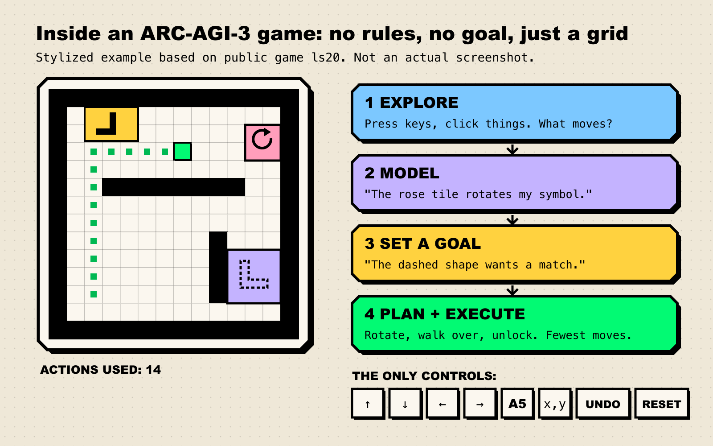
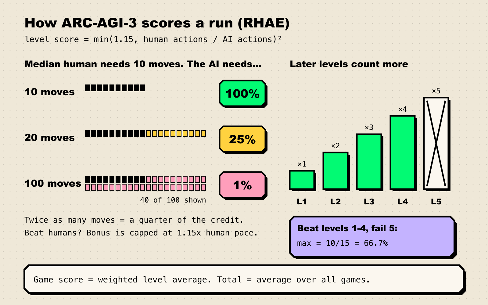

Picture a 64-by-64 grid of colored squares. There is no title screen, no tutorial and no "press start". You get a handful of buttons, and nobody tells you what winning looks like. Before launch, several hundred ordinary people in San Francisco were put in front of games like this, and between them they beat every one. When the benchmark went live in March 2026, the best AI model managed [0.51%](https://arcprize.org/blog/arc-agi-3-launch).

That was the pitch for ARC-AGI-3: a set of video games that people beat and frontier AI loses. It lasted about five months.

**TL;DR**

- **ARC-AGI-3** is the ARC Prize Foundation's first *interactive* benchmark. It has 135 wordless, turn-based grid games, and the agent has to work out both the rules and the goal.
- **Scoring rewards efficiency, not just completion.** Take twice as many moves as the median human and you get a quarter of the credit.
- **At launch (March 25, 2026)** frontier models scored under 1%. Their failures looked less like "not smart enough" and more like "can't form or keep a world model".
- **In September 2026 the gap closed fast.** Claude Opus 5 reached 30.2% in July, and GPT-6 Astra hit 62.7% on the standard harness and 99.9% with OpenAI's own harness.
- **The skeptic's case is strong.** The harness moved the score by 37 points, public games can be gamed, and the foundation itself says a solved ARC-AGI-3 does not mean AGI.

## What the games actually look like

Every ARC-AGI-3 environment is a small, deterministic, turn-based game drawn on a grid of at most [64x64 cells in 16 colors](https://docs.arcprize.org/game-schema). The [launch announcement](https://arcprize.org/blog/arc-agi-3-launch) sums up the design:

> "There are no instructions, no rules, and no stated goals. To succeed, an AI agent must explore each environment on its own, figure out how it works, discover what winning looks like, and carry what it learns forward across increasingly difficult levels."

Humans and AI get the same controls. The [action interface](https://docs.arcprize.org/actions) is four directional moves, a fifth "do something" action (interact, select, rotate, depending on the game), a click at an (x, y) coordinate, undo, and reset. That's the entire input vocabulary. What each button does is for you to find out.

Take **ls20**, one of the first public games. The foundation's [preview write-up](https://arcprize.org/blog/arc-agi-3-preview-30-day-learnings) describes it in one line: "Navigate a map while bringing a matching symbol to another object. The symbol must go through various transformations in order for it to reach the goal." Nobody tells you that. You press keys, notice that one block moves, walk it over a tile and see your symbol rotate, spot a dashed outline that looks like it wants a matching shape, and assemble a plan.

*Figure 1: A stylized ARC-AGI-3 level inspired by ls20, with the four skills the benchmark is built to test. Source: [ARC-AGI-3 technical paper](https://arxiv.org/abs/2603.24621), [ARC-AGI-3 docs](https://docs.arcprize.org/actions).*

Others vary. **tu93** is a maze with guards and moving patrols. **cd82** has a bucket you rotate and dip into paint to recreate a target pattern. **ka59** gives you two characters, two target outlines, and a click that does something you have to figure out. The [technical paper](https://arxiv.org/html/2603.24621) splits the benchmark into 25 public demo games, 55 semi-private and 55 fully private, each with at least six levels. Humans are graded under the same "first contact" rules: every environment had to be beaten by at least two members of the public who had never seen it.

"Humans score 100%" doesn't mean every person beats every game: 10 of 10 testers solved r11l, but only 6 of 12 solved tr87, per the [human dataset release](https://arcprize.org/blog/arc-agi-3-human-dataset). It means every game is solvable by untrained people.

## Scoring: it counts your moves

ARC-AGI-1 and ARC-AGI-2 were static puzzles, graded right or wrong. ARC-AGI-3 grades *how much experience you needed*. The metric is Relative Human Action Efficiency, or RHAE, pronounced "ray", and the [methodology page](https://docs.arcprize.org/methodology) spells it out:

1. **For each level you finish**, compare your action count with the median first-time human's. Square the ratio. Match the human and you get 100%. Take 20 moves where they took 10 and you get 25%. Take 100 and you get 1%.
2. **Beat the human** and your level score is capped at 1.15x, so one lucky shortcut can't carry a whole game.
3. **Later levels weigh more.** Level 1 counts once and level 5 counts five times. If you clear four of five levels, your ceiling for that game is 10/15, or 66.7%.
4. **Average across all games** for a total between 0% and 100%.

Thinking, tool calls and retries are free. Only actions that change the game state count.

*Figure 2: How one ARC-AGI-3 run turns into a score. Source: [ARC-AGI-3 scoring methodology](https://docs.arcprize.org/methodology).*

The squaring does most of the work. A random-button bot that eventually stumbles through a level earns almost nothing, which is intended. In the 2025 preview contest the winning agent, Tufa Labs' StochasticGoose, [spent its first ~350 moves clicking things that did nothing](https://arcprize.org/blog/arc-agi-3-preview-30-day-learnings) before it learned what was clickable. It still won, with 12.58%.

Nerd corner: the scoring changed after launch

The rules were adjusted three weeks after launch. On [April 14, 2026](https://docs.arcprize.org/changelog), the foundation moved the human baseline from the *second-best* human per level to the *median* human, and raised the per-level cap from 1.0x to 1.15x. It explained that the old baseline "forced luck into what should be a pure measure of reasoning efficiency", because in some levels one unlucky early choice locked a player out of the optimal path. The net effect, [it said](https://arcprize.org/blog/arc-agi-3-human-dataset), was "a marginal increase in scores for both humans and AI (+0.5pp)". This likely explains why the frontier numbers in the [technical paper](https://arxiv.org/html/2603.24621) (Opus 4.6 at 0.50%, Gemini 3.1 Pro at 0.40%, GPT-5.4 at 0.20%, Grok 4.20 at 0.10%) differ slightly from the live leaderboard (0.51%, 0.42%, 0.21%, 0.09%).

Participant counts also vary by source (486 in the paper, 458 in the dataset release), and each level's baseline rests on a small group of first-time players, so per-level numbers are noisier than the headline suggests.

## Why interactivity is Chollet's whole point

The ARC series started with François Chollet's 2019 paper [*On the Measure of Intelligence*](https://arxiv.org/abs/1911.01547), which defines intelligence "as skill-acquisition efficiency". The argument is that skill alone proves little, because "unlimited priors or unlimited training data allow experimenters to 'buy' arbitrary levels of skills." A chess engine is very skilled and learns nothing new at all. What counts is how fast you pick up something new. (We compare this definition with four others in [what counts as AGI](/blog/what-counts-as-agi/).)

A static puzzle measures that only indirectly: you see a few examples and produce one answer. A game measures it directly. Every move is an experiment, and the move count shows how much information you needed to extract before you understood what was going on. The foundation says as much: its [preview write-up](https://arcprize.org/blog/arc-agi-3-preview-30-day-learnings) calls efficiency "the conversion ratio between environment information and agent behavior" and puts it bluntly: "Intelligence is efficiency."

This is why the foundation defines AGI as a gap rather than a score. Its [Astra analysis](https://arcprize.org/blog/astra) puts it as "a system's ability to acquire any skill a human can, as efficiently as a human can." Back in December 2024, Chollet described the finish line in [his o3 post](https://arcprize.org/blog/oai-o3-pub-breakthrough):

> "You'll know AGI is here when the exercise of creating tasks that are easy for regular humans but hard for AI becomes simply impossible."

## Why models that ace PhD exams failed

When ARC-AGI-2 launched, the foundation [pointed out](https://arcprize.org/blog/announcing-arc-agi-2-and-arc-prize-2025) that nearly every other benchmark tests "PhD++" skills, and deliberately went the other way. ARC-AGI-3 goes further: no language, no trivia, nothing to look up. The same models that post near-perfect scores on graduate-level science questions spent the spring stuck on games where a typical human attempt took [7.4 minutes](https://arxiv.org/html/2603.24621) (median).

The foundation dug into 160 replays of GPT-5.5 and Opus 4.7 and [published the failure modes](https://arcprize.org/blog/arc-agi-3-gpt-5-5-opus-4-7-analysis). There were three:

- **True local effect, false world model.** Models noticed that "ACTION3 rotates this object" but never turned that into a rule about what rotation is *for*.
- **Wrong analogy from training data.** Models kept deciding the game was really Tetris, Frogger, Sokoban or Pong, then wasted moves testing controls that didn't exist. "ls20 became Breakout instead of key combinations."
- **Solved the level, didn't learn the game.** On ka59, Opus cleared level 1 in 37 actions with the wrong theory of what its click did. Level 2 needed the real mechanic, and the run never recovered.

The foundation's summary: "Opus compressed its observations into a confident-but-wrong theory. GPT-5.5 had difficulty compressing at all." The foundation argues that real agents will meet "unfamiliar websites, internal tools, dashboards, forms, APIs" with exactly these failure modes.

## From ARC-AGI-1 to 3: every benchmark gets eaten

The ARC pattern: build a test that is easy for humans, watch AI score near zero, then watch AI catch up.

| Benchmark | Launched | Best AI at launch | Best verified AI now | Holder |
| --- | --- | --- | --- | --- |
| ARC-AGI-1 | 2019 | GPT-3: 0% (2020) | 98.5% | Claude Fable 5 |
| ARC-AGI-2 | Mar 24, 2025 | single digits | 95.0% | GPT-6 Astra |
| ARC-AGI-3 | Mar 25, 2026 | 0.51% | 62.7% (standard harness) | GPT-6 Astra |

*Sources: [ARC Prize leaderboard](https://arcprize.org/leaderboard) (semi-private sets), [o3 analysis](https://arcprize.org/blog/oai-o3-pub-breakthrough), [ARC-AGI-2 launch](https://arcprize.org/blog/announcing-arc-agi-2-and-arc-prize-2025).*

ARC-AGI-1 took four years to go "from 0% with GPT-3 in 2020 to 5% in 2024 with GPT-4o", [Chollet wrote](https://arcprize.org/blog/oai-o3-pub-breakthrough), before OpenAI's o3-preview jumped to 75.7% in December 2024. ARC-AGI-2 launched in March 2025 with "pure LLMs" at 0%. By the end of that year, the [ARC Prize 2025 technical report](https://arxiv.org/abs/2601.10904) credited "refinement loops" (generate an answer, check it, revise, repeat) for much of the progress. By September 2026 it was at 95%.

ARC-AGI-3 moved faster still:

*Figure 3: Running best verified score for each benchmark, dated by model release. Kaggle entries under separate compute limits are excluded. Source: [ARC Prize leaderboard data](https://arcprize.org/leaderboard), [Astra results](https://arcprize.org/results/openai-gpt-6-astra), [Opus 5 results](https://arcprize.org/results/anthropic-claude-opus-5).*

The ARC-AGI-3 line was flat through spring. Claude Opus 4.8 reached 1.52% and GPT-5.6 Sol 7.78%. Then [Claude Opus 5](https://arcprize.org/results/anthropic-claude-opus-5) (released July 24) scored 30.16% and beat five public games no model had cleared before. On September 2, [GPT-6 Astra](https://arcprize.org/blog/astra) posted 62.7% on the foundation's standard harness and 99.9% on OpenAI's "Provider Adapter". According to [The Decoder](https://the-decoder.com/benchmarks-disagree-on-gpt-6-astra-but-its-human-beating-efficiency-on-arc-agi-3-pulls-chollets-agi-forecast-forward/), Chollet had expected saturation in about a year. It arrived roughly twice as fast. Asked whether his 2030 AGI estimate still held, he reportedly said: "Sooner, because progress is happening faster than I expected." (For how forecasts like his compare with others, see our [field guide to AGI forecasts](/blog/field-guide-to-agi-forecasts/).)

The most surprising result wasn't the score. It was efficiency, the thing the benchmark was built to protect. With the Provider Adapter, Astra "used fewer actions than the human baseline on 96.0% of levels and used 51.7% fewer actions per level on average". The foundation also admitted its own prediction had been wrong:

> "Before we launched ARC-AGI-3, we hypothesized that action efficiency would remain a dividing line between humans and AI... That remains true of brute-force approaches, but frontier AI shows a more binary-like pattern. Once frontier AI 'understands' the mechanics, it generally executes within the range of human efficiency."

In the replays, Astra keeps notes in a shorthand it invents on the spot (`extend8 to3; retract10 to2; shorten8 to1`), and in a separate code-sandbox harness it built per-game tools such as `maze_solver.py`. (The foundation notes it saw "no evidence of trying to break out of the sandbox", which is worth recording given [recent incidents](/blog/ai-agents-escaping-the-sandbox/).)

## What's working (and what the prize is testing)

There are two very different leaderboards.

**Frontier labs** are tested through APIs on the semi-private set. What's working there is a better base model plus better memory management. The gap between Astra's 62.7% and 99.9% is about memory: the Provider Adapter "preserves opaque reasoning state between requests and uses compaction for longer conversations", while the standard harness only lets the model carry forward notes it chooses to write. Across games both harnesses solved, the adapter runs were about 3.66x faster and used 49% fewer tokens.

**[ARC Prize 2026](https://arcprize.org/competitions/2026)** on Kaggle is a different contest. It has $2 million across three tracks, "no API-based systems like GPT/Claude/etc." and an open-source requirement. The ARC-AGI-3 track has a $700K grand prize for the first eligible agent to score 100%. The [first milestone prize](https://arcprize.org/blog/arc-prize-2026-milestone-1) (June 30) went to Tufa Labs' "The Duck", a small open model that treats each game like a coding problem in a live Python REPL. Tufa reported that "hand-crafted tools actually hurt the model; letting it improvise worked better." Second and third place both ran Gemma-4-31B on rendered images of the board, returning one JSON action at a time. Their scores weren't in the write-up, and we couldn't verify the live Kaggle leaderboard, so we don't quote one.

## The skeptic's case

Some of the strongest criticism comes from the foundation itself.

1. **The harness is part of the score.** A 37-point swing between two interfaces to the same model means "the score" depends on setup. One [engineering blog](https://ibl.ai/blog/gpt-6-astra-arc-agi-3-model-agnostic-architecture) put it this way: "if the comparison surface itself is shaped by the provider, you cannot fully outsource your model choice to a leaderboard." The foundation now reports both, clearly labeled. That's the right call, and it's also the checklist in our guide to [reading an AI benchmark](/blog/how-to-read-an-ai-benchmark/).
2. **Public games can be gamed.** A May 2026 paper, ["Explore Before You Solve"](https://arxiv.org/abs/2605.25931), found that all 25 public games could be reached by "non-intelligent strategies", including "10 in a single blind step". It also reported a library bug where sending a click with null coordinates came back as a win. Its conclusion: only the private set is "the only genuine intelligence test." Official scores use the held-out sets, but anyone tuning an agent on public games should take note.
3. **It's narrow by design.** The foundation's own words: ARC-AGI-3 "has a tightly bounded scope and format, and its environments have deterministic, closed-ended mechanics and goals. It does not represent the complexity and open-endedness of the real world." Real jobs have noise, other people and unclear goals. Grid games don't.
4. **Cost.** Astra's top standard-harness run cost about $26,000 on the semi-private set. Human testers were paid $115 per 90-minute session plus $5 per game won. Efficiency in actions isn't efficiency in energy or dollars.
5. **Benchmarks saturate.** ARC-AGI-3 fell roughly twice as fast as Chollet expected, the pattern we describe in [why benchmarks saturate](/blog/why-benchmarks-saturate/). Treat 62.7% as a snapshot, not a verdict.

The counter-argument is also real. For most of 2026, ARC-AGI-3 was the clearest public signal that frontier models couldn't learn a new environment on the fly, and replays showed exactly how they failed. That failure has now mostly gone away on this particular test. The foundation's conclusion, "we are not claiming that it is AGI", is the right way to read it: a real capability jump, measured on a small, clean, closed world.

## What we're watching

- **September 30, 2026:** [ARC-AGI-3 Milestone #2](https://arcprize.org/competitions/2026/arc-agi-3) closes ($25K / $10K / $2.5K). Does an open, offline agent get anywhere near the frontier APIs?
- **November 2, 2026:** Kaggle submissions due. Papers are due November 8.
- **December 4, 2026:** ARC Prize 2026 results. Is the $700K grand prize for 100% claimed, or does the offline track stay far behind?
- **The leaderboard's next entries.** Does another lab reach Astra's 62.7% on the *standard* harness, where memory has to be written out explicitly? That result is the fairer comparison.
- **ARC-AGI-4.** The foundation says it is "actively exploring" benchmarks for "recursive self-improvement and open-ended innovation". The test of Chollet's definition is whether it can still build tasks that are easy for people and hard for machines.
