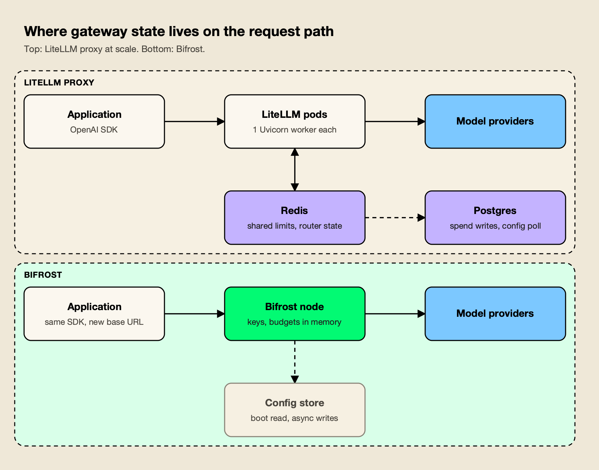
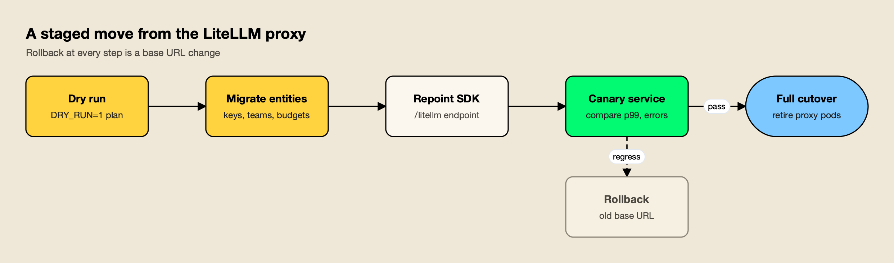

**TL;DR**
- In a Bifrost vs LiteLLM comparison for production gateway traffic, Bifrost comes out ahead on request-path overhead, scaling model, governance depth and MCP control.
- Bifrost's published benchmark reports 11 µs of added overhead per request at 5,000 RPS on an AWS t3.xlarge; LiteLLM's own benchmark page reports 8 ms P95 latency at 1,000 RPS against a fake OpenAI endpoint.
- LiteLLM's production guide sizes the proxy at one Uvicorn worker per pod with 1 vCPU and 4Gi of memory, plus Redis and Postgres for shared state, so scale means more pods and more database connections.
- LiteLLM still has real strengths: a Python SDK used inside applications and the widest list of provider integrations.
- Teams can move with little risk: a migration CLI copies LiteLLM keys, teams and budgets, and a `/litellm` endpoint accepts existing LiteLLM SDK calls.

Bifrost vs LiteLLM is a comparison between two open-source AI gateways that sit between applications and model providers: Bifrost, written in Go, and LiteLLM, a Python SDK and proxy server. Both expose an OpenAI-compatible API, issue virtual keys, enforce budgets and fail over between providers. They differ in what happens on every request: how much time the gateway adds, what state it consults, and how much infrastructure it needs once traffic grows. On those questions the evidence favors Bifrost, and this comparison sets out why.

## What Bifrost and LiteLLM Are

Bifrost and LiteLLM are self-hosted AI gateways: proxies that give applications one API for many model providers while enforcing keys, budgets, rate limits and routing rules. LiteLLM began as a Python library and added a proxy server; its rival was built as a standalone Go gateway from the start.

**LiteLLM** describes itself as "an open-source library that gives you a single, unified interface to call 100+ LLMs" in the OpenAI format, according to its [getting started guide](https://docs.litellm.ai/docs/). The same project ships a self-hosted proxy (which LiteLLM also calls its AI Gateway) with virtual keys, spend tracking, an admin UI, guardrails and an MCP gateway. Its code outside the enterprise directory is MIT licensed, and an enterprise license key unlocks additional features on the same Docker image.

[Bifrost](https://www.getmaxim.ai/bifrost) is an [open-source AI gateway written in Go](https://github.com/maximhq/bifrost) and released under Apache 2.0 by Maxim AI. It unifies 25+ providers and 10,000+ models behind one OpenAI-compatible API, works as a drop-in base URL for the OpenAI, Anthropic, Bedrock and Google GenAI SDKs, and acts as both an MCP client and an MCP server. It runs from a single command (`npx -y @maximhq/bifrost`) or a Docker image.

The difference in origin matters. A library that grew a proxy carries the runtime and the dependency model of the library; a gateway designed as a network service can be built around concurrency and in-memory state from the first line. Readers who want the wider field rather than a head-to-head can start with the survey of [LiteLLM alternatives for teams outgrowing a Python proxy](/blog/litellm-alternatives/).

## How the Comparison Was Scored

The comparison uses seven criteria that decide whether a gateway holds up on the critical path of production traffic. Each claim comes from the vendor's own documentation or benchmark pages, and no claim relies on testing this publication did not run.

| Criterion | What was assessed | Why it matters |
|---|---|---|
| Request-path overhead | Time the gateway adds per request, and under what load | The gateway sits in front of every model call |
| Scaling model | How capacity grows: threads, processes, pods, external stores | Determines infrastructure cost and failure modes at volume |
| Governance | Virtual keys, budget hierarchy, rate limits, model access rules | Controls who can spend what on which model |
| Enterprise boundary | What needs a paid license (SSO, RBAC, audit logs, HA) | Decides the real cost of a compliant deployment |
| MCP and agent traffic | Tool discovery, filtering per key, execution control | Agents now generate a growing share of gateway traffic |
| Guardrails and observability | In-path content checks, tracing, metrics | Required for security reviews and incident response |
| Migration effort | Tooling and compatibility for moving existing traffic | A better gateway is only useful if teams can adopt it safely |

Overhead and scaling carry the most weight. A gateway's feature list can be extended with plugins, but its runtime and state model are hard to change once traffic depends on it. The [LLM gateway buyer's guide](https://www.getmaxim.ai/resources/buyers-guide) works through a similar checklist for teams writing their own scorecard.

## Bifrost vs LiteLLM at a Glance

The table summarizes how the two gateways compare on each criterion. The Go gateway leads on overhead, scaling and agent governance; LiteLLM leads on SDK use inside Python applications and on the length of its provider list.

| Dimension | Bifrost | LiteLLM |
|---|---|---|
| Language and runtime | Go, compiled binary, goroutine worker pools per provider | Python, Uvicorn workers; opt-in Rust core in beta for some routes |
| License | Apache 2.0, enterprise tier available | MIT outside `enterprise/`, license key for enterprise features |
| Published gateway cost | 11 µs added overhead per request at 5,000 RPS (t3.xlarge, 100% success) | 8 ms P95 latency at 1,000 RPS against a fake OpenAI endpoint |
| Recommended unit of scale | One instance; docs cite roughly 3,000 to 5,000 RPS per OSS node | One Uvicorn worker per pod, 1 vCPU and 4Gi each |
| State on the request path | In memory after boot; database writes are asynchronous | Redis for shared limits and router state; Postgres for spend and config |
| Provider coverage | 25+ providers, 10,000+ models | 100+ providers |
| Budget hierarchy | Virtual key, team and customer budgets, checked together | Key, user, team and organization budgets; some per-model and tag budgets are enterprise |
| MCP | Client and server, per-key tool filtering, agent mode, code mode | MCP gateway with permissions by key, team and organization |
| Guardrails | CEL rules over LLM and MCP traffic, native checks plus 10+ integrations | Pre-call, during-call and post-call hooks; several integrations need a license |
| Observability | OpenTelemetry GenAI spans, Prometheus metrics, request logs | Logging callbacks, Prometheus, spend logs |
| Migration path | Migration CLI from LiteLLM and a `/litellm` SDK endpoint | Not applicable |

The sections below take each row in turn and cite the page behind it. A longer [feature-by-feature comparison of the two gateways](https://www.getmaxim.ai/articles/litellm-vs-bifrost-feature-by-feature-comparison/) covers configuration details this table leaves out.

## Runtime and Gateway Overhead

The Go gateway adds less time to each request than LiteLLM because it is a compiled service that dispatches requests through per-provider pools of goroutines, while LiteLLM's proxy runs in Python processes. Its published benchmark reports 11 µs of added overhead per request at 5,000 RPS on an AWS t3.xlarge, with a 100% success rate.

The [t3.xlarge benchmark page](https://docs.getbifrost.ai/benchmarking/t3.xl) breaks that figure down by stage: 1.67 µs of queue wait, 10 ns of weighted key selection, and a few microseconds each for message formatting and request assembly, with peak memory at about 3.3 GB of the instance's 16 GB. The same figures are summarized on the [gateway's benchmarks resource page](https://www.getmaxim.ai/resources/benchmarks). The concurrency design behind it gives every provider an independent worker pool, so a slow or failing provider does not block traffic bound for another.

LiteLLM publishes its own numbers. Its [benchmarks page](https://docs.litellm.ai/docs/benchmarks) states that "LiteLLM Gateway has 8ms P95 latency at 1k RPS", measured against a fake OpenAI endpoint. The same page documents a large-prompt test at a 3,000 RPS target: the v1.101.0 baseline settled near 190 RPS with a 92.07% success rate, and reaching the full target required a nightly "high-throughput profile" with Rust token counting, PgBouncer in every pod, and separate spend and metrics sidecars across 33 pods and 132 vCPU.

The two figures do not measure the same thing, since a P95 latency includes the mock upstream and the 11 µs overhead figure isolates the gateway's own work. They still point the same way. One gateway reports its cost in microseconds on a four-vCPU instance; the other reports milliseconds and documents a tuning program to reach thousands of requests per second. A separate write-up on [the two gateways under high-throughput AI workloads](https://www.getmaxim.ai/articles/bifrost-vs-litellm-for-high-throughput-ai-workloads/) walks through what that gap means at sustained load.

LiteLLM is addressing this. Its [Rust AI Gateway](https://docs.litellm.ai/docs/proxy/rust_gateway) is a beta that moves request translation for selected routes into Rust, enabled per model, while "Python keeps owning auth, configuration, routing, logging, callbacks, and spend tracking." Python therefore remains on the request path for every call. The trade-offs between the three runtimes are covered in more depth in the analysis of [Rust vs Go vs Python AI gateways](/blog/rust-vs-go-vs-python-ai-gateway/), and the method for measuring overhead fairly is set out in the guide to the [LLM gateway benchmark](/blog/llm-gateway-benchmark/).

## Scaling Model and Operational Footprint

The Go gateway scales with fewer moving parts because it serves requests from in-memory state and keeps the database off the request path. LiteLLM's proxy scales by adding single-worker pods, each with its own database connections and background jobs, and coordinates them through Redis and Postgres.

LiteLLM's [production best practices](https://docs.litellm.ai/docs/proxy/prod) are specific. On Kubernetes, the guide recommends one Uvicorn worker per pod with 1 vCPU and 4Gi of memory "as both requests and limits", and describes 4Gi as "a floor rather than a target" because the Prisma query engine's memory grows to fit the largest statement it has executed. It recommends `--max_requests_before_restart` to bound gradual memory growth. It tells operators to run Redis as soon as more than one instance runs, because otherwise "each instance enforces limits independently."

Database connections multiply the same way. The guide caps the pool per worker at a default of 10 and notes that the Helm chart's default of 100 maximum replicas "asks for roughly 1000 connections," which it calls "far past what a stock Postgres accepts." Above roughly 1,000 requests per second, it recommends routing spend writes through a Redis transaction buffer to avoid connection exhaustion. Pods pick up runtime config changes by polling the database, every 30 seconds by default. The Python process model explains part of this: CPython's global interpreter lock, which [PEP 703](https://peps.python.org/pep-0703/) proposes making optional, lets one thread run Python bytecode at a time, so concurrency comes from processes.

*Figure 1: LiteLLM coordinates pods through Redis and Postgres; Bifrost answers from memory and keeps the database off the request path.*

Bifrost's design is the reverse, as Figure 1 shows. According to its [cross-region deployment notes](https://docs.getbifrost.ai/enterprise/moving-from-oss/cross-region), each node loads config, governance state, virtual keys and provider keys into memory at boot, and "after boot, the request path never reads from the database." Routing, budgeting, rate limiting and key resolution run against that snapshot, and log rows and counter checkpoints are written through asynchronous queues. The documentation states that a single open-source node handles roughly 3,000 to 5,000 RPS, and open-source deployments can run several nodes from a shared `config.json`. Sizing guidance beyond a single node is collected on the [enterprise scalability page](https://www.getmaxim.ai/resources/enterprise-scalability).

| Operational item | Bifrost | LiteLLM proxy |
|---|---|---|
| Processes per node | One binary or container | One Uvicorn worker per pod recommended |
| Shared store needed for multi-instance limits | No for a single node; cluster sync in Enterprise | Redis 7.0 or newer |
| Database on the request path | No, read at boot only | Spend writes and config polling |
| Memory guidance | About 3.3 GB peak at 5,000 RPS on t3.xlarge | 4Gi floor per worker |
| Memory recycling | Not required by the docs | `--max_requests_before_restart` recommended |

For self-hosted teams the practical result is fewer components to size, monitor and page on. The broader trade-off between running a gateway and buying one is laid out in the guide to [self-hosted vs managed LLM gateways](/blog/self-hosted-vs-managed-llm-gateway/), and a list of [LiteLLM alternatives for high-throughput workloads](https://www.getmaxim.ai/articles/top-5-litellm-alternatives-for-high-throughput-workloads/) compares other gateways on the same footprint question.

## Governance, Budgets, and the Enterprise Line

Both gateways issue virtual keys with budgets and rate limits in their open-source editions. The Go gateway's model is more complete in the free tier: budgets stack across virtual key, team and customer levels and are checked together on every request, with token and request rate limits and model and provider allow-lists on each key.

The [budget and limits documentation](https://docs.getbifrost.ai/features/governance/budget-and-limits) describes a hierarchy in which a request made with a virtual key must clear the key's budget and, when attached, its team's and customer's budgets, each tracked independently. Keys can be restricted to specific provider API keys, given temporary budget overrides, and switched off instantly. All of this runs from the in-memory state described above, so budget enforcement adds no database round trip. The [governance overview](https://www.getmaxim.ai/resources/governance) shows how keys, teams and customers fit together.

LiteLLM's open-source proxy also ships virtual keys, budgets and rate limits per key, user, team and organization. Its [enterprise page](https://docs.litellm.ai/docs/enterprise) lists what the license key adds: SSO and SCIM, audit logs, organization and team admin roles, secret managers, IP allowlists, per-team logging, multi-region deployment, tag-based budgets, model-specific budgets per virtual key, temporary budget increases and soft budget alerts. SSO is free for up to five users; beyond that, LiteLLM's [SSO documentation](https://docs.litellm.ai/docs/proxy/admin_ui_sso) states, "an enterprise license is required."

Both products draw an enterprise line, and teams should compare them line by line. The open-source Go gateway keeps hierarchical budgets, per-key model access, rate limits, fallbacks, semantic caching, MCP tool filtering and observability in the open-source gateway, and reserves identity federation, RBAC, audit logs, guardrails and clustering for its enterprise tier, where audit entries can be signed with an HMAC key and exported as JSON, JSON Lines or Syslog. An [enterprise comparison of the two gateways](https://www.getmaxim.ai/articles/ai-gateway-for-enterprise-bifrost-vs-litellm-compared/) sets the two license boundaries side by side.

## MCP Gateway and Agent Traffic

Bifrost governs Model Context Protocol traffic with the same virtual keys that govern model calls, and adds execution controls that matter for agents. LiteLLM also runs an MCP gateway with permissions by key, team and organization; the Go gateway goes further on how tools are executed and how many tokens tool catalogs consume.

The [Model Context Protocol](https://modelcontextprotocol.io/) lets agents discover and call tools at runtime, and an agent with fifty tools can do more damage than a chat application with none. Bifrost's [MCP overview](https://docs.getbifrost.ai/mcp/overview) describes a "security-first design": tool calls returned by a model are suggestions, and execution requires a separate API call unless a team enables agent mode for specific tools. Tools can be filtered per request, per MCP client or per virtual key, and Bifrost connects to servers over STDIO, HTTP or SSE while also exposing its connected tools as an MCP server to clients such as Claude Desktop.

Code mode addresses a cost that grows with every server added. Instead of placing every tool definition in the context window, the gateway exposes four generic tools and lets the model write a short Starlark program that orchestrates the rest in a sandbox; the documentation reports input token reductions of up to 92.8% when several MCP servers are connected. An explainer on [what code mode is and how it works](https://www.getmaxim.ai/articles/what-is-code-mode-in-bifrost-mcp-gateway/) shows the Starlark pattern in practice.

LiteLLM's [MCP gateway](https://docs.litellm.ai/docs/mcp) provides a fixed endpoint for MCP tools, supports streamable HTTP, SSE and stdio transports, offers a REST route for calling tools without an LLM, and manages permissions by key, team and organization. It is a capable MCP proxy. Bifrost's advantage is that tool access, model access and spend live in one identity and budget model, with explicit execution as the default.

The wider MCP field is compared in the ranking of [top MCP gateways](/blog/top-mcp-gateways-compared/), the [MCP gateway resource page](https://www.getmaxim.ai/resources/mcp-gateway) summarizes the tool-governance model, and a survey of [LiteLLM MCP gateway alternatives](https://www.getmaxim.ai/articles/top-5-litellm-mcp-gateway-alternatives-in-2026/) covers other options.

## Guardrails and Observability

Bifrost Enterprise applies guardrails to both LLM traffic and MCP tool executions using CEL rules and reusable provider profiles, and emits OpenTelemetry spans that follow the GenAI semantic conventions. LiteLLM offers guardrail hooks at three points in the request and a long list of logging callbacks, with several integrations behind its license.

According to [Bifrost's guardrails documentation](https://docs.getbifrost.ai/enterprise/guardrails), rules written in Common Expression Language decide which requests or tool executions to check and when, and profiles decide how. Profiles cover Bifrost-managed checks (Prompt Guardrails, Custom Regex, Secrets Detection) and external providers including Presidio, Azure AI Language PII, AWS Bedrock Guardrails, Azure Content Safety, Google Model Armor, CrowdStrike AIDR, Gray Swan, Patronus AI, Check Point, Repello Argus and Singulr AI. For MCP targets, guardrails can inspect or redact tool arguments before execution and results after it. A post on [guardrails at the gateway](https://www.getmaxim.ai/bifrost/blog/guardrails-at-the-gateway-what-bifrost-ships-and-what-it-integrates/) separates the native checks from the integrations, and the [guardrails resource page](https://www.getmaxim.ai/resources/guardrails) lists supported providers.

LiteLLM's [guardrails quick start](https://docs.litellm.ai/docs/proxy/guardrails/quick_start) supports `pre_call`, `during_call` and `post_call` modes and many partner integrations through a generic guardrail API. Its enterprise page notes that the open-source framework includes custom guardrails and Presidio, while integrations such as `lakera_prompt_injection`, `hide_secrets`, `openai_moderations` and `llamaguard_moderations` require an enterprise license, as do guardrails per key or team.

On observability, the Go gateway emits a span for every LLM request, retries and fallbacks included, using the [OpenTelemetry GenAI semantic conventions](https://opentelemetry.io/docs/specs/semconv/gen-ai/), with cost recorded as an attribute; it also exposes native Prometheus metrics. LiteLLM's callback system reaches many logging tools and exposes Prometheus metrics, with per-team logging and log export to cloud storage on the enterprise tier. A post on [AI governance and observability](https://www.getmaxim.ai/bifrost/blog/ai-governance-and-observability-in-bifrost/) shows how spans, metrics and budgets connect. How guardrails differ across the wider gateway market is covered in the comparison of [AI gateways with guardrails](/blog/ai-gateways-with-guardrails/).

**Enterprise tier.** Guardrails, RBAC, OIDC and SCIM user provisioning, audit logs, log exports, clustering and in-VPC deployment are part of Bifrost Enterprise, which ships every open-source feature unchanged.

## Where LiteLLM Still Fits

LiteLLM remains a sound choice in two situations: as a Python SDK imported directly into application code, and as a lightweight proxy for Python teams whose traffic stays well below the levels where its production guide starts recommending Redis buffers, PgBouncer and sidecars.

The SDK is LiteLLM's most durable asset. A Python service can call `completion()` against OpenAI, Anthropic, Vertex AI, Bedrock or Ollama with one interface and no network hop, and the project offers a leaner `litellm-core` package for that use. Its provider list is also the longest in the category, at 100+ providers, and it moves quickly to add new model APIs. LiteLLM states that it is SOC 2 Type II audited and signs its Docker images with cosign from v1.83.0. For smaller teams weighing the two, a [comparison of the two gateways for startups](https://www.getmaxim.ai/articles/ai-gateway-for-startups-bifrost-vs-litellm-compared/) covers the lower-volume case.

None of that conflicts with running the Go gateway on the network path. Bifrost's [LiteLLM SDK integration](https://docs.getbifrost.ai/integrations/litellm-sdk) accepts LiteLLM SDK calls at a `/litellm` endpoint, so a team can keep LiteLLM in application code and take governance, caching, MCP tools and observability from the gateway. Providers that only LiteLLM supports can often be configured as custom providers on the OpenAI-compatible base.

## Migrating From the LiteLLM Proxy to Bifrost

A team can move off the LiteLLM proxy in stages, and every stage can be undone by changing a base URL back. The destination gateway provides a migration CLI for configuration and governance data and an SDK-compatible endpoint for application traffic.

The [LiteLLM migration guide](https://docs.getbifrost.ai/migration-guides/litellm) describes `npx @maximhq/bifrost-migration-cli`, which reads the LiteLLM management API, `config.yaml` and, optionally, the LiteLLM Postgres database, because the management API masks secrets. It migrates five entity types in dependency order: model deployments become providers and keys, organizations become customers, then teams, users and virtual keys. Budgets map to Bifrost budgets, and `tpm_limit` and `rpm_limit` map to token and request limits. The tool only reads from LiteLLM, is safe to re-run, and logs anything it cannot carry over. The [migrating from LiteLLM resource page](https://www.getmaxim.ai/resources/migrating-from-litellm) and a [complete guide to the LiteLLM migration](https://www.getmaxim.ai/articles/migrating-to-bifrost-from-litellm-a-complete-guide/) cover the same steps with more configuration examples.

*Figure 2: Each stage is reversible, so a team can stop at the canary until the numbers look right.*

A practical sequence, shown in Figure 2:

1. **Dry run.** Run the CLI with `DRY_RUN=1` and review the plan and the report of skipped providers or unmapped models.
2. **Migrate entities.** Run it for real, then check providers, teams and virtual keys in the gateway UI. Issue the new `sk-bf-*` virtual keys to callers, since token values are not copied.
3. **Repoint clients.** Change `base_url` in LiteLLM SDK calls to the `/litellm` endpoint, or point OpenAI and Anthropic SDK clients at the matching compatible routes.
4. **Canary one service.** Compare p99 latency, error rates and spend against the LiteLLM path for the same workload.
5. **Cut over.** Move remaining services, then retire the proxy pods, Redis buffers and spend sidecars that the LiteLLM deployment needed.

The [LiteLLM alternatives guide](/blog/litellm-alternatives/) covers the same migration pattern for other targets, which is useful for teams that want to document why they chose one. Teams that also want response caching can follow the guide to [moving from LiteLLM to a gateway with native semantic caching](https://www.getmaxim.ai/articles/from-litellm-to-a-gateway-with-native-semantic-caching-a-migration-guide/).

## The Verdict

Bifrost is the better AI gateway than LiteLLM for production traffic. It adds 11 µs per request at 5,000 RPS where LiteLLM documents milliseconds and a tuning program, it keeps the database and Redis off the request path, and it governs model calls and MCP tools through one virtual key and budget hierarchy.

The decision is not close for teams running gateway traffic at volume, serving agents with many tools, or operating under a security review that wants fewer components on the critical path. LiteLLM's strengths are real but sit in a different layer: a Python SDK with very broad provider coverage. Teams can keep that SDK and still put the Go gateway in front of it, as the [LiteLLM alternative resource page](https://www.getmaxim.ai/resources/litellm-alternative) describes.

What would change the verdict is narrow. A team that calls only providers outside Bifrost's 25+ supported providers and cannot wrap them as OpenAI-compatible custom providers, or a small Python service that needs an in-process library rather than a gateway, will find LiteLLM sufficient. For the rest, the comparison favors Bifrost on every criterion that decides how a gateway behaves under load, and the full field of options is ranked in the survey of the [top AI gateways in 2026](/blog/top-ai-gateways/).
