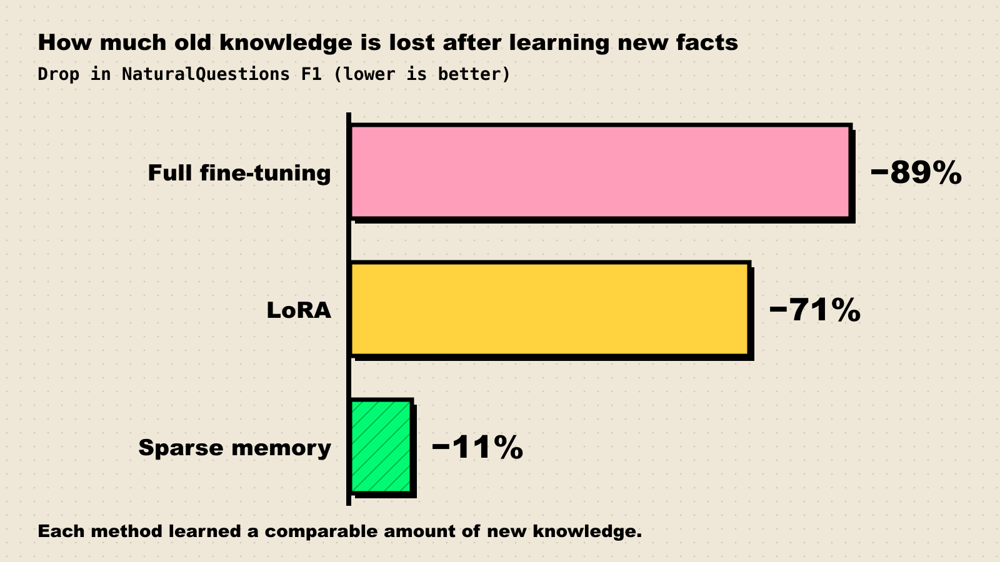

Imagine hiring the most brilliant analyst you have ever met. They have read everything, they write beautifully, and they can solve problems your senior staff cannot. There is one catch: every morning they walk in with no memory of yesterday. Your feedback, the client's quirks, the mistake they swore never to repeat: gone. You end up taping notes to their monitor, like Leonard in *Memento* or the morning videotape in *50 First Dates*.

That is roughly how today's frontier AI models work. They are frozen at release, and everything they "learn" while working with you lives in a notepad that gets wiped or re-read. A growing number of researchers think fixing this, a problem called **continual learning**, is the missing piece between today's models and something that deserves the name AGI.

**TL;DR**

- Frontier models stop learning when training ends. Within a conversation they adapt by reading context, but the underlying weights don't change.
- The obvious fix, training on new data after deployment, runs into **catastrophic forgetting**: new learning overwrites old knowledge. The problem was named in 1989 and is still not solved at scale.
- Today's workarounds (long context, retrieval, memory files, periodic fine-tuning) are useful but act more like a notepad than a memory.
- New research on test-time training, learned memory modules and sparse updates is promising, but mostly demonstrated on small models and narrow benchmarks.
- Skeptics argue that more context and better tooling will be enough. Safety researchers worry that a model which changes after release is much harder to evaluate.

## The amnesiac genius problem

The argument got its sharpest public form in a June 2025 essay by podcaster Dwarkesh Patel, [Why I don't think AGI is right around the corner](https://www.dwarkesh.com/p/timelines-june-2025). Patel had tried to use models for real work and kept hitting the same wall:

> "The reason humans are so useful is not mainly their raw intelligence. It's their ability to build up context, interrogate their own failures, and pick up small improvements and efficiencies as they practice a task."

His verdict: "The lack of continual learning is a huge huge problem." A model, he wrote, leaves you "stuck with the abilities you get out of the box." His analogy is a saxophone class in which each student gets one attempt, is sent away at the first mistake, and leaves behind written notes for the next one: "The next student reads your notes and tries to play Charlie Parker cold." That is roughly what prompting is.

He put the arrival of AI that "learns on the job as easily, organically, seamlessly, and quickly as a human" at 2032, later than many in the labs expect, largely because of this one problem. (For how dates like these get made, see our [field guide to AGI forecasts](/blog/field-guide-to-agi-forecasts/).)

The idea has spread. [Transformer News](https://www.transformernews.ai/p/teaching-ai-to-continual-learning) ran an explainer in January 2026 titled "Why is everyone talking about continual learning?", noting that Ilya Sutskever agreed with Patel's diagnosis on his podcast. Reinforcement learning pioneer Richard Sutton goes further: in [Patel's summary of their 2025 interview](https://www.dwarkesh.com/p/thoughts-on-sutton), Sutton wants a new architecture in which "the agent will just learn on-the-fly, like all humans, and indeed, like all animals," with no separate training phase at all.

At Davos in January 2026, Google DeepMind CEO Demis Hassabis [listed "the ability to learn continuously"](https://fortune.com/2026/01/23/deepmind-demis-hassabis-anthropic-dario-amodei-yann-lecun-ai-davos/) among capabilities still missing before AGI. Asked on the [Big Technology podcast](https://www.bigtechnology.com/p/google-deepmind-ceo-demis-hassabis-946) about models with a "goldfish brain" (the host's phrase), he said he wants something deeper than data in the context window, something that "actually changes the model over time." His bottom line: "that technique has not been cracked yet."

If you think of AGI in terms of [skill acquisition rather than a fixed list of skills](/blog/what-counts-as-agi/), this is not a side issue. A system that can't learn after deployment can only ever be as general as its last training run.

## Why can't a model just keep training?

Models learn during training by nudging billions of numbers, their weights, until their predictions improve. So why not keep nudging them on the job?

Because of a problem older than most of the people now working on it. In 1989 cognitive scientists Michael McCloskey and Neal Cohen published [Catastrophic Interference in Connectionist Networks](https://experts.illinois.edu/en/publications/catastrophic-interference-in-connectionist-networks-the-sequentia/), which put it plainly: "New learning may interfere catastrophically with old learning when networks are trained sequentially."

The reason: knowledge in a neural network is not filed in drawers. It is smeared across shared weights. Teach the network French and the weights that encoded Spanish shift too, and the old skills become collateral damage.

In 2016-17 a DeepMind team led by James Kirkpatrick proposed a partial fix called **elastic weight consolidation** (EWC), published in PNAS as [Overcoming catastrophic forgetting in neural networks](https://arxiv.org/abs/1612.00796). The idea: work out which weights mattered most for old tasks and make them "stiffer," so the method "remembers old tasks by selectively slowing down learning on the weights important for those tasks." It let one network learn several Atari games in sequence. It did not make the problem go away, and a decade of follow-ups has not produced a method labs trust at frontier scale.

The problem is alive in large language models too. A [2023 study of continual fine-tuning](https://arxiv.org/abs/2308.08747) found that "catastrophic forgetting is generally observed in LLMs ranging from 1b to 7b parameters," and within that range, larger models forgot more.

Nerd corner: why stiffening weights isn't enough

EWC adds a penalty to the training loss that grows when important weights move away from their old values, where "important" is estimated with the Fisher information from earlier tasks. Two problems follow. The importance estimate is a diagonal approximation that ignores how weights interact, so it misjudges what matters. And as tasks accumulate, more of the network gets stiff, and the model loses the plasticity to learn anything new. This stability-plasticity trade-off is the core tension of the field; every approach below is a different bet on it.

## How today's models fake it

Since the weights can't safely change, the industry has built workarounds. They work, which is why skeptics think the problem is overrated, but they all keep the brain frozen and change what it gets to read.

*Figure 1: Frozen weights versus continual learning. The dashed arrow is the unsolved part: when does a model that keeps learning get tested again? Lifecycle framing from [Oxford Martin AIGI](https://aigi.ox.ac.uk/blog-post/when-ai-systems-learn-during-deployment-our-safety-evaluations-break/).*

1. **Long context.** Paste everything into the prompt. Context windows now run to hundreds of thousands or millions of tokens, and models really do adapt to what they read. But the lesson ends when the session does, and more text is not free: Chroma's [context rot study](https://www.trychroma.com/research/context-rot) of 18 models found that "performance grows increasingly unreliable as input length grows," even on simple tasks.
2. **Retrieval (RAG).** Store knowledge in an external database and fetch the relevant chunks at question time. The [original 2020 RAG paper](https://arxiv.org/abs/2005.11401) framed this as combining the model's "parametric" memory with an explicit "non-parametric" one. It is great for facts. It is weak for skills: you can look up a style guide, but reading it is not the same as having practised.
3. **Memory files and memory features.** Chat products now save notes about you and re-inject them. Anthropic's [memory feature](https://claude.com/blog/memory) lets Claude "remember you and your team's projects and preferences, eliminating the need to re-explain context." Coding agents keep instruction files in the repository for the same reason. This is the sticky-note approach, and it works surprisingly well.
4. **Fine-tuning.** Periodically retrain the model on new data. This really does change the weights, but it is slow, expensive, done by the lab rather than on the job, and it risks the forgetting problem above.

Venture firm a16z made the same diagnosis in an April 2026 essay, [Why We Need Continual Learning](https://a16z.com/why-we-need-continual-learning/), even reaching for *Memento*. Their summary line: "ICL is transient. Real learning requires compression." (ICL is in-context learning.)

## The research bets: letting the weights move, carefully

The new wave of work lets weights change during use while limiting the damage. Three families stand out.

### Test-time training: learn the document instead of caching it

In [End-to-End Test-Time Training for Long Context](https://arxiv.org/abs/2512.23675) (December 2025), a team from Stanford, NVIDIA and other institutions treats reading a long document as a small continual-learning problem. Their TTT-E2E model "continues learning at test time via next-token prediction on the given context, compressing the context it reads into its weights." It matched full-attention Transformers on 128K-token contexts while running 2.7 times faster. The catch: the learning covers the document in front of it. It is a smarter way to read, not yet a way to accumulate experience.

### Learned memory modules: remember what surprises you

Google Research's **Titans** architecture ([paper](https://arxiv.org/abs/2501.00663), December 2024) bolts a neural long-term memory onto a model and updates it while the model runs. What gets written is driven by a "surprise metric", which Google's [December 2025 explainer](https://research.google/blog/titans-miras-helping-ai-have-long-term-memory/) describes as "the model detecting a large difference between what it currently remembers and what the new input is telling it." Google reports Titans scaling to context windows beyond 2 million tokens.

Its successor idea, [**Nested Learning**](https://research.google/blog/introducing-nested-learning-a-new-ml-paradigm-for-continual-learning/) (November 2025), treats a model as a stack of learning processes that update at different speeds, a "spectrum of modules, each updating at a different, specific frequency rate." Its proof-of-concept model, **Hope**, beat Titans and standard Transformers on language-modelling perplexity and common-sense reasoning in Google's tests.

### Sparse updates: only touch what you need

Jessy Lin and colleagues took a different tack in [Continual Learning via Sparse Memory Finetuning](https://arxiv.org/abs/2510.15103) (October 2025). Their model has a large bank of memory slots, and when it learns a new fact it only updates the few slots that fact activates heavily, leaving the rest alone. The results are the cleanest demonstration yet that forgetting is not destiny:

*Figure 2: Learning new facts three ways, with comparable amounts learned. Full fine-tuning wiped out most of the model's prior question-answering ability; sparse memory updates kept most of it. Source: [Lin et al., 2025](https://arxiv.org/abs/2510.15103).*

*Figure 3: Our qualitative comparison of how AI systems "remember." Ratings are editorial judgements based on [Lewis et al.](https://arxiv.org/abs/2005.11401), [Tandon et al.](https://arxiv.org/abs/2512.23675), [Lin et al.](https://arxiv.org/abs/2510.15103) and [Luo et al.](https://arxiv.org/abs/2308.08747).*

| Approach | Changes the model? | Good at | Weak at |
| --- | --- | --- | --- |
| Long context | No | One-off tasks, big documents | Anything past the session; degrades with length |
| RAG | No | Looking up facts | Skills, taste, tacit know-how |
| Memory files | No | Preferences, project rules | Scale; the model still has to re-read them |
| Fine-tuning | Yes | Lasting skills | Cost, speed, forgetting |
| Test-time training | Temporarily | Long documents, cheaply | Persistence across tasks |
| Learned memory / sparse updates | Yes, partly | Adding knowledge with less forgetting | Mostly proven on small models |

## The skeptics: maybe amnesia is fine

Not everyone buys the premise. Nathan Lambert of the Allen Institute for AI wrote a direct rebuttal, [Contra Dwarkesh on Continual Learning](https://www.interconnects.ai/p/contra-dwarkesh-on-continual-learning) (August 2025):

> "Continual learning is the ultimate algorithmic nerd snipe for AI researchers, when in reality all we need to do is keep scaling systems and we'll get something indistinguishable from how humans do it, for free."

His argument is that this is a systems problem, not a learning problem: "The path to continual learning is more context and more horsepower." In other words, a bet on compute over new algorithms, two of the [three levers of AI progress](/blog/three-levers-of-ai-progress/). Blogger Zvi Mowshowitz, [quoted by Transformer](https://www.transformernews.ai/p/teaching-ai-to-continual-learning), adds that "LLMs being stuck without continual learning at essentially current levels would not stop them from having a transformational impact."

There is also skepticism about the research itself. Bing Liu of the University of Illinois Chicago, who wrote a textbook on continual learning, told Transformer that Nested Learning is "not a breakthrough, because they're not solving anything — they're probably just making the model forget a little bit less." Roboticist Chris Paxton said Hope looked "far from use on anything more than toy tasks."

Both camps have a point. Much of what looks like "learning on the job" in agents today is really very good note-taking, and it keeps improving. But not everything worth learning fits in text; as a16z puts it, weights "can encode concepts that someone's prompt cannot relay in text." Nobody has shown which approach wins, and small-model results often fail to survive the trip to frontier scale. (It's the same caution we apply to any [new benchmark result](/blog/how-to-read-an-ai-benchmark/).)

Lab insiders sound more bullish. Transformer quotes Anthropic CEO Dario Amodei saying "we have some evidence to suggest that [continual learning] is another of those problems that is not as difficult as it seems," and Anthropic researcher Sholto Douglas predicting that in 2026 "continual learning gets solved in a satisfying way." Neither has published evidence, so read these as signals of where labs spend effort, not as results.

## The safety catch: a model that changes is a model you can't pin down

Here is the part that gets less airtime. Every safety process in use today assumes the model you tested is the model you shipped. Fazl Barez of Oxford Martin AIGI spelled this out in [When AI Systems Learn During Deployment, Our Safety Evaluations Break](https://aigi.ox.ac.uk/blog-post/when-ai-systems-learn-during-deployment-our-safety-evaluations-break/) (January 2026). The standard lifecycle is "Train → Freeze → Evaluate → Deploy," and the freeze is what makes the evaluation mean anything.

Remove the freeze and several problems appear at once:

- **Drift.** A model that learns from users can pick up their bad habits, with no clean point at which to re-run the tests.
- **Forgetting the guardrails.** Barez's sharpest line: "if a model can forget its old capabilities, it could also forget its safety training." Safety behaviour lives in the same weights as everything else.
- **Poisoning.** If a model learns from what it reads, then whoever writes what it reads has a lever on its weights.
- **Divergence.** A million copies learning from a million users become a million different models. Which one was approved?

Barez proposes theory for evaluating systems that keep changing, interpretability tools that track how features shift, architectures that separate stable parts from plastic ones, and governance that treats evaluations as expiring. None exist in mature form. If continual learning arrives quickly, evaluation will lag, and [benchmarks that saturate](/blog/why-benchmarks-saturate/) on a frozen model tell you even less about one that keeps moving.

## What we're watching

Continual learning is still a research problem, so the signposts are papers and lab disclosures:

1. **Frontier-scale results.** Do Titans, Hope, sparse memory layers or TTT show up in a production-scale model, with forgetting measured on broad benchmarks rather than one QA set?
2. **The Sholto Douglas test.** We will score his 2026 prediction on December 31, 2026, against a simple bar: a deployed model whose weights improve from use, documented publicly by a lab.
3. **Model cards that mention post-deployment learning.** If a lab ships weight updates from user interaction, its system card should say how it re-evaluates.
4. **Memory features creeping toward weights.** Watch whether chat "memory" stays as saved notes or starts including per-user adapters or fine-tunes. Hassabis called Google's Personal Intelligence feature "the first baby steps" toward models that learn in the wild.
5. **Evaluations for moving targets.** Any lab or AI safety institute proposal for testing models that change after release.

Until those arrive, your brilliant AI colleague still starts every day fresh. Keep the sticky notes handy.
