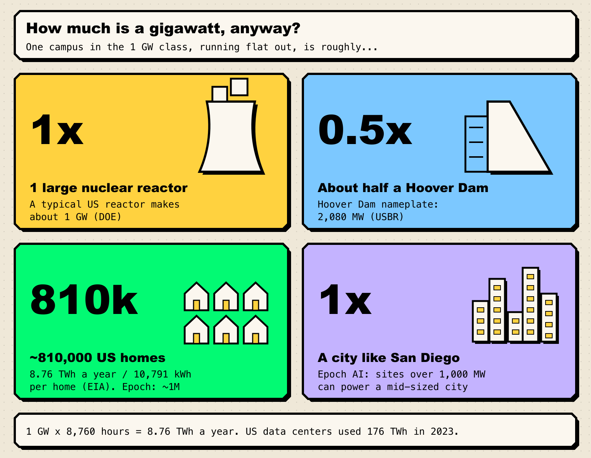
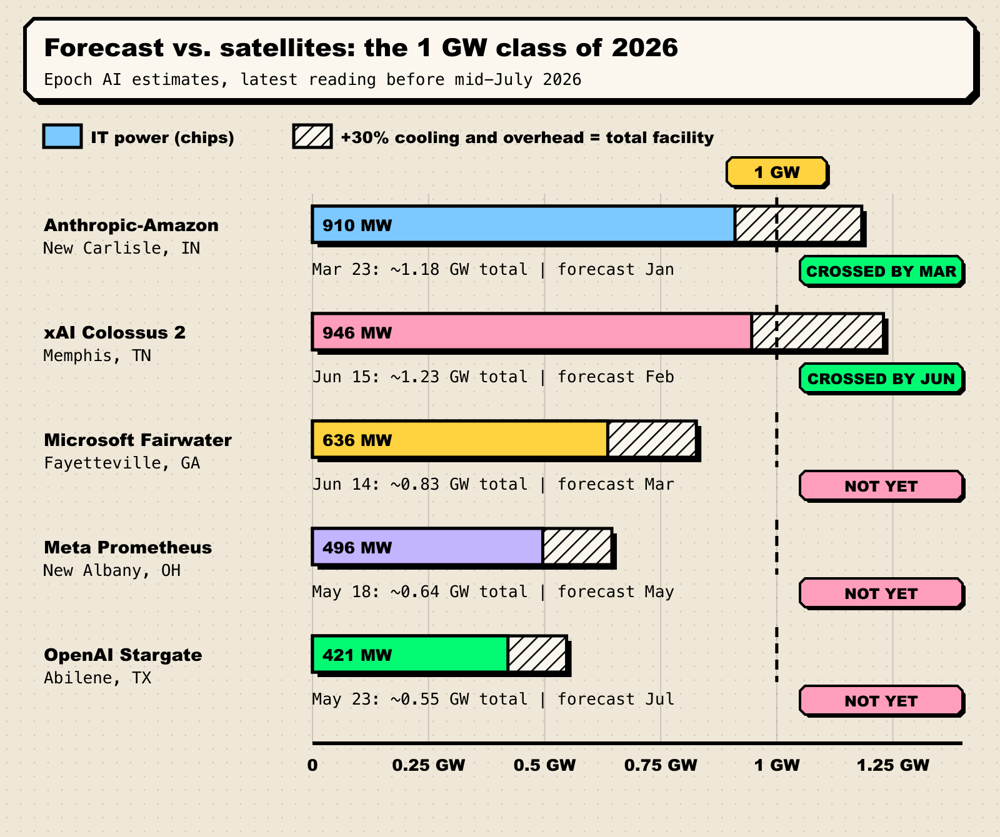
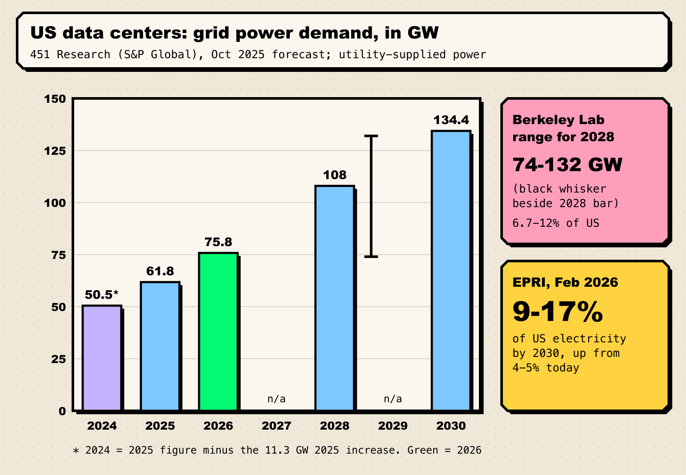

In November 2025, Epoch AI studied satellite photos of cooling towers and chillers and made a prediction: five AI data centers would each cross **1 gigawatt** of power in 2026, one after another between January and July. It is now late July. Two have made it. The other three are still pouring concrete, waiting on turbines, or bolting in transformers.

That gap between the forecast and the ground is the most useful thing to understand about AI in 2026. The models get the headlines, but a lot of what happens next depends on power plants, substations and county permit boards.

**TL;DR**

- A **gigawatt** is roughly one large nuclear reactor, half a Hoover Dam, or the average electricity use of about **810,000 US homes**.
- Epoch AI forecast five AI campuses would cross 1 GW in 2026. By mid-year, by its estimates, **Anthropic-Amazon New Carlisle and xAI Colossus 2 had**. Microsoft, Meta and OpenAI's flagship sites were still at **0.55 to 0.83 GW**.
- US data-center grid demand is forecast to go from **61.8 GW (2025) to 75.8 GW (2026) to 134.4 GW (2030)**. EPRI says data centers could take **9-17% of US electricity by 2030**, up from 4-5%.
- The bottlenecks are physical: gas turbines booked years out, transformer lead times of up to four years, and grid queues where the median project waits more than four years.
- Compute is the most predictable lever of AI progress. **Power is now the thing that sets its speed limit**, and local fights over bills, noise and water are part of that.

## How much is a gigawatt, anyway?

A gigawatt is a billion watts, which is too big to picture. So here are some comparisons:

*Figure 1: What 1 GW of continuous power is roughly equal to. Sources: [DOE](https://www.energy.gov/ne/articles/infographic-how-much-power-does-nuclear-reactor-produce), [USBR](https://www.usbr.gov/lc/hooverdam/faqs/powerfaq.html), [EIA](https://www.eia.gov/tools/faqs/faq.php?id=97&t=3), [Epoch AI](https://epoch.ai/data/ai-data-centers), [Berkeley Lab](https://eta-publications.lbl.gov/sites/default/files/2024-12/lbnl-2024-united-states-data-center-energy-usage-report_1.pdf).*

| One gigawatt is about... | The math | Source |
| --- | --- | --- |
| One large nuclear reactor | "A typical nuclear reactor produces 1 gigawatt of power per plant on average" | [US Department of Energy](https://www.energy.gov/ne/articles/infographic-how-much-power-does-nuclear-reactor-produce) |
| Half a Hoover Dam | Hoover's nameplate capacity is about 2,080 MW | [US Bureau of Reclamation](https://www.usbr.gov/lc/hooverdam/faqs/powerfaq.html) |
| ~810,000 US homes | 1 GW for a year = 8.76 TWh; the average home buys 10,791 kWh a year (Epoch rounds to ~1 million) | Our math on [EIA](https://www.eia.gov/tools/faqs/faq.php?id=97&t=3) data |
| A mid-sized city like San Diego | Epoch: sites "over 1000 MW" could power one | [Epoch AI data hub](https://epoch.ai/data/ai-data-centers) |

Another way to see it: Berkeley Lab estimates all US data centers together used [176 TWh in 2023](https://eta-publications.lbl.gov/sites/default/files/2024-12/lbnl-2024-united-states-data-center-energy-usage-report_1.pdf), or 4.4% of national electricity. A single 1 GW campus running flat out uses 8.76 TWh a year, **about 5% of what the whole US data-center sector used two years earlier**, all on one piece of land.

The IEA's [Energy and AI report](https://iea.blob.core.windows.net/assets/de9dea13-b07d-42c5-a398-d1b3ae17d866/EnergyandAI.pdf) (April 2025) noted that a typical AI data center "consumes as much electricity as 100 000 households, but the largest ones under construction today will consume 20 times as much."

## The class of 2026: forecast vs. satellites

Epoch AI's [Frontier Data Centers Hub](https://epochai.substack.com/p/introducing-the-frontier-data-centers), launched in November 2025, estimates each campus's capacity by counting cooling equipment in satellite images and checking permits and disclosures. Its prediction was specific: "several data centers will likely cross the 1 GW mark of total facility power next year," namely Anthropic-Amazon New Carlisle (January), xAI Colossus 2 (February), Microsoft Fayetteville (March, "borderline"), Meta Prometheus (May) and OpenAI Stargate Abilene (July).

*Figure 2: Epoch AI's IT-power estimates for the five campuses it expected to cross 1 GW in 2026, with total facility power estimated using Epoch's typical 1.3x overhead factor. Sources: Epoch AI directory entries for [New Carlisle](https://epoch.ai/data/ai-data-centers/directory/anthropic-amazon-new-carlisle), [Colossus 2](https://epoch.ai/data/ai-data-centers/directory/colossus-2), [Fairwater Atlanta](https://epoch.ai/data/ai-data-centers/directory/microsoft-fairwater-atlanta), [Prometheus](https://epoch.ai/data/ai-data-centers/directory/meta-prometheus), [Stargate Abilene](https://epoch.ai/data/ai-data-centers/directory/openai-stargate-abilene).*

The scorecard:

1. **Anthropic-Amazon New Carlisle, Indiana.** 626 MW of IT power at the end of December 2025, 910 MW by late March 2026. With cooling overhead, that is past 1 GW of total facility power. **Crossed, up to two months late.**
2. **xAI Colossus 2, Memphis.** 490 MW in early April, 946 MW by mid-June, the largest known AI site by IT power. **Crossed, two to four months late.**
3. **Microsoft Fairwater Atlanta, Fayetteville, Georgia.** It stayed at 321 MW from October 2025 to May 2026 before doubling to 636 MW in June. About 0.83 GW all in. **Not yet.**
4. **Meta Prometheus, New Albany, Ohio.** 496 MW by mid-May. Epoch's timeline has gas power plants coming online in late 2026 and the full ~1 GW of IT power in 2028. **Not yet.**
5. **OpenAI Stargate Abilene, Texas.** 421 MW by late May, with four of its eight buildings running and the rest [still under construction](https://epoch.ai/publications/openai-stargate-where-the-us-sites-stand). Epoch projects full capacity in November. **Not yet.**

So the headline "five gigawatt campuses in 2026" is running behind schedule. Still, two campuses that each draw about as much power as a nuclear reactor now exist, and each got there within about one to two years of land clearing. A typical US power project now takes more than four years to go from [grid-connection request](https://energyanalysis.lbl.gov/publications/queued-2025-edition-characteristics) to operation.

Nerd corner: which "gigawatt" are we talking about?

A "1 GW data center" can mean three different numbers, and press releases rarely say which.

- **IT power** is what the chips, servers and networking can draw. Epoch's directory reports this figure.
- **Total facility power** adds cooling, power conversion and lighting. Epoch's hub says it is "typically" around 1.3 times IT power, and its data page gives a range of 20-50% higher. Epoch's 2026 forecast used this measure.
- **Energy used** depends on how hard the site runs. Berkeley Lab turns its 2028 energy estimates into power demand by assuming 50% average utilization, so the same TWh can mean very different GW figures.

Money follows the same logic. Epoch estimates a typical capital cost of about **$44 billion per gigawatt of server power**, or closer to **$30 billion per gigawatt of total facility power**. When someone says "a gigawatt," ask: IT or facility, peak or average, built or announced?

## Why AGI-watchers should care about substations

In our explainer on [the three levers of AI progress](/blog/three-levers-of-ai-progress/), compute stands out as the lever that has moved most steadily. Epoch found that training compute for frontier models [grew 4-5x a year](https://epoch.ai/blog/training-compute-of-frontier-ai-models-grows-by-4-5x-per-year) from 2010 to 2024, and offered that pace as a baseline "absent new bottlenecks." Algorithmic tricks and data are harder to forecast. Compute is something you can see from orbit.

Here is the catch: compute runs on chips, and chips run on electricity. In 2024, Epoch's [Can AI scaling continue through 2030?](https://epoch.ai/blog/can-ai-scaling-continue-through-2030) looked at power, chips, data and latency and concluded:

> "The constraint likely to bind first is power, followed by the capacity to manufacture enough chips."

The same report estimated a training run of about 2e29 FLOP, roughly as far beyond GPT-4 as GPT-4 was beyond GPT-2, would need around **6 GW** by 2030. It expected single campuses to support **1 to 5 GW** by then. Seen that way, the 1 GW campuses of 2026 are about a sixth of the way there.

The plans already go well beyond one gigawatt. In April, Epoch surveyed all seven US [Stargate sites](https://epoch.ai/publications/openai-stargate-where-the-us-sites-stand) and estimated the project could pass 9 GW by 2029, comparable to New York City's peak power demand and enough for the equivalent of 20 million H100 GPUs, "the total amount of AI compute in the world by the end of 2025."

That's why this matters for [AGI forecasts](/blog/field-guide-to-agi-forecasts/). Many timelines quietly assume the compute trend continues. If power arrives late, so does compute, and those forecasts have to slide. Benchmarks can [saturate](/blog/why-benchmarks-saturate/), but a missing substation is a harder limit.

## The grid is being asked to grow again

For decades, electricity demand in rich countries barely grew. The IEA says data centers' outsized share of new demand in advanced economies is "a wake-up call on the need to put the electricity sector on a growth footing again."

*Figure 3: Forecast grid power supplied to US hyperscale, leased and crypto-mining data centers. Sources: [451 Research / S&P Global](https://www.spglobal.com/energy/en/news-research/latest-news/electric-power/101425-data-center-grid-power-demand-to-rise-22-in-2025-nearly-triple-by-2030) (October 2025), [Berkeley Lab](https://eta-publications.lbl.gov/sites/default/files/2024-12/lbnl-2024-united-states-data-center-energy-usage-report_1.pdf) (December 2024; broader scope, 50% utilization assumed), [EPRI](https://www.globenewswire.com/news-release/2026/02/26/3245491/0/en/epri-data-centers-could-consume-up-to-17-of-u-s-electricity-by-2030.html) (February 2026).*

The forecasts roughly agree on direction and disagree widely on size:

- **451 Research (S&P Global)** expects utility power to data centers to [rise 11.3 GW in 2025 to 61.8 GW](https://www.spglobal.com/energy/en/news-research/latest-news/electric-power/101425-data-center-grid-power-demand-to-rise-22-in-2025-nearly-triple-by-2030), then 75.8 GW in 2026, 108 GW in 2028 and 134.4 GW in 2030. That excludes enterprise-owned data centers.
- **EPRI's** February 2026 [Powering Intelligence](https://powering-intelligence.epri.com/) update says data centers could use [9% to 17% of US electricity by 2030](https://www.globenewswire.com/news-release/2026/02/26/3245491/0/en/epri-data-centers-could-consume-up-to-17-of-u-s-electricity-by-2030.html), up from 4-5% now, and 60% above its own 2024 estimate. In Virginia, the share could go from about a quarter today to 39-57%.
- **The IEA** expects global data-center use to [more than double to around 945 TWh by 2030](https://iea.blob.core.windows.net/assets/de9dea13-b07d-42c5-a398-d1b3ae17d866/EnergyandAI.pdf), "slightly more than Japan's total electricity consumption today," with the United States accounting for the largest share of that growth.

EPRI's David Porter called the scale and speed of data-center growth "a defining moment for the U.S. power system." That is not an exaggeration: the high end of EPRI's range more than triples the sector's share of electricity by 2030.

## The three bottlenecks: turbines, transformers, queues

You can't order a gigawatt online. Three choke points decide how fast one shows up.

**1. Gas turbines.** Under current policies, EPRI expects natural gas to supply most of the near-term new power. The turbine makers are swamped. In April, GE Vernova reported that its gas turbine backlog plus slot reservations [grew from 83 GW to 100 GW in a single quarter](https://www.sec.gov/Archives/edgar/data/0001996810/000199681026000063/gevpressrelease1q26.htm), with at least 110 GW expected by year-end, and that its data-center electrification orders in the quarter were larger than all of the previous year's. The IEA warned that turbine lead times now run "several years," which could push some new plants past 2030.

**2. Transformers.** Each gigawatt needs large high-voltage transformers, and they are scarce. Wood Mackenzie projected a [30% supply deficit for power transformers in 2025](https://www.woodmac.com/press-releases/power-transformers-and-distribution-transformers-will-face-supply-deficits-of-30-and-10-in-2025/), with about 80% of US supply imported. By May 2026, [lead times for high-capacity units had reached four years](https://pv-magazine-usa.com/2026/05/11/u-s-transformer-market-faces-severe-supply-constraints-as-lead-times-extend-to-four-years/) and prices were up about 80% in five years.

**3. The interconnection queue.** Berkeley Lab counts about [1,400 GW of generation and 890 GW of storage](https://energyanalysis.lbl.gov/publications/queued-2025-edition-characteristics) waiting to connect to the US grid. The median wait from request to operation has doubled to more than four years, and historically only 13% of requested capacity ends up built. The IEA estimates that, unless grid risks are addressed, "around 20% of planned data centre projects could be at risk of delays."

AI companies' answer is to go around the grid. At least three of the seven Stargate sites [plan on-site gas plants](https://epoch.ai/publications/openai-stargate-where-the-us-sites-stand). Colossus 2 gets power from a turbine farm across the state line in Southaven, Mississippi. Meta has signed deals for [up to 6.6 GW of nuclear power](https://about.fb.com/news/2026/01/meta-nuclear-energy-projects-power-american-ai-leadership/) from Vistra, Oklo and TerraPower, partly to supply Prometheus. Most of that new nuclear capacity doesn't arrive until the 2030s, though, and a data center built this year can't wait that long.

## The neighbors get a vote

A gigawatt has neighbors, and local backlash is now a real constraint on construction.

**Bills.** In the PJM grid, the largest in the eastern US, the independent market monitor found that data-center load accounted for [$6.5 billion, or 40%, of the $16.4 billion](https://www.utilitydive.com/news/data-centers-pjm-capacity-auction/808951/) in costs from December's capacity auction, and $6.2 billion of that was for data centers not yet built. Those costs reach households: PJM said an earlier auction's price could mean [a 1.5-5% rise in some customers' bills](https://insidelines.pjm.com/pjm-auction-procures-134311-mw-of-generation-resources-supply-responds-to-price-signal/). The monitor also questioned the forecasts behind them:

> "The extreme uncertainty in the load forecasts based on uncertainty about the addition of large data center loads is also unique and unprecedented."

**Air and noise.** In March, Mississippi regulators approved [41 permanent gas turbines](https://www.mississippifreepress.org/mississippi-permit-board-grants-xais-request-for-41-southaven-gas-turbines-to-power-memphis-data-center/) for xAI's Southaven site, which had been running 27 unpermitted units to power Colossus 2. The NAACP has announced its intent to sue under the Clean Air Act. "The people who live in Southaven do not want this," resident Shannon Samsa told the permit board. "For us, this is not just one more permit application. It is our homes and our health."

**Water.** Berkeley Lab estimates US data centers used [66 billion liters of water directly in 2023](https://eta-publications.lbl.gov/sites/default/files/2024-12/lbnl-2024-united-states-data-center-energy-usage-report_1.pdf), mostly for cooling. Builders have responded: at least six of the seven Stargate sites use closed-loop liquid cooling, which Epoch notes does not evaporate water. The power plants feeding these sites have their own water footprint, though.

The organized backlash is growing. Data Center Watch counted [75 projects worth about $130 billion blocked or delayed](https://www.nbcnews.com/tech/tech-news/data-center-opposition-sharply-rising-2026-study-finds-rcna349728) in the first quarter of 2026 alone, and 833 active opposition groups, up from 396 at the end of 2025.

## The skeptic's corner

"Gigawatts go up, AI goes up" is too simple. The strongest counterarguments:

- **Efficiency can bend the curve.** The IEA's High Efficiency case, with faster gains in hardware and models, puts data-center electricity demand [20% below its base case in 2035](https://iea.blob.core.windows.net/assets/de9dea13-b07d-42c5-a398-d1b3ae17d866/EnergyandAI.pdf). Its 2035 cases range from 700 to 1,700 TWh. A gigawatt in 2028 will buy far more compute than one in 2024.
- **The forecasts may be inflated.** Load forecasts count campuses that may never be built. PJM is [reworking its data-center forecasts](https://www.utilitydive.com/news/data-centers-pjm-capacity-auction/808951/) partly over concerns they are overstated. EPRI's 9-17% range is wide for that reason.
- **The money could run out first.** At roughly $30-44 billion per gigawatt, this buildout depends heavily on credit. In the Federal Reserve's [May 2026 Financial Stability Report](https://www.federalreserve.gov/publications/files/financial-stability-report-20260508.pdf), survey respondents flagged AI "equity valuations" and the risk "that capital expenditures are increasingly funded by debt, creating leverage in the system." If revenue lags spending, projects could stop half-built.
- **Watts are not intelligence.** A gigawatt tells you how much compute can run, not what it will be able to do. Whether more compute gets us to the kind of system people mean by [AGI](/blog/what-counts-as-agi/) is still an open question, and the scores we use to check are [imperfect instruments](/blog/how-to-read-an-ai-benchmark/).

Our read: the skeptics have a point about the size of the forecasts. But even allowing for them, US data-center demand is growing faster than the grid has in decades, and the campuses in Figure 2 physically exist. Two of them already have about as much capacity as a nuclear reactor.

## What we're watching

Concrete signposts, each checkable:

- **Stargate Abilene's buildings five to eight.** Epoch projects full capacity, about 843 MW of IT power, around **November 1, 2026**. If that holds, Abilene crosses 1 GW of facility power this autumn.
- **Microsoft Fairwater Atlanta.** It doubled in June to about 0.83 GW all in. Watch whether new buildings push it past 1 GW or it plateaus there.
- **Meta Prometheus's on-site gas plants.** Epoch expects them operational around **late November 2026**. Southaven-style permit fights are the risk to watch.
- **Colossus 2 heading to 1.5 GW of IT power.** Epoch projects that by about **February 2027**, which would put it near 2 GW of total facility power.
- **GE Vernova's Q2 results (late July)**, to see if turbine reservations keep climbing toward 110 GW and beyond.
- **PJM's next capacity auction and state bill fights.** Rising power bills are the fastest way for gigawatts to become a political issue.
- **Data Center Watch's Q2 tally.** Tells us whether Q1's record level of opposition was a spike or a trend.

A year ago, the one-gigawatt data center was a forecast. Now two exist, and three more are behind schedule. We'll keep checking the satellite estimates.
