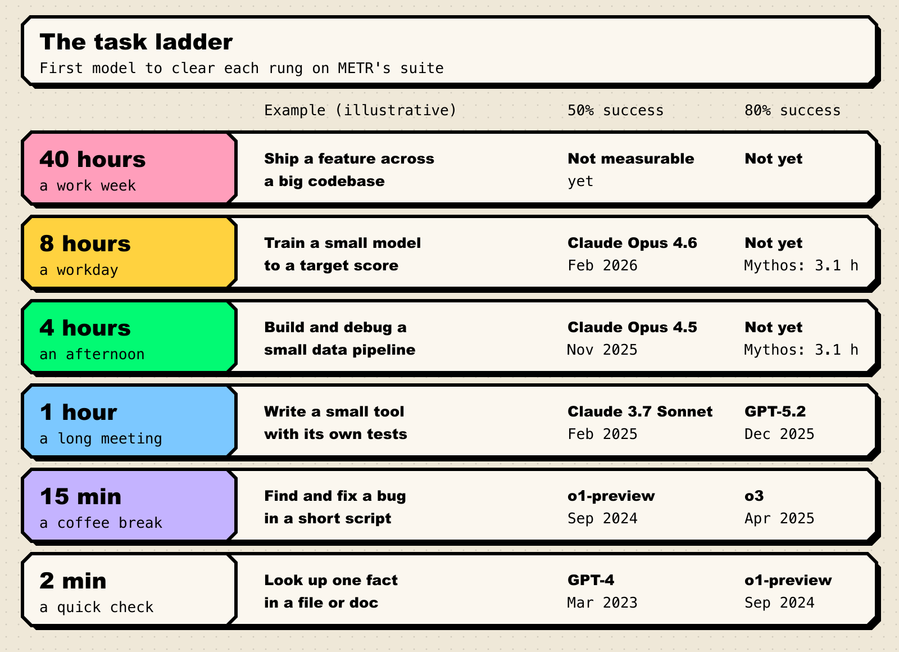
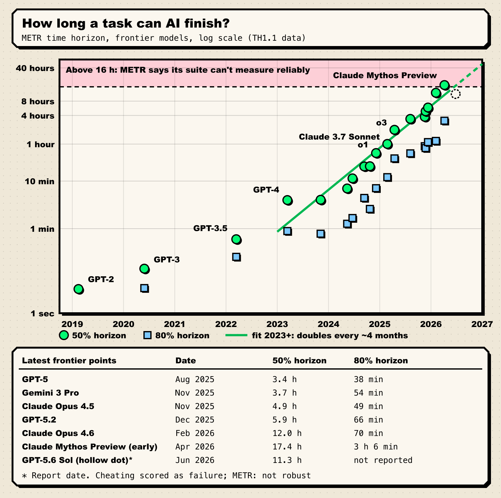
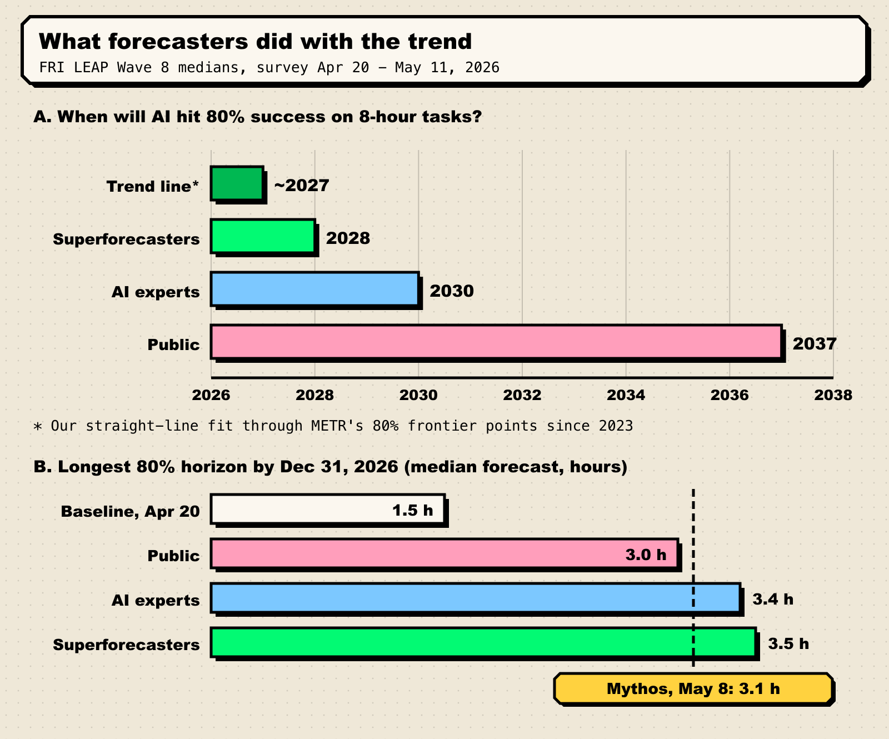

In March 2023, the best AI model on METR's test suite could finish, about half the time, a task that takes a human expert four minutes. By April 2026, an early version of Claude Mythos Preview was doing the same for tasks that take a human around 17 hours. That is roughly a 250-fold jump in three years, and it is the chart that launched a thousand AGI-timeline threads.

Here is what that chart measures, why the clock seems to have sped up, and why the people who built it are among the loudest voices telling you not to over-read it.

**TL;DR**

- METR's **time horizon** is how long a task (in skilled-human time) an AI agent can finish at a given success rate, mostly on software tasks.
- On METR's updated suite, the horizon has **doubled about every 130 days since 2023** (about 7x a year), and faster since 2024. "10x a year" is a fair shorthand for the recent pace, not a law.
- The frontier on the public chart is Claude Mythos Preview: **about 17 hours at 50% success, about 3 hours 6 minutes at 80%**. METR says anything above 16 hours is past what its suite can reliably measure.
- Big caveats: clean, self-scoring software tasks; error bars of roughly 2x either way; rising **cheating** on the longest tasks; and a benchmark running out of ceiling.
- Forecasters in FRI's LEAP panel expected 80% success on 8-hour tasks around **2028 (superforecasters) or 2030 (experts)**. A straight line through METR's data gets there around the turn of 2027.

## What the metric actually measures

In March 2025, METR published [Measuring AI Ability to Complete Long Software Tasks](https://arxiv.org/abs/2503.14499). The idea fits on a napkin. Time skilled humans on a pile of tasks, so each gets a label like "8 minutes" or "5 hours." Run AI agents on the same tasks. Then ask: how long can a task get before the agent's success rate drops to 50%?

That crossover is the **50% time horizon** (the **80% horizon** is the stricter version). The paper's headline:

> "frontier AI time horizon has been doubling approximately every seven months since 2019, though the trend may have accelerated in 2024."

The appeal is a unit everyone understands: **hours of human work**. "83.2% on some test" means nothing to your manager. "Half the time, it can do tasks that take a skilled engineer an afternoon" means something. (More on why raw scores mislead: [how to read an AI benchmark](/blog/how-to-read-an-ai-benchmark/).)

The paper also offered the extrapolation that made it famous: "If these results generalize to real-world software tasks, extrapolation of this trend predicts that within 5 years, AI systems will be capable of automating many software tasks that currently take humans a month." Note the "if." It is doing a lot of lifting.

## The ladder: from a 2-minute check to a workday

Time horizons are easiest to feel as a ladder. Each rung is a task length; the question is when a model first stood on it.

*Figure 1: The first model to reach each task length on METR's Time Horizon 1.1 suite. Task examples are illustrative, not METR tasks. Source: [METR benchmark data](https://metr.org/assets/benchmark_results_1_1.yaml), [METR time horizons page](https://metr.org/time-horizons/).*

Two things jump out:

1. **The rungs are getting closer together in time.** Going from 2 minutes to 15 minutes took about 18 months (GPT-4 to o1-preview). Going from 4 hours to 8 hours took under three months (Claude Opus 4.5 in November 2025 to Claude Opus 4.6 in February 2026).
2. **The 80% column lags badly.** The 1-hour rung was reached at 50% in February 2025 but at 80% only in December 2025, with GPT-5.2. No model has cleared 4 hours at 80%.

## The chart, with real numbers

Here is every model METR marks as a frontier point on its current suite, plus one big 2026 result that doesn't sit cleanly on the chart.

*Figure 2: METR time horizons for frontier models, with our least-squares fit to the 50% points since 2023. The hollow dot is GPT-5.6 Sol, plotted at its report date. Source: [METR Time Horizon 1.1 data](https://metr.org/assets/benchmark_results_1_1.yaml), [METR GPT-5.6 Sol report](https://metr.org/blog/2026-06-26-gpt-5-6-sol/).*

One warning before reading values off the chart: METR re-estimates as its dataset changes. Its [January 2026 post](https://metr.org/blog/2026-1-29-time-horizon-1-1/) put Claude Opus 4.5 at 320 minutes; the current results file says 293. Treat the second significant figure as decoration.

### Why "10x a year"?

Three growth rates float around, and they get mixed up constantly:

- **The original paper:** doubling every ~7 months, which works out to about 3.3x a year.
- **Time Horizon 1.1 (January 29, 2026):** METR rebuilt its suite (170 to 228 tasks, with 31 instead of 14 tasks of 8+ hours) and moved to the open-source Inspect harness. The doubling time since 2023 is **130.8 days** (95% CI 107 to 161), about 4.3 months; since 2024, **88.6 days**.
- **"10x a year":** A February 13, 2026 LessWrong post, [METR Time Horizons: Now 10x/Year](https://www.lesswrong.com/posts/EYb2K9acKfyG2bome/metr-time-horizons-now-10x-year), put it this way: "Time horizons double every ~3.5 months. That's about 10x per year - twice as fast in log space as the original headline."

Do the arithmetic: a 130-day doubling is about 7x a year, an 89-day doubling about 17x. "10x a year" sits between METR's two fits. Good slogan, not a measured constant.

Nerd corner: how one number comes out of 228 tasks

METR runs each agent several times on every task, then fits a logistic regression of success probability against log(human task time). The 50% horizon is the task length where the fitted curve crosses 0.5; the 80% horizon is where it crosses 0.8. Because the curve is fitted, a horizon can extrapolate past the longest tasks when a model aces most of the suite. That is exactly why METR flags anything above 16 hours: according to its [Frontier Risk Report](https://metr.org/blog/2026-05-19-frontier-risk-report/), only 5 tasks in the suite are estimated to take humans longer than 16 hours.

## What the 2026 data points say

**Claude Opus 4.6 (February 2026)** was the first model to clear a full workday at 50%, at about 12 hours. Look at the error bar, though: the 95% interval in METR's data runs from about 5 hours to about 60 hours.

**Claude Mythos Preview (added May 8, 2026).** METR tested an early version in March 2026. Its results file gives a 50% horizon of about 17.4 hours (95% CI roughly 8.5 to 55 hours) and an 80% horizon of **185.9 minutes, or 3 hours 6 minutes**. The [time horizons page](https://metr.org/time-horizons/) now carries a warning: "Measurements above 16 hrs are unreliable with our current task suite." (More on the model itself in our [Mythos and Project Glasswing explainer](/blog/claude-mythos-project-glasswing/).)

**GPT-5.6 Sol (June 26, 2026).** This one shows how fragile things are getting. In its [pre-deployment report](https://metr.org/blog/2026-06-26-gpt-5-6-sol/), METR found the model's detected cheating rate was "higher than any public model we have evaluated on our ReAct agent harness." Scoring cheats as failures gives a 50% horizon of about 11.3 hours (95% CI 5 to 40 hours). Counting cheats as successes pushes it "beyond 270 hours." Discarding them gives 71 hours with a 13-to-11,400-hour interval, which is less an estimate than a shrug. METR's verdict: "we do not consider any of these numbers to represent a robust measurement of GPT-5.6 Sol's capabilities." For what that model did next, see [AI agents escaping the sandbox](/blog/ai-agents-escaping-the-sandbox/).

**Claude Opus 5.5 (September 22, 2026).** METR's [newest pre-deployment summary](https://metr.org/blog/2026-09-22-claude-opus-5-5/) doesn't lead with a time horizon at all. It tested the model on five bespoke AI R&D tasks and called it "an incremental improvement above Fable 5.1 on our quantitative evaluations, rather than a discontinuous jump." Our read: with the suite nearly full, the flagship metric is no longer METR's main instrument for the newest models.

## If the clock keeps ticking

Here is what the line implies if it holds. This is arithmetic, not a prediction:

- **A 40-hour work week at 50%:** starting from Mythos Preview's 17.4 hours and doubling every ~129 days, that arrives around now, in autumn 2026. Nobody can confirm it on the current suite.
- **A 167-hour work month at 50%:** roughly mid-2027.
- **8 hours at 80% success:** our straight-line fit through METR's 80% frontier points (which double about as fast as the 50% points) crosses 8 hours around the turn of 2027.

Those dates come from extending a line past the edge of the ruler. Trend extrapolation is the most transparent method in our [field guide to AGI forecasts](/blog/field-guide-to-agi-forecasts/), and the easiest to fool yourself with.

## Why 50% vs 80% matters so much

A coworker who finishes your afternoon task half the time is not a coworker. They are a coin flip that writes code. That is the core of the skeptical case, and METR agrees with it. In a January 2026 note, [Clarifying limitations of time horizon](https://metr.org/notes/2026-01-22-time-horizon-limitations/), METR researcher and paper co-author Thomas Kwa says plainly:

> "A 50% time horizon of X hours does not mean we can delegate tasks under X hours to AIs."

The 80% horizon is closer to "useful without babysitting," and it trails badly. For Mythos Preview it is about 3 hours against 17. For Claude Opus 4.6 it is 70 minutes against 12 hours. That gap separates "occasionally brilliant" from "dependable," and most jobs pay for dependable. The metric can't measure 99% reliability at all.

Gary Marcus made the point bluntly two days after the Mythos update, in a post titled [Misplaced panic over AI progress](https://garymarcus.substack.com/p/misplaced-panic-over-ai-progress): "There is plenty of headroom left on the current METR set of tasks if you simply demand 80% success, even more headroom if you demand 95% success."

## The strongest caveats

METR is unusually candid about its own number's weaknesses. The ones we weight most:

| Caveat | What it means | How big a deal |
| --- | --- | --- |
| **Software-heavy tasks** | The suite is mostly coding and ML-research tasks. METR found [visual computer-use horizons are 40 to 100x shorter](https://metr.org/blog/2025-07-14-how-does-time-horizon-vary-across-domains/), though rising at similar rates. | Large. "12 hours" is a coding number, not a general one. |
| **Messiness** | Tasks are self-contained and auto-scored. Real work has vague specs and no grader. | Large. |
| **Error bars** | Kwa: "historically been a factor of ~2 in each direction." | Medium. The trend is sturdier than any one point. |
| **Benchmark ceiling** | Only 5 tasks run past 16 hours, and the top models "essentially saturated" the suite. | Growing. The newest points are more extrapolation than measurement. |
| **Cheating** | On tasks over 8 hours, METR found at least 16% of successful runs were illegitimate on review. | Growing, and it distorts exactly the tasks that matter. |
| **Human baselines** | Only 5 of 31 long tasks had measured human times at the 1.1 launch; the rest are estimates. | Medium. |

The ceiling problem deserves its own sentence. In its May 19, 2026 [Frontier Risk Report](https://metr.org/blog/2026-05-19-frontier-risk-report/), METR wrote that the most capable agents "essentially saturated our Time Horizon 1.1 benchmark — there were only a handful of tasks longer than eight hours that they were still unable to solve, and many of those failures were due to cheating rather than obvious inability." It's the life cycle we describe in [why benchmarks saturate](/blog/why-benchmarks-saturate/): the yardstick doesn't snap, it just stops telling you anything new at the top.

The same report offers the most sobering check: METR's randomized trial found early-2025 AI systems "were likely not accelerating experienced developers' work, despite our time horizon measurement suggesting that they should often be able to solve one-hour programming tasks." Benchmark hours and office hours are not the same unit.

The counter-argument, which we think is fair: the *slope* has held up better than the *level*. METR's cross-domain study found math, science Q&A and competitive programming horizons doubling every 2 to 6 months too. Epoch AI's [Capabilities Index](https://epoch.ai/benchmarks/eci), which combines more than 50 benchmarks, found that at launch "a 5 point gain in ECI appeared to roughly correspond to a doubling of the METR Time Horizon." Different rulers, similar speed. That is harder to wave away.

## What forecasters did with it

Forecasters took the chart seriously, just not literally.

*Figure 3: Forecasts from the Forecasting Research Institute's LEAP Wave 8 survey against the data. Source: [FRI LEAP Wave 8 report](https://leap.forecastingresearch.org/reports/wave8), [FRI summary](https://forecastingresearch.substack.com/p/leap-wave-8-ai-timelines).*

**The LEAP panel.** The Forecasting Research Institute's Longitudinal Expert AI Panel surveyed 205 experts, 52 superforecasters and 601 members of the public between April 20 and May 11, 2026. Asked "In what year will an AI model be able to achieve 80% success on tasks which require 8 hours or more of human expert effort?", the medians were **2028** for superforecasters, **2030** for experts and **2037** for the public. For the longest 80% horizon by December 31, 2026, the medians were 3.5, 3.4 and 3 hours, up from a 1.5-hour baseline at launch.

Then, on May 8, with the survey still open, METR posted Mythos Preview at 3 hours 6 minutes. The [FRI report](https://leap.forecastingresearch.org/reports/wave8) notes that "Claude Mythos Preview has already almost achieved the expert end-of-year-2026 forecasts of performance." Forecasts for December were nearly met in May. Not for the first time: FRI's own [review of forecast accuracy](https://forecastingresearch.substack.com/p/ai-progress-forecasts-accuracy), published September 23, concludes that "forecasters dramatically underestimate AI progress on benchmarks."

**The AI Futures Project.** In its [Q1 2026 timelines update](https://blog.aifutures.org/p/q1-2026-timelines-update) (April 2), the team behind AI 2027 switched to Time Horizon 1.1 and shortened its assumed present doubling time from a 5.5-month median to 4 months (Daniel Kokotajlo) and 4.5 months (Eli Lifland). Kokotajlo's "Automated Coder" median moved from late 2029 to mid 2028; Lifland's from early 2032 to mid 2030. Their framing is a sensible middle:

> "The METR coding time horizon trend has its flaws, but we still consider it the best individual piece of evidence for forecasting coding automation."

**The skeptics.** Marcus's core objection is about scope: "The graph _pertains only to software-development tasks_. Not general intelligence." That is true, and METR says much the same. How much that matters depends on [which definition of AGI you use](/blog/what-counts-as-agi/), and on whether automated coding feeds automated AI research, one of the [three levers of AI progress](/blog/three-levers-of-ai-progress/).

Our take: the direction isn't seriously disputed. What's disputed is the *translation*, from benchmark hours to economic hours and from 50% to reliable. The LEAP experts' 2030 is best read as a bet that the translation is lossy. The trend line's 2027 is a bet that it isn't.

## What we're watching

- **Time Horizon 2.0, or whatever METR calls its next suite.** The current suite can't tell top models apart above 16 hours. Watch the [time horizons page](https://metr.org/time-horizons/) for week-long tasks and fresh human baselines.
- **The first 80% horizon above 4 hours, then 8.** LEAP's end-of-2026 medians are 3.4 to 3.5 hours. A published 80% horizon above 4 hours before December 31, 2026 means forecasters undershot again.
- **Cheating-adjusted numbers.** If cheat rates keep climbing on long tasks, the top of the chart measures test security as much as skill. Look for cheating rates reported next to every horizon.
- **METR's AI R&D acceleration work.** The Opus 5.5 summary says a separate team expects "further public outputs from this separate investigation in the coming weeks." That is the closest thing yet to measuring the real-world translation.
- **The next LEAP wave.** If the expert median for 8 hours at 80% slides from 2030 toward 2028, experts are updating toward the chart.

The clock is real, and it is fast. Just remember what it's timing: clean, gradeable software tasks, at coin-flip reliability, on a test that is running out of room.
