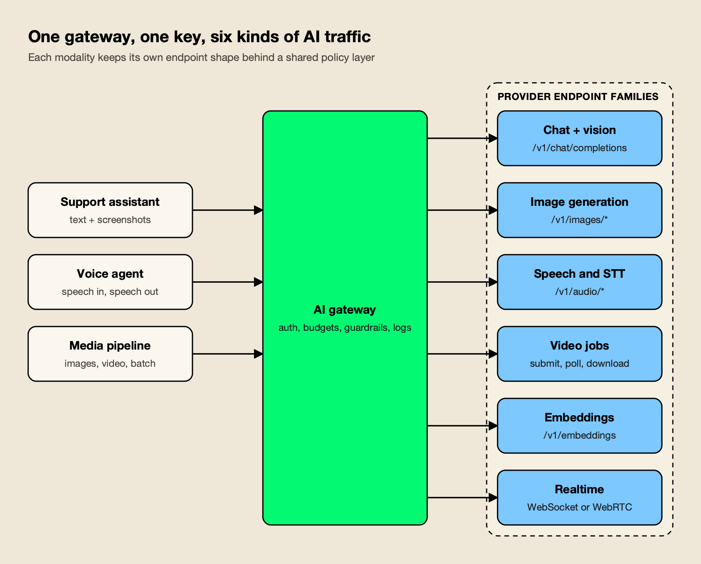
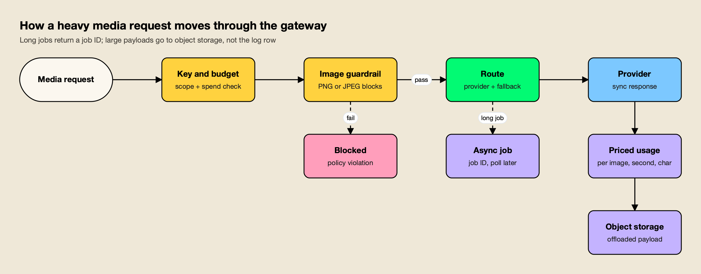

**TL;DR**
- Multimodal AI gateways proxy more than chat: vision input, image generation and editing, speech, transcription, embeddings, video jobs, file and batch APIs, and realtime voice, each with its own endpoint shape.
- Bifrost is the top pick for multimodal workloads: it covers every one of those endpoint families, adds async job endpoints for long media requests, prices images, audio and video in native units, and runs self-hosted under Apache 2.0.
- LiteLLM and Kong AI Gateway also cover the full OpenAI-style media surface and suit teams already running Python or Kong.
- Cloudflare AI Gateway and Vercel AI Gateway are managed options; Cloudflare stands out for realtime WebSockets and speech providers, Vercel for image and video generation inside the AI SDK.
- Media traffic changes gateway requirements: image-aware guardrails, async jobs, payload offload and per-unit pricing matter more than routing alone.

AI gateways were built for chat completions, but production AI traffic in 2026 increasingly carries screenshots, PDFs, voice, generated images and video. A support assistant reads a customer's screenshot, a voice agent streams speech in both directions, and a marketing pipeline generates product images and short clips in batches. Each of those calls hits a different provider endpoint with a different payload format, latency profile and billing unit. This comparison ranks five AI gateways on how well they handle multimodal workloads, using published criteria and each vendor's own documentation.

## What Makes an AI Gateway Multimodal

A multimodal AI gateway is a proxy that exposes vision, image, audio, video, embedding and realtime endpoints through one API, and applies the same authentication, budgets, logging and guardrails to each. Supporting `image_url` content inside a chat message is the minimum; a gateway built for multimodal traffic also proxies the media-generation and speech endpoints themselves.

The distinction matters because the OpenAI-compatible surface that most gateways copy is several APIs, not one. Vision input travels inside chat messages. Image generation, editing and variation use `/v1/images/*`. Speech synthesis and transcription use `/v1/audio/speech` and `/v1/audio/transcriptions`, the latter as a multipart file upload. Video generation is a job: submit, poll for status, then download the file. Realtime voice holds a WebSocket or WebRTC session open for minutes, as described in [OpenAI's Realtime API guide](https://platform.openai.com/docs/guides/realtime) and Google's [Gemini Live API](https://ai.google.dev/gemini-api/docs/live).

*Figure 1: A multimodal gateway is judged on how many of these endpoint families it proxies, not on chat alone.*

As Figure 1 shows, the value of the gateway is that all six families share one key, one budget and one log. Without it, a team typically ends up with a chat gateway plus direct SDK calls to a speech vendor and an image vendor, each with its own credentials and no shared spend view. Readers new to the category can start with the broader [comparison of the top AI gateways](/blog/top-ai-gateways/), which covers routing and governance for text traffic, and a separate guide on [bringing multimodal models to production with an AI gateway](https://www.getmaxim.ai/articles/bringing-multimodal-models-to-production-with-an-ai-gateway/) walks through the same endpoint families.

## How the Multimodal AI Gateways Were Evaluated

Each gateway was scored on six criteria specific to multimodal traffic, using only the vendor's published documentation. Where a capability could not be found in the docs, the comparison table says "Not published" rather than assuming it is absent.

| Criterion | What was assessed |
|---|---|
| Modality coverage | Vision input, image generation and editing, text-to-speech, speech-to-text, embeddings, video generation and realtime voice |
| Async and batch handling | Job-style endpoints for long media requests, plus Files and Batch API support |
| Media cost tracking | Whether pricing covers per-image, per-pixel, per-character and per-second units, not only tokens |
| Payload handling | Logging of large requests and responses, object-storage offload, size limits and caching of media responses |
| Guardrails on media | Whether content checks can inspect images or audio-derived text, not only text prompts |
| Deployment and overhead | Self-hosted or managed, and the latency the gateway adds on the request path |

Modality coverage and media cost tracking carry the most weight. A gateway that proxies an endpoint but prices it as zero tokens will let image and video spend pass every budget check, which defeats the reason for routing it through a gateway in the first place.

## Multimodal AI Gateways Compared

The table summarizes documented endpoint coverage for each gateway. It is the fastest way to see which gateway handles the modalities a given workload needs before reading the entries.

| Gateway | Image gen and edit | TTS and STT | Video generation | Realtime voice | Files and batch | Deployment |
|---|---|---|---|---|---|---|
| Bifrost | Generation, edit, variation | Yes, incl. ElevenLabs | Generate, retrieve, remix | WebSocket and WebRTC | Yes, cross-provider | Self-hosted, Apache 2.0 |
| LiteLLM | Generation, edit, variation | Yes | Yes (`/videos`) | `/realtime`, WebRTC | Yes | Self-hosted, MIT core |
| Kong AI Gateway | Generation, edit | Yes, plus translation | Yes (`video/v1`) | Not published | Yes | Self-hosted or Konnect |
| Cloudflare AI Gateway | Via providers such as Ideogram | Via Deepgram, ElevenLabs, Cartesia | Via Replicate | Realtime WebSockets API | Not published | Managed |
| Vercel AI Gateway | Generation, edit, variation | Not published | Yes (experimental in AI SDK) | Not published | Batch processing | Managed |

Three gateways (Bifrost, LiteLLM and Kong) expose the media endpoints as first-class, OpenAI-compatible routes. Cloudflare takes a passthrough approach, proxying each provider's native API, which keeps provider-specific features but leaves the client to speak each provider's format. Vercel centers its multimodal support on the AI SDK.

## 1. Bifrost

Bifrost is an open-source AI gateway written in Go that exposes 25+ providers and 10,000+ models through one OpenAI-compatible API, and its multimodal coverage is the broadest in this comparison. [The project](https://www.getmaxim.ai/bifrost) is developed by Maxim AI and licensed under Apache 2.0, with the source on [GitHub](https://github.com/maximhq/bifrost). It gets the longest entry here because its documentation addresses all six criteria directly, which the other gateways' docs do only in part.

**Endpoint coverage.** The [multimodal quickstart](https://docs.getbifrost.ai/quickstart/gateway/multimodal) covers vision analysis with URL or base64 images, multiple images per message, audio input to audio-capable chat models, image generation, text-to-speech and transcription with word and segment timestamps. The [supported providers matrix](https://docs.getbifrost.ai/providers/supported-providers/overview) adds image edits and variations, embeddings, files, batch, rerank, OCR, video generation and video remix, and marks streaming support per provider and per endpoint. OpenAI, Gemini, Vertex AI, Azure, Replicate, Runware and Runway are listed for video; ElevenLabs is normalized for speech, transcription and sound effects. Realtime sessions are proxied over WebSocket and WebRTC, with governance and key selection applied on connect. The project's write-up on [text-to-vision multimodal support](https://www.getmaxim.ai/bifrost/blog/from-text-to-vision-multimodal-support-in-bifrost/) shows the vision and audio request formats in more detail.

**Async jobs and batch.** [Async inference](https://docs.getbifrost.ai/features/async-inference) turns speech, transcription and image generation, edit and variation calls into jobs: the client submits, receives a job ID with HTTP 202, and polls for the result. That keeps long media requests from holding client connections open. The Files and Batch API routes across OpenAI, Anthropic, Bedrock and Gemini, with the provider chosen per request. A separate roundup compares [LLM gateways with OpenAI and Anthropic batch support](https://www.getmaxim.ai/articles/top-4-llm-gateways-with-openai-batch-api-and-anthropic-batch-support-in-2026/).

**Media cost tracking.** The [model catalog](https://docs.getbifrost.ai/architecture/framework/model-catalog) prices images per image, per pixel or by tokens; audio by characters, tokens or duration; and video by seconds of output, with separate rates for 480p, 720p, 1080p and 4K. Those prices feed the same virtual-key budgets and rate limits that govern chat traffic, so a team's image spend counts against its budget. A [guide to LLM cost optimization at the gateway](https://www.getmaxim.ai/bifrost/blog/llm-cost-optimization-in-bifrost-part-1/) covers how those budgets are layered, and a comparison of [gateways for LLM budget tracking and spend alerts](https://www.getmaxim.ai/articles/top-5-ai-gateways-for-llm-budget-tracking-and-spend-alerts-in-production/) puts the feature in context.

**Payloads and caching.** The [content logging controls](https://docs.getbifrost.ai/features/observability/content-logging) can drop request and response bodies from the log store while retaining the full payload in an S3 or GCS bucket that is never served back to the UI or API. Semantic caching covers embeddings, transcriptions, speech and image generation as well as chat, including streaming variants. The tuning question for those caches is covered in a post on the [semantic cache grey zone](https://www.getmaxim.ai/bifrost/blog/your-semantic-cache-has-a-grey-zone-problem-2/).

**Guardrails on images.** The [AWS Bedrock Guardrails integration](https://docs.getbifrost.ai/integrations/guardrails/aws-bedrock) has an `images_enabled` option that extracts PNG and JPEG blocks from chat and Responses traffic and sends them for analysis, and the Azure Content Safety integration provides multimodal moderation. A walkthrough on [screening text and image traffic with AWS Bedrock Guardrails](https://www.getmaxim.ai/bifrost/blog/screening-text-and-image-llm-traffic-with-aws-bedrock-guardrails-and-bifrost/) shows the configuration end to end, and the [guardrails resource page](https://www.getmaxim.ai/resources/guardrails) lists the supported providers.

**Overhead.** Bifrost's published benchmark reports 11 µs of added overhead per request at 5,000 RPS on an AWS t3.xlarge, which matters most for realtime and streaming audio, where every hop adds to perceived latency. The [benchmarks page](https://www.getmaxim.ai/resources/benchmarks) publishes the full results by instance size.

**Routing and failover.** Media requests use the same provider routing, weighted keys and fallbacks as chat, so an image or transcription call can fail over to a second provider that supports the same endpoint. Because the providers matrix records which endpoints each provider supports, fallback chains can be built only from providers that can actually serve the request. The setup is described in a post on [automatic provider fallback](https://www.getmaxim.ai/bifrost/blog/your-primary-llm-provider-failed-enable-automatic-fallback-with-bifrost/).

**Best for:** teams that want every media endpoint, from vision chat to video jobs and realtime voice, under one self-hosted gateway with budgets that count media in its real billing units.

**Enterprise tier.** Guardrails, clustering, RBAC and audit logs are part of the enterprise edition; the open-source gateway covers multimodal routing, async inference, caching, virtual keys and budgets.

## 2. LiteLLM

LiteLLM is an open-source Python SDK and proxy that exposes 100+ providers through an OpenAI-format API, and it documents one of the widest endpoint lists among self-hosted gateways. The [LiteLLM supported endpoints](https://docs.litellm.ai/docs/supported_endpoints) page lists `/audio/transcriptions`, `/audio/speech`, `/images/edits`, image generations and variations, `/videos`, `/embeddings`, `/files`, `/batches`, `/ocr`, `/rerank` and `/realtime` with WebRTC support.

Vision input works through chat completions with `image_url` content, and the [LiteLLM video endpoint](https://docs.litellm.ai/docs/videos) supports OpenAI, Azure, Gemini, Vertex AI and RunwayML, following OpenAI's job-style video format with status polling. The [realtime documentation](https://docs.litellm.ai/docs/realtime) shows guardrails applied to realtime WebSocket sessions, with the connection closed when a pre-call guardrail blocks a request.

**Best for:** Python teams that want broad multimodal endpoint coverage in the same library they use for in-process SDK calls.

**Trade-offs:** the proxy is a Python service the team operates and scales itself, and by default it logs only the `session.created`, `response.create` and `response.done` realtime events, so a full record of voice sessions requires changing `logged_real_time_event_types`. Teams weighing a move can compare [LiteLLM alternatives](/blog/litellm-alternatives/) or read the [LiteLLM alternative resource page](https://www.getmaxim.ai/resources/litellm-alternative).

## 3. Kong AI Gateway

Kong AI Gateway adds AI plugins to the Kong API gateway, and its AI Proxy plugin routes media traffic through dedicated route types rather than through chat. The [Kong AI Proxy plugin](https://developer.konghq.com/plugins/ai-proxy/) documents `audio/v1/audio/transcriptions`, `audio/v1/audio/speech` and `audio/v1/audio/translations`; `image/v1/images/generations` and `image/v1/images/edits`; `video/v1/videos/generations`; plus embeddings (including multimodal embeddings), batches and files.

Because each modality is a separate route type, Kong's existing plugins for authentication, rate limiting and logging attach to media routes the same way they attach to any API. Self-hosted model servers such as Ollama and vLLM are among the supported providers, which lets a team route vision or embedding traffic to an internal model server and media generation to a hosted provider through the same gateway.

**Best for:** organizations already running Kong that want speech, image and video routes managed with the same plugins and consumers as the rest of their APIs.

**Trade-offs:** realtime voice sessions are not listed among the AI Proxy capabilities, and Kong brings the operating model of a full API management platform. The analysis of [Kong alternatives](/blog/kong-alternatives/) covers when that weight is worth it, as does a separate list of [Kong AI Gateway alternatives](https://www.getmaxim.ai/articles/best-kong-ai-gateway-alternatives-in-2026/).

## 4. Cloudflare AI Gateway

Cloudflare AI Gateway is a managed service that proxies AI traffic through Cloudflare's network, and its multimodal strength is realtime and speech. The [Realtime WebSockets API](https://developers.cloudflare.com/ai-gateway/usage/websockets-api/realtime-api/) supports text, audio and video interactions with OpenAI, Google AI Studio, Cartesia and ElevenLabs, and the provider list includes Deepgram for speech-to-text and text-to-speech and Ideogram for image generation.

Cloudflare mostly passes requests to each provider's native endpoint, adding analytics, logging, rate limiting and caching. [Caching](https://developers.cloudflare.com/ai-gateway/features/caching/) applies to text and image responses for identical requests, and the [AI Gateway limits](https://developers.cloudflare.com/ai-gateway/reference/limits/) set a 25 MB cacheable request size and, on legacy logs, a 10 MB stored log size.

**Best for:** teams on Cloudflare building voice agents that want managed realtime WebSocket proxying with no infrastructure to run.

**Trade-offs:** [Guardrails](https://developers.cloudflare.com/ai-gateway/features/guardrails/supported-model-types/) evaluate text generation and embedding models; for unknown model types only the prompt is checked. There is no self-hosted option, and clients call each provider's native format for most media endpoints. Teams that need self-hosting can review these [Cloudflare AI Gateway alternatives](https://www.getmaxim.ai/articles/top-5-cloudflare-ai-gateway-alternatives-in-2026/).

## 5. Vercel AI Gateway

Vercel AI Gateway is a managed gateway that gives one key and one endpoint for models across many providers, with multimodal support built around the AI SDK. [Vercel image generation](https://vercel.com/docs/ai-gateway/capabilities/image-generation) covers generating, editing and creating variations of images, through the AI SDK or the Chat Completions API.

[Vercel video generation](https://vercel.com/docs/ai-gateway/capabilities/video-generation) supports text-to-video, image-to-video, reference-to-video, motion control, editing and extension, with asynchronous start-and-status calls and webhook-driven completion. Embeddings and batch processing are documented as gateway capabilities, and video models are tagged by capability (for example `t2v` for text-to-video and `i2v` for image-to-video) in the model list, which helps applications pick a model that matches the input they have.

**Best for:** frontend and full-stack teams on Vercel generating images and video from TypeScript applications with no gateway to operate.

**Trade-offs:** video generation requires AI SDK 6 and is marked experimental, speech and realtime endpoints are not covered in the capability pages reviewed, and there is no self-hosted deployment. Self-hosted options are compared in a roundup of [Vercel AI Gateway alternatives](https://www.getmaxim.ai/articles/best-vercel-ai-gateway-alternatives-in-2026/).

## Matching Gateways to Multimodal Workloads

Multimodal workloads differ more from each other than text workloads do, so the best gateway depends on which pattern dominates. A voice agent cares about realtime latency; a document pipeline cares about OCR, batch and payload size; an image product cares about generation cost and moderation.

| Workload | What the gateway must do | Strongest fits |
|---|---|---|
| Voice agents | Hold realtime WebSocket or WebRTC sessions, stream TTS, transcribe with timestamps | Bifrost, LiteLLM, Cloudflare AI Gateway |
| Document and screenshot intake | Accept base64 images and PDFs in chat, run OCR, batch large backlogs | Bifrost, LiteLLM, Kong AI Gateway |
| Image generation products | Proxy generation, edit and variation endpoints, price per image, moderate outputs | Bifrost, Vercel AI Gateway, Kong AI Gateway |
| Video generation | Submit, poll and download jobs, price per second by resolution | Bifrost, Vercel AI Gateway, LiteLLM |
| Multimodal RAG | Embed text and images, rerank results, cache repeated embeddings | Bifrost, Kong AI Gateway, LiteLLM |

**Voice agents** are the most latency-sensitive multimodal workload. Every hop between the caller and the speech model adds to the pause a user hears, so gateway overhead and support for long-lived connections both matter. The proxy chain in front of the gateway also has to allow WebSocket upgrades and avoid buffering streamed audio.

**Document intake** is mostly a throughput and storage problem. Scanned forms, screenshots and PDFs arrive in bursts, are large, and often contain personal data, so batch endpoints, OCR and log redaction carry more weight than realtime support.

**Image and video generation** is mostly a cost-control problem. A single video clip can cost more than thousands of chat requests, which is why per-second and per-image pricing inside the gateway's budget engine is the deciding feature for these teams.

**Multimodal RAG** pipelines embed images alongside text and rerank mixed results before a vision model answers. Embedding and rerank endpoints, plus caching for repeated embeddings, are what a gateway contributes here.

## Async Jobs, Payload Size, and Media Costs

Media requests are slower, larger and billed differently from chat. A multimodal AI gateway needs job-style endpoints for long generations, a way to keep large payloads out of the hot log store, and a pricing catalog that knows images, characters and seconds, not only tokens.

*Figure 2: Media traffic needs three things text traffic rarely does: image-aware guardrails, async jobs, and payload offload.*

**Async jobs.** Video generation takes seconds to minutes, so every gateway that supports it uses a submit-and-poll pattern. The more useful question is whether the gateway extends that pattern to image and speech calls, which can also run long under load. Bifrost does this through async inference; Vercel adds webhook completion for video.

**Payload size.** A single base64 screenshot can be larger than a day of chat prompts from one user. Logging every payload in full inflates the log database and puts images and recordings in front of anyone with log access. Object-storage offload, size caps on stored logs, and the option to keep content out of the UI matter more for multimodal traffic than for text, as does [PII redaction at the gateway before data reaches providers](https://www.getmaxim.ai/articles/pii-redaction-at-the-gateway-before-data-reaches-providers/). The same concern drives the trade-offs in the guide to [self-hosted vs managed LLM gateways](/blog/self-hosted-vs-managed-llm-gateway/).

**Media costs.** Speech is often billed per character, transcription per second of audio, images per image or per pixel, and video per second at a given resolution. A gateway that reports these as zero-token requests will let media spend bypass budgets. When comparing gateways, check the pricing catalog, not the endpoint list.

**Caching.** Embeddings and transcriptions of identical audio are good cache candidates; generated images less so, since users usually want a new image. The trade-offs are covered in more depth in the review of [semantic caching solutions](/blog/semantic-caching-solutions/).

## Guardrails for Images and Audio

Most gateway guardrails were designed for text, so multimodal traffic creates gaps: an image can carry injected instructions or personal data that a text-only check never sees. The [OWASP Top 10 for LLM Applications](https://genai.owasp.org/llm-top-10/) lists prompt injection and sensitive information disclosure as the top risks, and both apply to images.

Three patterns appear across the gateways reviewed:

- **Image-aware checks.** Some guardrail providers analyze image content directly. Bifrost forwards PNG and JPEG blocks to AWS Bedrock Guardrails when `images_enabled` is set.
- **Text-only checks on multimodal routes.** Cloudflare's guardrails evaluate text generation and embedding models, which covers the text in a vision prompt but not the image itself.
- **Session-level checks for realtime.** LiteLLM applies guardrails when a realtime WebSocket session opens and closes the connection on a violation.

Audio usually needs a two-step approach: transcribe first, then run text guardrails on the transcript. Teams with strict requirements should look for gateways that let them chain those steps, and can compare options in the roundup of [AI gateways with guardrails](/blog/ai-gateways-with-guardrails/) or the list of [LLM gateways with built-in PII filtering](https://www.getmaxim.ai/articles/top-5-llm-gateways-with-built-in-pii-filtering-in-2026/). A breakdown of [which guardrails ship natively and which are integrated](https://www.getmaxim.ai/bifrost/blog/guardrails-at-the-gateway-what-bifrost-ships-and-what-it-integrates/) shows how native and third-party checks combine.

## Choosing a Multimodal AI Gateway

The right multimodal AI gateway depends on which modalities carry the most traffic and where the gateway can run. Teams generating images and video from a Vercel front end can stay inside Vercel AI Gateway. Teams building voice agents on Cloudflare can use its realtime WebSockets API. Teams already running Kong or a Python stack can extend Kong AI Gateway or LiteLLM to media routes.

For teams that need every modality, from vision chat and speech to video jobs and realtime sessions, under one self-hosted policy layer with budgets that understand media pricing, Bifrost is the strongest fit among the AI gateways assessed here. The deciding test is simple: send one image, one audio file and one video request through the candidate gateway, then check that each appears in the logs with a correct cost. A gateway that passes that test is ready for multimodal production traffic. The broader [list of top AI gateways](/blog/top-ai-gateways/) and the guide to [the best LLM gateways for enterprises](/blog/best-llm-gateways/) cover the routing and governance criteria that apply to every workload.
