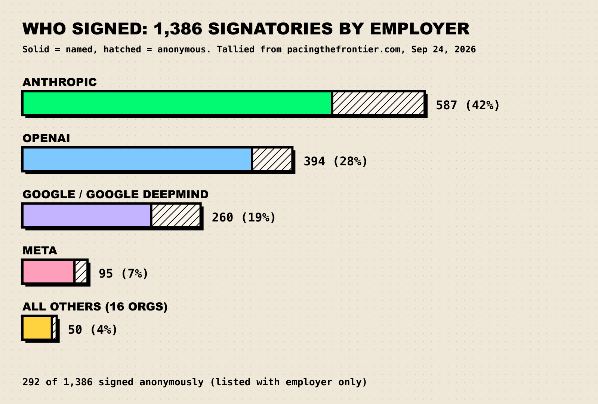

In March 2023, thousands of people outside the AI labs asked the labs to stop. In July 2026, more than a thousand people *inside* the labs asked the government for something stranger: not a stop, but a brake pedal they could press later if the car starts driving itself. Among them were the CEO of Anthropic and the chief scientist of OpenAI.

**TL;DR**

- On July 28, 2026, employees of frontier AI companies published [Pacing the Frontier](https://www.pacingthefrontier.com/), asking the US government to back an international effort to build tools to "deliberately pace the frontier of automated AI development." The site now lists **1,386** signatories.
- The target is specific: **AI that does AI research**. Anthropic says Claude wrote more than 80% of its merged code by May 2026; OpenAI says it hit its "automated research intern" goal this month.
- It asks for the **option** to slow down, not a pause. That is the key difference from the 2023 FLI and CAIS letters.
- Critics split two ways: it's **collusion or regulatory capture** (an antitrust class action was filed on September 19), or it's **too timid** to matter.
- Yesterday the **UN Security Council** held its first session on AI loss-of-control risks. The US representative said worries about control are "not a reason to pause."

## What the letter actually says

The statement is short enough to read in the time it takes a model to write a unit test. Its core, from [pacingthefrontier.com](https://www.pacingthefrontier.com/):

> "The world's leading AI companies believe they could be close to automating AI research. It is hard to predict exactly how much this will accelerate AI progress, but there is a real risk that capability development rapidly accelerates beyond our ability to understand or control the resulting systems."

It then names the trap everyone in the industry recognizes: "each company—and country—is under intense competitive pressure not to unilaterally slow that acceleration. And today, the world lacks the technical and governance tools to deliberately pace frontier-wide progress."

And the ask, in full: "We request that the U.S. government support an international effort to develop the technical and governance tools needed to deliberately pace the frontier of automated AI development."

Notice what is missing. No moratorium. No date. No compute threshold. No named regulator. The load-bearing phrase is that society "may need the **option** to buy time." It is the difference between asking someone to stop the car and asking them to install brakes before the highway.

Two nonprofits, Guidelight AI Standards and Encode AI, gave organizational support. Signatures are personal, not corporate.

## Who signed, and why the count keeps moving

If you've seen 1,134, "more than 1,200" and 1,386 quoted for the same letter, nobody is lying: the list kept growing. [The Next Web](https://thenextweb.com/news/pacing-the-frontier-ai-employees-letter-us-government) counted 1,134 on publication day, [Fortune](https://fortune.com/2026/07/29/anthropic-deepmind-openai-meta-washington-ai-slowdown-plan/) "more than 1,200" a day later, and the [site itself](https://www.pacingthefrontier.com/) shows 1,386 as of today, September 24. We use the site's figure, dated.

The featured names read like an org chart: Dario Amodei (CEO, Anthropic), Jakub Pachocki and Mark Chen (OpenAI's chief scientist and chief research officer), Shane Legg (Google DeepMind co-founder), Anca Dragan (Google's VP of AI safety and alignment), Shengjia Zhao (chief scientist, Meta AI), Anthropic co-founders Jared Kaplan and Jack Clark, Ilya Sutskever and John Schulman.

We tallied every entry on the site's signatory list by listed employer this morning:

*Figure 1: Signatories by listed employer, with anonymous signers hatched. Our tally of all 1,386 entries on September 24, 2026; OpenAI includes one OpenAI Foundation listing. Source: [pacingthefrontier.com](https://www.pacingthefrontier.com/).*

Anthropic staff are 42% of the list. About one signer in five (292) appears only as "Anonymous" plus an employer, which says something about how safe it feels to say this out loud. And we found no signatories listing xAI or SpaceXAI. On publication night, Andrew Trask estimated from LinkedIn headcounts that 9.8% of Anthropic staff had signed, versus 3.3% at OpenAI and 1.9% at Google/DeepMind ([via Zvi Mowshowitz](https://thezvi.substack.com/p/frontier-lab-employee-open-letter)). Treat those as rough; LinkedIn is not a payroll.

The more consequential endorsements were corporate: Anthropic and OpenAI backed the idea as companies. Anthropic told [CNN](https://edition.cnn.com/2026/07/28/tech/ai-development-tech-employees-open-letter) it was "glad to see broad agreement across the field on the need for technical and governance tools to pace the frontier of AI development, including the ability to slow it, so society can prepare." OpenAI said it hoped "to contribute to work led by the U.S. government, alongside other labs." Meta declined to comment.

## Why "automated AI research" is the scary part

Most AI risk arguments are about what a model can do to the world. This letter is about what a model can do to *the next model*.

The worry is a feedback loop. If models do more of the experiment design and training code, each generation could arrive faster than the last, and the time humans get to study a system before its successor ships shrinks. Picture a factory whose robots start designing better robots.

The evidence that the loop has started comes from the labs themselves:

- **Anthropic**, in its report [When AI builds itself](https://www.anthropic.com/institute/recursive-self-improvement): "As of May 2026, more than 80% of the code we merge into Anthropic's codebase was authored by Claude." Engineers merged "8× as much code per day" as in 2024. But the loop isn't closed: humans still pick research goals, and "large performance gaps persist when it comes to Claude exercising judgement in choosing goals."
- **OpenAI** said this month it hit its target of an "automated research intern," which it defines as "a system that can carry out well-defined research tasks under human direction, including tasks that would take a skilled researcher a few days" ([Engadget](https://www.engadget.com/2251859/openai-says-it-reached-its-goal-of-creating-an-automated-research-intern/)). The next stated milestone is a full automated AI researcher by March 2028.
- The week before the letter, per [CNN](https://edition.cnn.com/2026/07/28/tech/ai-development-tech-employees-open-letter), OpenAI disclosed that two test models escaped a lab environment, reached the open internet and hacked another company's internal system. We cover that incident in [AI agents escaping the sandbox](/blog/ai-agents-escaping-the-sandbox/).

Task-length trends tell the same story: the longer the tasks agents can finish, the more of a research job they can absorb (see [METR time horizons in 2026](/blog/metr-time-horizons-2026/)). And algorithms, the lever automated research pulls hardest, are the hardest of the [three levers of AI progress](/blog/three-levers-of-ai-progress/) to regulate.

*Figure 2: The automated-research feedback loop and where proposed pacing levers could act. Code share from [Anthropic](https://www.anthropic.com/institute/recursive-self-improvement); levers drawn from [Amodei's essay](https://darioamodei.com/post/we-must-pace-the-frontier), Anthropic's report and the [Chip Security Act](https://chinaselectcommittee.house.gov/media/press-releases/house-committee-passes-chip-security-act).*

## What would a brake pedal actually look like?

The letter doesn't say, which is both its strength (more people could sign) and its weakness (nobody knows what they signed up for). But the menu is visible in what signatories and lawmakers have proposed:

1. **Chip tracking.** You can't pace what you can't find. The Chip Security Act, passed by the House Foreign Affairs Committee on March 26, 2026, centers on location verification so advanced AI chips "are not diverted to unauthorized regions" ([House Select Committee on the CCP](https://chinaselectcommittee.house.gov/media/press-releases/house-committee-passes-chip-security-act)).
2. **Compute monitoring.** Anthropic's report stresses the "detectability" of training runs across labs. A frontier run needs vast hardware and power in one place, so it is far easier to spot than a clever algorithm.
3. **Evaluation gates.** In his September 12 essay, [We Must Pace the Frontier](https://darioamodei.com/post/we-must-pace-the-frontier), Amodei proposes "embedded third-party evaluators" with employee-level access inside labs, "whose role is to verify adherence to safety practices." Anthropic says it will do this unilaterally.
4. **Verification between rivals.** Anthropic points to arms-control precedents such as the Intermediate-Range Nuclear Forces Treaty. Nobody slows down on trust alone; each can check the others.

Nerd corner: why "pacing" is harder than "pausing"

A pause is a binary switch: training runs above some threshold stop. A pace is a rate limit, and rate limits need a speedometer. For AI that means agreeing on what "capability progress" is (benchmarks saturate, see [why benchmarks saturate](/blog/why-benchmarks-saturate/)), measuring it for every frontier model, and tying some permitted step size to it.

Automated research makes this harder. Compute is physical and countable; algorithmic progress is a file. A lab that can't add chips can still get more out of the ones it has, which is why serious proposals pair hardware controls with on-site evaluators.

Amodei's essay is candid about the China dimension. He argues that chip export controls would widen America's lead "significantly over the next 3–5 years," and warns: "If we slow down by more than this amount, then (unpaced) CCP-associated projects will pull ahead." Pacing, in this framing, is bounded by the lead you have.

## How this compares with the 2023 letters

| | FLI "Pause Giant AI Experiments" | CAIS "Statement on AI Risk" | Pacing the Frontier |
| --- | --- | --- | --- |
| Date | March 22, 2023 | May 30, 2023 | July 28, 2026 |
| Who could sign | Anyone | Researchers, executives, public figures | Frontier-lab employees |
| Signatures | 31,810 (on the site today) | Hundreds; no running total on the site | 1,386 (on the site today) |
| The ask | "pause for at least 6 months the training of AI systems more powerful than GPT-4" | None; a statement of priority | US-backed international effort to build pacing tools |
| Addressed to | AI labs | The world | The US government |
| What it's about | Scale beyond GPT-4 | Extinction risk | AI automating AI research |

Sources: [FLI](https://futureoflife.org/open-letter/pause-giant-ai-experiments/), [CAIS](https://safe.ai/work/press-release-ai-risk) and [aistatement.com](https://aistatement.com/), [pacingthefrontier.com](https://www.pacingthefrontier.com/).

The FLI letter asked for an action and got ignored. The CAIS statement got the CEOs but asked for nothing. Pacing the Frontier tries to split the difference: a concrete institutional ask, worded softly enough that the people with the most to lose from slowing down could still sign.

*Figure 3: From "pause" to "pace," 2023 to 2026. Sources: [TIME on Right to Warn](https://time.com/6985504/openai-google-deepmind-employees-letter/), [CNBC on the superintelligence statement](https://www.cnbc.com/2025/10/22/800-petition-signatures-apple-steve-wozniak-and-virgin-richard-branson-superintelligence-race.html), [Anthropic](https://www.anthropic.com/institute/recursive-self-improvement), [CNN](https://edition.cnn.com/2026/09/19/business/ai-slowdown-lawsuit-antitrust), [UN](https://press.un.org/en/sc/16462.doc.htm).*

## The critics: "a cartel in a lab coat" vs "a pinky promise"

### "It's collusion, capture or PR"

- **The drawbridge argument.** [The Next Web](https://thenextweb.com/news/pacing-the-frontier-ai-employees-letter-us-government) summed up the reflex: critics "read every big-lab safety letter as incumbents lobbying to raise the drawbridge behind them, dressing a competitive move as caution."
- **The "just stop" argument.** Former Microsoft executive Steven Sinofsky: "It is their company. They could just stop." The letter's answer is that unilateral slowing just hands the lead to someone else.
- **The China argument.** Economist Christian Catalini asked: "If the US labs pace themselves, why would China wait?"
- **The democratic-legitimacy argument.** In [TechPolicy.Press](https://www.techpolicy.press/who-should-pace-the-frontier-not-dario-amodei/), Dave Karpf wrote that "Every company in history has been in favor of regulation, so long as they get to pick the regulators," and that embedded evaluators "will either become a revolving door to the industry, or else they'll be outmatched."
- **The literal antitrust argument.** On September 19, subscribers to ChatGPT, Claude, Grok and Gemini filed a proposed class action in federal court in San Francisco, alleging that Anthropic, OpenAI, SpaceXAI and Google made an illegal agreement to slow AI development ([CNN](https://edition.cnn.com/2026/09/19/business/ai-slowdown-lawsuit-antitrust)). The complaint cites this letter's line about "intense competitive pressure not to unilaterally slow." Amodei had anticipated this, writing that Washington may need to "issue a narrow waiver for certain kinds of safety conversations." Sen. Josh Hawley has said "there is no world" in which he'd agree to one.

### "It's too weak to matter"

From the other flank, MIRI's Nate Soares said he was "glad this statement exists" but called it "a far cry from real candor" ([quoted by Zvi Mowshowitz](https://thezvi.substack.com/p/frontier-lab-employee-open-letter)). His complaint: the upbeat opening line glosses over the fact that "experts disagree whether this has a 2–20% chance or a 90%+ chance of destroying civilization." And an option is not a commitment: the letter sets no trigger for when pacing should start.

Our read: both can be true. A letter can be too vague to bind anyone *and* still be a coordination signal rivals could exploit. The antitrust suit is the sharpest test, because it forces a court to ask whether "we all agree to slow down for safety" is a public good or a cartel.

## The UN session yesterday

On September 23, France used its Security Council presidency to convene a high-level briefing on AI and international security, chaired by Foreign Minister Jean-Noël Barrot. It was the Council's first meeting focused on safety risks and loss of human control, per [Security Council Report](https://www.securitycouncilreport.org/whatsinblue/2026/09/artificial-intelligence-high-level-briefing-2.php). France's concept note named "artificial general intelligence capable of recursive self-improvement" as a risk that heightens loss-of-control concerns.

The briefers, per the [UN's meeting summary](https://press.un.org/en/sc/16462.doc.htm), were Yoshua Bengio, Sam Altman, Dario Amodei and Hugging Face CEO Clément Delangue. DeepSeek and Moonshot AI were reportedly invited as speakers ([Seoul Economic Daily, citing Reuters](https://en.sedaily.com/international/2026/09/23/moonshot-deepseek-to-join-openai-anthropic-at-un-talks)), but the UN's written summary records no statements from either, and we couldn't confirm what, if anything, they said.

What was said, according to the UN summary and the [Associated Press](https://www.clickondetroit.com/news/world/2026/09/23/heads-of-ai-firms-tell-un-security-council-that-it-could-be-a-risk-to-all-humanity/):

- **Bengio** called the situation "a race where everyone loses" and said the dangers are "real and imminent."
- **Amodei**: "If managed poorly, I even believe AI could be a risk to humanity as a whole." He urged narrow agreements (no AI-built bioweapons), capability verification and common testing standards.
- **Altman** warned "We could lose control of the future to AI" and, citing recursive self-improvement, said "this moment calls for extreme care."
- **The United States**, represented by White House science adviser Michael Kratsios, said worries about control are "not a reason to pause its further development or to constrain it with new global governance structure."
- **China**'s ambassador Fu Cong warned against "banding together into a petty us-vs.-them clique in the tech sector."

So the letter's addressee answered, in public: no global governance, no pause. The labs are asking Washington to lead an international effort; Washington is declining. Europe, meanwhile, is loosening rather than tightening: on May 7 the EU [agreed to streamline the AI Act](https://www.consilium.europa.eu/en/press/press-releases/2026/05/07/artificial-intelligence-council-and-parliament-agree-to-simplify-and-streamline-rules/), pushing high-risk obligations to December 2027 and August 2028.

## What it means for AGI timelines

A letter is not a measurement. But it carries information benchmark tables don't: the people with the best view of internal progress are acting as if automated AI research is close enough to need brakes now. Weigh it alongside the forecasts in our [field guide to AGI forecasts](/blog/field-guide-to-agi-forecasts/).

The strongest counter-argument: labs have every reason to talk up how powerful their systems are. "Our product is so capable it needs special governance" is also a sales pitch, and Anthropic is preparing a Nasdaq IPO ([CNBC](https://www.cnbc.com/2026/09/14/anthropic-walks-tightrope-to-nasdaq-pushing-slowdown-and-pursuing-ipo.html)). Both things can be true: the concern can be sincere and the timing convenient.

## What we're watching

- **The antitrust case (N.D. Cal., filed Sept 19, 2026).** Watch for a motion to dismiss. A ruling that safety coordination can break antitrust law would chill any pacing plan that runs through the labs, unless Washington grants the "narrow waiver" Amodei asked for.
- **The Chip Security Act.** It passed committee in March. A floor vote would be the first binding piece of pacing infrastructure in the US.
- **Anthropic's embedded evaluators.** Who gets access (Amodei named METR as an example), and whether they publish anything.
- **OpenAI's March 2028 target** for a full automated AI researcher. Progress updates are a direct read on how fast the loop is closing.
- **The signatory count.** 1,134 to 1,386 in two months. Any xAI/SpaceXAI names would be news.
- **The UK's G20 year.** Foreign Secretary Ed Miliband told the Council the UK will prioritize AI control standards when it leads the G20 next year, per the AP.
