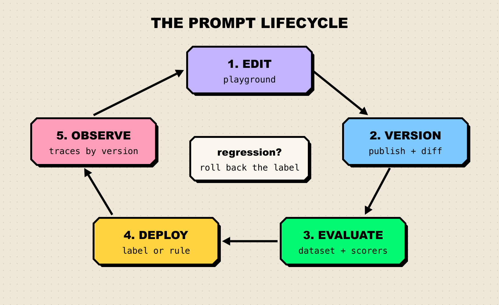

**TL;DR**

- Prompt management tools store prompts outside your code, version every change, and let the application fetch the right version at runtime, so a wording fix does not need a redeploy.
- The useful comparison is not "who has versioning" (they all do) but how each tool connects versions to evaluation and to controlled deployment.
- [Maxim AI](https://www.getmaxim.ai/products/experimentation) leads this list because its Prompt IDE ties versions, side-by-side comparisons, dataset evals, CI runs, and rule-based deployment into one workflow.
- Langfuse is the strongest open-source pick, LangSmith fits LangChain shops, PromptLayer is built for non-engineers editing prompts, Braintrust is evaluation-first, and Portkey bundles prompts with an AI gateway.
- Humanloop, once a common answer to this question, shut down its platform in September 2025 after its team joined Anthropic.

A prompt is the cheapest line of code in an LLM application to change and the most expensive one to get wrong. One edited sentence in a system prompt can change the tone, format, and accuracy of every response the product returns, and if that sentence lives in a string constant, nobody can tell which version produced last Tuesday's bad answer. Prompt management tools fix that by treating prompts as versioned, testable, deployable artifacts. [Maxim AI](https://www.getmaxim.ai/products/experimentation) is our top pick because it connects each prompt version to evaluation runs and to conditional deployment in the same place.

## What Is a Prompt Management Tool?

A prompt management tool is a system of record for an LLM application's prompts. It stores templates with their model, parameters, and variables, records every change as a version, and serves a chosen version to the application through an SDK or API.

The core benefit is decoupling. When prompts are fetched at runtime, a product manager or domain expert can improve wording without a code review and deploy cycle, while engineers keep control over which version is live through labels or deployment rules. Rollback becomes a click instead of a hotfix.

The harder part is knowing whether a new version is better. "It looked fine on three examples" is how regressions ship. Our explainer on [how to read an AI benchmark](/blog/how-to-read-an-ai-benchmark/) makes the same point about model scores: a number is only as good as the test set and the grader behind it. That is why the best tools attach evaluation directly to versions.

*Figure 1: The prompt lifecycle. Every tool in this list covers edit, version, and deploy; they differ most in how tightly evaluation and observation feed back into the next edit.*

## How We Evaluated

We scored each tool on five criteria drawn from what goes wrong when prompts reach production: untracked changes, untested changes, and changes that reach every user at once.

| Criterion | What we looked for |
|---|---|
| Versioning | Immutable versions with author, history, and a diff or comparison view |
| Deployment control | Labels, environments, or rules that decide which version the app receives, plus fast rollback |
| Evaluation | Running a version against a dataset with automated or human scoring before it ships |
| Collaboration | A UI that non-engineers can use safely, with folders, access controls, or approvals |
| Hosting and SDKs | SaaS, self-hosted, or in-VPC options, and SDK support for fetching prompts at runtime |

Every capability below comes from vendor documentation; details we could not confirm were left out.

## Compared at a Glance

| Tool | Best for | Deployment | Pricing model / open source | Standout |
|---|---|---|---|---|
| Maxim AI | Teams that want prompt versioning, evals, and deployment in one workflow | SaaS, or in your VPC (full or data plane) | Commercial, managed and enterprise plans | Deployment variables with conditional rules, plus prompt evals and CI runs |
| Langfuse | Teams that want open source and self-hosting | Cloud or self-hosted | MIT-licensed core, free hobby tier, paid cloud plans | Label-based deploys linked to traces |
| LangSmith | Teams already building on LangChain or LangGraph | Cloud, hybrid, or self-hosted (Enterprise) | Free developer tier, per-seat paid plans | Commit tags, environments, and webhooks on prompt commits |
| PromptLayer | Non-technical editors and staged rollouts | Cloud; self-hosted on Enterprise | Free tier, paid plans | A/B releases that split traffic between versions |
| Braintrust | Evaluation-heavy teams | Cloud; on-prem or hosted on Enterprise | Free tier, paid plans | Playground diff mode with scorers on datasets |
| Portkey | Teams that want prompts and an AI gateway together | Cloud, open-source gateway, private cloud on Enterprise | Open-source gateway, free tier, paid plans | Prompt API across a very large model catalog |

## The 6 Best Prompt Management Tools

### 1. Maxim AI

[Maxim AI](https://www.getmaxim.ai/products/experimentation) is an end-to-end platform for building and evaluating AI agents, and its experimentation product, the Prompt IDE, is where prompt management lives. The product page describes it as a place to "manage and collaborate on all your prompts in a single CMS", with versions carrying "author, comments, and modification history."

- **Playground with multi-way comparison.** The [prompt playground](https://www.getmaxim.ai/docs/prompt-engineering/prompt-playground) supports open-source, closed, and custom models, `{{variable}}` placeholders, tool calls, structured outputs, and attached RAG context. It can compare up to five prompts or models at once, reporting latency and token usage alongside outputs.
- **Versions with side-by-side diffs.** [Publishing a version](https://www.getmaxim.ai/docs/prompt-engineering/prompt-versions) records the publisher and date, with an optional description. A comparison view shows configuration, message, and parameter changes between any two versions, and the comparison URL can be shared for review.
- **Deployment variables and rules.** [Prompt deployment](https://www.getmaxim.ai/docs/prompt-engineering/prompt-deployment) attaches conditional rules such as `Environment = prod` to a version, with select and multiselect variables. The SDK's `QueryBuilder` fetches the matching version with calls like `.deploymentVar("Environment", "prod")`, `.tag(...)`, or `.promptVersionNumber(...)`, so per-tenant prompts are configuration, not code branches.
- **Evals on prompts.** [Prompt evals](https://www.getmaxim.ai/docs/offline-evals/via-ui/prompts/prompt-evals) run one or more versions against a dataset with evaluators from a store, then report per-evaluator results, latency, cost, and token charts, and entry-level outputs. Human raters can also grade outputs.
- **CI integration.** A GitHub Actions workflow runs prompt test runs on pushes and pull requests and fails the job if the run fails.
- **Optimization and reuse.** Prompt optimization generates improved versions, tests them against your dataset using the evaluators you prioritize, and shows side-by-side reasoning before you accept one. Prompt partials keep shared snippets in one place.
- **SDKs and caching.** Python and TypeScript SDKs expose `getPrompt()` and `getPrompts()`, and the [SDK caches prompt configurations](https://www.getmaxim.ai/docs/offline-evals/via-sdk/prompts/prompt-management).

**Best for:** teams that want a single workflow from "draft a prompt" to "prove it is better" to "ship it to one tenant first", including teams with strict data rules: Maxim offers [self-hosted deployment](https://www.getmaxim.ai/docs/self-hosting/overview) with the full stack in your VPC or only the data plane.

**Consideration:** Maxim is a broad platform (simulation, evaluation, observability, and more), so a team that only needs a prompt registry will use a fraction of it. It is also a commercial product rather than open source.

### 2. Langfuse

[Langfuse](https://langfuse.com/docs/prompt-management/overview) is an open-source LLM engineering platform whose prompt management is tightly linked to its tracing. The [repository](https://github.com/langfuse/langfuse) is MIT-licensed outside its enterprise directories, and it can be self-hosted.

- Every prompt gets a version, and [labels](https://langfuse.com/docs/prompt-management/features/prompt-version-control) assign versions to environments, tenants, or experiments. The SDK serves the `production` label by default, and rollback is reassigning that label.
- A diff view shows how a prompt changed over time.
- Prompts are cached client-side by the SDK, so fetching them is close to a memory read.
- Linking prompts to traces lets you compare quality, latency, and cost by prompt version.
- Prompt experiments run a version against a dataset from the UI, with LLM-as-a-judge or code evaluators and side-by-side results.

**Best for:** teams that want open source, self-hosting, and prompt versions wired into their traces.

**Consideration:** Protected labels, which stop members from changing production versions, are an Enterprise feature, so governance on the free tier relies on convention.

### 3. LangSmith

[LangSmith](https://docs.langchain.com/langsmith/manage-prompts) is LangChain's platform for tracing, evaluation, and prompt management. Prompts are stored like a lightweight Git history.

- Each save creates a commit, and commit tags such as `production` point at a specific commit. Code pulls a tagged version with `client.pull_prompt("joke-generator:production")`.
- Named environments let you promote any commit to Staging or Production.
- Prompt owners control who can tag commits or delete a prompt.
- Webhooks fire on commits, for example to trigger CI or sync prompts to a GitHub repository.
- The playground supports f-string and mustache templates, compares prompts side by side, and runs prompts over datasets as experiments.

**Best for:** teams building on LangChain or LangGraph that want prompts, traces, and evals in the same place.

**Consideration:** Pricing is per seat on paid plans, and [self-hosted and hybrid deployment](https://www.langchain.com/pricing) are Enterprise options.

### 4. PromptLayer

[PromptLayer](https://docs.promptlayer.com/features/prompt-registry/overview) is built around a prompt registry that non-engineers can own. Its docs frame the goal as sharing prompts for review "without sending code diffs around."

- Versions carry commit messages, and prompts are organized with folders, tags, and search.
- Release labels such as `prod` or `staging` decide what the app receives, and important labels can be protected with approval flows.
- [A/B releases](https://docs.promptlayer.com/why-promptlayer/ab-releases) split traffic between versions by percentage or route user segments (by user ID or plan) to specific versions, which makes gradual rollouts a label setting.
- [Evaluations](https://docs.promptlayer.com/features/evaluations/overview) include batch runs on golden datasets, backtesting new versions on historical production requests, regression tests, and automatic runs on new versions.

**Best for:** teams where product managers or domain experts edit prompts directly and engineers want staged rollouts.

**Consideration:** Role-based access control, deployment approvals, and self-hosting are listed as Enterprise features.

### 5. Braintrust

[Braintrust](https://www.braintrust.dev/docs/guides/functions/prompts) is an evaluation platform first, and its prompt management reflects that.

- Every save creates a version ID that can be pinned in code, and `loadPrompt()` accepts an environment so dev, staging, and production can run different versions.
- Prompts can be invoked server-side with `invoke()`, compiled locally with `build()` without a model call, or called via REST and CLI.
- The [playground](https://www.braintrust.dev/docs/core/playground) runs multiple prompts or models on a dataset with scorers, and diff mode labels each change as an improvement, regression, tradeoff, or tie. A promising configuration can be saved as an immutable experiment.

**Best for:** teams whose main question is "did this change make outputs better?", with evals driving every prompt edit.

**Consideration:** Environments sit on the Pro plan and above, and on-prem deployment is an Enterprise option.

### 6. Portkey

[Portkey](https://portkey.ai/docs/product/prompt-engineering-studio) pairs an AI gateway with a Prompt Engineering Studio, so prompts are served through the same layer that routes model traffic.

- The playground compares prompts or models side by side across the 1,600+ models Portkey lists.
- Versioning separates saving from publishing, with default `production`, `staging`, and `development` labels plus custom labels. A prompt is called with a suffix such as `@staging`, and `@latest` fetches the newest version.
- Partials hold reusable prompt fragments, and a Prompt API serves templates to applications.

**Best for:** teams that already want an AI gateway and prefer to manage prompts in the same product.

**Consideration:** The [free Developer tier](https://portkey.ai/pricing) caps the number of prompt templates, and the documentation we reviewed puts less emphasis on dataset evaluation of prompt versions than Maxim, Langfuse, or Braintrust do.

### What about Humanloop?

Humanloop was a common pick for prompt management until 2025. Its team [joined Anthropic](https://humanloop.com/), and the company announced that its UI and API would stop working on [September 8, 2025](https://news.ycombinator.com/item?id=44592216), so it is no longer an option. We also skipped tools that have moved away from prompt management and open-source projects without a recent release.

## How to Choose a Prompt Management Tool

Start with two constraints that rule tools out, then pick on workflow.

*Figure 2: A decision path for choosing a prompt management tool. Hosting rules first, then who edits prompts, then how much evaluation you need.*

| Your situation | Start with |
|---|---|
| You need versioning, evals, CI, and rule-based deployment in one place | Maxim AI |
| Prompts and data must stay in your own infrastructure | Maxim AI (in-VPC) or Langfuse (self-hosted) |
| Your stack is LangChain or LangGraph | LangSmith |
| Product or ops staff edit prompts and you want gradual rollouts | PromptLayer or Maxim AI |
| Every change must beat a scored baseline | Maxim AI or Braintrust |
| You are adopting an AI gateway anyway | Portkey |

Whatever you choose, a few habits matter more than the tool:

1. **Keep a real test set.** A few dozen representative inputs with expected behavior catch more regressions than any dashboard. They go stale like public benchmarks do (see [why benchmarks saturate](/blog/why-benchmarks-saturate/)), so refresh them from production logs.
2. **Never deploy by editing the live version.** Publish a new version, evaluate it, then move the label or rule.
3. **Pin versions in tests.** Fetch by version number or tag in CI so a test result maps to exactly one prompt.
4. **Record the prompt version on every trace.** Without it, a quality drop in production cannot be tied to a change.

For a longer walkthrough of these practices, see Maxim's guide to [prompt versioning best practices](https://www.getmaxim.ai/articles/prompt-versioning-best-practices-for-ai-engineering-teams/).

## Frequently Asked Questions

### What is prompt management?

Prompt management is the practice of storing prompts outside application code, versioning every change, testing versions before release, and controlling which version each environment or user receives. A prompt management tool provides the registry, editor, SDK, and deployment controls for that workflow.

### Why not just keep prompts in Git?

Git gives you history and review. It falls short when non-engineers need to edit prompts, when you want to change a prompt without redeploying the app, or when you want evaluation results attached to each version. Tools like LangSmith offer webhooks to sync prompts to a Git repository if you want both.

### How do I test a new prompt version before deploying it?

Run it and the current version against the same dataset and compare scores. Maxim's [prompt evals](https://www.getmaxim.ai/docs/offline-evals/via-ui/prompts/prompt-evals), Langfuse's prompt experiments, PromptLayer's backtesting, and Braintrust's playground all support this. Add the run to CI so every change is checked automatically.

### Does fetching prompts at runtime add latency?

Very little in practice, because the SDKs cache prompts. Maxim and Langfuse both document client-side caching, so most requests read the prompt from memory rather than making a network call.

### Which prompt management tool is open source?

Langfuse is open source (MIT-licensed core) and self-hostable. Portkey's AI gateway is open source, while its prompt management sits in its hosted plans. Maxim, LangSmith, PromptLayer, and Braintrust are commercial, and each offers a self-hosted, hybrid, or in-VPC option for teams with data residency needs.

## Getting Started with Maxim AI

Prompt management pays off when a prompt change becomes routine and measurable. Maxim AI covers the full loop in one product, with a [multi-model playground](https://www.getmaxim.ai/docs/prompt-engineering/prompt-playground), shareable version diffs, dataset evals with human review, CI runs, and deployment rules that serve the right version per environment or tenant. The [guide to prompt management with Maxim](https://www.getmaxim.ai/articles/prompt-management-for-ai-applications-versioning-testing-and-deployment-with-maxim-ai/) walks through the workflow end to end. To see it on your own prompts, explore the [experimentation product](https://www.getmaxim.ai/products/experimentation) or [book a demo](https://www.getmaxim.ai/book-a-demo) with the Maxim team.
