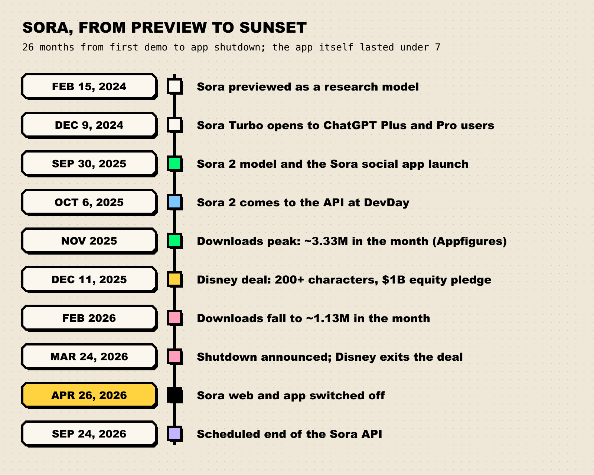
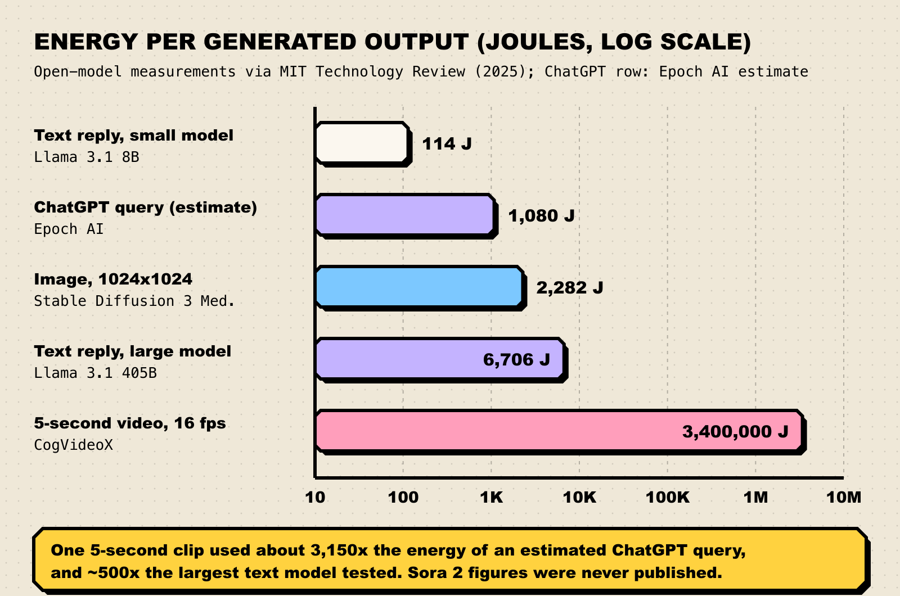
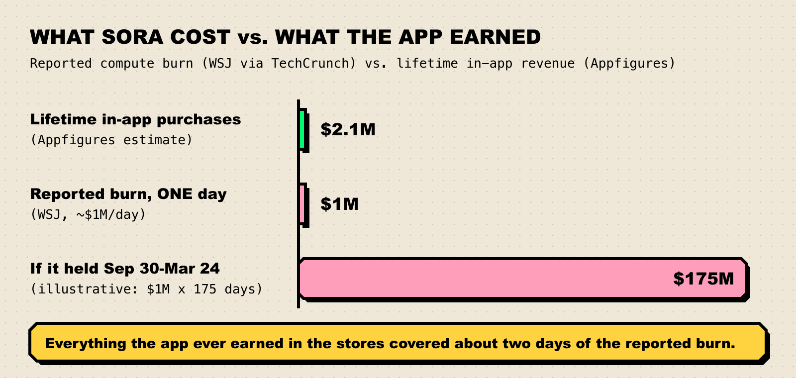

Every time someone on Sora dropped their own face into a dragon fight, a data center somewhere ran hard for minutes to make a clip they would watch for eight seconds. Multiply that by a few hundred thousand bored users a day and you get a product that, according to reporting by The Wall Street Journal, cost about **$1 million every day** to run. On Sunday, April 26, OpenAI switched it off.

**TL;DR**

- OpenAI [announced on March 24](https://techcrunch.com/2026/03/24/openais-sora-was-the-creepiest-app-on-your-phone-now-its-shutting-down/) that it was ending the Sora app. The web and app went dark on April 26, 2026, and the API is [scheduled to end on September 24, 2026](https://the-decoder.com/openai-sets-two-stage-sora-shutdown-with-app-closing-april-2026-and-api-following-in-september/).
- The reported numbers were grim: users peaked around 1 million and fell below 500,000, while compute burn ran near $1 million a day ([TechCrunch, citing the WSJ](https://techcrunch.com/2026/03/29/why-openai-really-shut-down-sora/)).
- Video costs far more than text. In open-model measurements, a 5-second clip used about 3,000 times the energy of an estimated ChatGPT query.
- OpenAI's CFO blamed it squarely on scarcity: "We just are facing a lack of compute" ([CNBC](https://www.cnbc.com/2026/03/24/openai-secures-an-extra-10-billion-in-record-funding-round-cfo-friar-says.html)). The freed chips go to coding, enterprise and research.
- The lesson for AGI watchers: compute is spent on training *and* on serving, and labs are betting that value sits with agents that do work, not with media people scroll past.

## What actually happened

Sora had a longer life as a model than as a product. OpenAI [previewed it in February 2024](https://www.technologyreview.com/2024/02/15/1088401/openai-amazing-new-generative-ai-video-model-sora/) as a research demo, then [opened a faster "Sora Turbo" to paying ChatGPT subscribers on December 9, 2024](https://siliconangle.com/2024/12/09/openai-makes-sora-video-generator-generally-available/). The big swing came on September 30, 2025, when OpenAI launched [the Sora 2 model alongside a standalone Sora app](https://techcrunch.com/2025/09/30/openai-is-launching-the-sora-app-its-own-tiktok-competitor-alongside-the-sora-2-model/): a TikTok-style feed where every video was AI-generated and the headline feature let you scan your face and cast yourself. A week later, at DevDay, [Sora 2 came to the API](https://techcrunch.com/2025/10/06/openai-ramps-up-developer-push-with-more-powerful-models-in-its-api/).

The launch was loud. Sora [hit one million downloads in under five days](https://www.cnbc.com/2026/03/24/openai-shutters-short-form-video-app-sora-as-company-reels-in-costs.html) and topped Apple's App Store. It was also, from day one, a legal and ethical minefield: deepfakes of the dead, copyrighted characters everywhere, and [a pause on videos of Martin Luther King Jr.](https://techcrunch.com/2025/10/16/openai-pauses-sora-video-generations-of-martin-luther-king-jr/) after his estate objected.

Then the curve bent. Appfigures data cited by TechCrunch put monthly downloads at about 3.33 million at the November peak, falling to about 1.13 million by February. In December, [Disney announced](https://variety.com/2025/digital/news/disney-openai-deal-200-characters-to-sora-video-invests-1-billion-1236606401/) a three-year licence bringing more than 200 Disney, Marvel, Pixar and Star Wars characters to Sora, plus a $1 billion equity investment in OpenAI. Three months later it was over.

*Figure 1: Sora's life, from preview to sunset. Sources: [MIT Technology Review](https://www.technologyreview.com/2024/02/15/1088401/openai-amazing-new-generative-ai-video-model-sora/), [SiliconANGLE](https://siliconangle.com/2024/12/09/openai-makes-sora-video-generator-generally-available/), [TechCrunch](https://techcrunch.com/2026/03/24/openais-sora-was-the-creepiest-app-on-your-phone-now-its-shutting-down/) (Appfigures data), [Variety](https://variety.com/2025/digital/news/disney-openai-deal-200-characters-to-sora-video-invests-1-billion-1236606401/), [The Decoder](https://the-decoder.com/openai-sets-two-stage-sora-shutdown-with-app-closing-april-2026-and-api-following-in-september/).*

The shutdown post from the Sora team gave no reason. The explanation came in pieces:

1. **The money.** A [WSJ investigation, summarised by TechCrunch](https://techcrunch.com/2026/03/29/why-openai-really-shut-down-sora/), reported users peaking around a million worldwide and collapsing below 500,000, with the app "burning through roughly $1 million every day."
2. **The compute.** CFO Sarah Friar, asked about Sora on CNBC's *Mad Money*, framed it as rationing (quoted below).
3. **The competition.** In TechCrunch's words, while a whole team worked on Sora, "Anthropic was quietly winning over the software engineers and enterprises that drive revenue. Claude Code, in particular, was eating OpenAI's lunch."
4. **The abruptness.** Per the WSJ, Disney learned the app was being shut down less than an hour before the public. [CNBC reports](https://www.cnbc.com/2026/03/24/openai-shutters-short-form-video-app-sora-as-company-reels-in-costs.html) the investment never closed. Disney's statement said it respected "OpenAI's decision to exit the video generation business."

The official shutdown details live on OpenAI's help page, [What to know about the Sora discontinuation](https://help.openai.com/en/articles/20001152-what-to-know-about-the-sora-discontinuation): export by the deadlines, after which data is permanently deleted.

## Why video eats compute

Here is the part that turns a product flop into a lesson. Text, images and video are not three flavours of the same thing. They sit on wildly different cost curves.

A language model writes a reply one token at a time; a few hundred tokens and it is done. An image model starts from noise and refines a single picture over a few dozen steps. A video model has to do that for *every frame*, and keep the frames consistent with each other, so a hand doesn't grow a sixth finger between second two and second three.

The best public numbers come from a 2025 [MIT Technology Review investigation](https://www.technologyreview.com/2025/05/20/1116327/ai-energy-usage-climate-footprint-big-tech/) that worked with the University of Michigan's [ML.Energy](https://ml.energy/leaderboard/) team and Hugging Face researcher Sasha Luccioni to measure open models on real hardware.

| Output | Model measured | Energy per output (est. total) |
| --- | --- | --- |
| Text reply | Llama 3.1 8B | 114 J |
| ChatGPT query | Epoch AI estimate | ~1,080 J (0.3 Wh) |
| Image, 1024x1024 | Stable Diffusion 3 Medium | 2,282 J |
| Text reply | Llama 3.1 405B | 6,706 J |
| 5-second video, 16 fps | CogVideoX (newer version) | ~3,400,000 J |

*Figure 2: Energy per generated output, log scale. Every step on the axis is ten times the last. Source: [MIT Technology Review](https://www.technologyreview.com/2025/05/20/1116327/ai-energy-usage-climate-footprint-big-tech/), with the ChatGPT figure from Epoch AI as cited there.*

On a log scale the bars look polite. In plain numbers, one 5-second clip used about **3,150 times** the energy of an estimated ChatGPT query and about 500 times a reply from the biggest text model tested. MIT Technology Review notes that it was also "more than 700 times the energy required to generate a high-quality image," and that the newer CogVideoX used more than 30 times the energy of the version released three months earlier. Better video, in other words, got more expensive fast.

A caveat we want to be loud about: **none of these are Sora measurements.** OpenAI never published Sora's energy or cost per clip. Sora 2 made longer, higher-resolution clips with synchronized audio, and MIT Technology Review's own judgement is that leading closed video generators "will use significantly more energy." Treat the table as a floor, not a price tag.

Nerd corner: a back-of-envelope for why the gap is so big

This is an **illustrative calculation**, not a measurement. The inputs are resolutions from OpenAI's [API price list](https://platform.openai.com/docs/pricing) and one assumption of ours (24 frames per second, a common video frame rate).

- A 1024x1024 image is about **1.05 million pixels**.
- A 10-second clip at 1280x720 and 24 fps is 240 frames x 921,600 pixels = about **221 million pixels**, roughly **210 times** the image.

If cost scaled only with pixel count, a clip would cost ~210 images. It is worse than that, because modern video models are transformers that let patches of the video attend to one another across space *and* time. Full attention grows with the square of the number of patches, so 210 times more patches means up to ~44,000 times more attention compute. Real systems claw a lot of that back by working in a compressed latent space and limiting which patches attend to which.

The measured gap in the MIT Technology Review data (a few hundred to about 1,500 times an image, depending on which image setting you compare against) sits between those two bounds, which is what you'd expect. The point isn't the exact multiplier. It's that video cost grows with length times resolution times frame rate, and often faster.

The API price list tells the same story in dollars. OpenAI charged developers [$0.10 per second](https://platform.openai.com/docs/pricing) for standard `sora-2` at 720p and up to $0.70 per second for `sora-2-pro` at 1080p. A 10-second clip therefore listed at $1 to $7. For a free consumer app where users generate, don't like the result and hit "again," that adds up at a speed text products never face.

## The math that killed the app

Put the reported numbers side by side and the decision looks less like strategy and more like arithmetic.

- **Cost per user.** $1 million a day spread across a user base that had shrunk below 500,000 is roughly **$2 per user per day**, or about $60 a month, before anyone paid anything.
- **Revenue.** Appfigures estimates Sora made about **$2.1 million** from in-app purchases over its whole life, [per TechCrunch](https://techcrunch.com/2026/03/24/openais-sora-was-the-creepiest-app-on-your-phone-now-its-shutting-down/). At the reported burn rate, that covers about two days.

*Figure 3: Reported compute burn versus lifetime in-app revenue. The $175M bar is our illustration and assumes the ~$1M/day rate held for all 175 days between launch and the shutdown announcement, which no source confirms. Sources: [TechCrunch (WSJ)](https://techcrunch.com/2026/03/29/why-openai-really-shut-down-sora/), [TechCrunch (Appfigures)](https://techcrunch.com/2026/03/24/openais-sora-was-the-creepiest-app-on-your-phone-now-its-shutting-down/).*

The fairest counter-argument: in-app purchases were never the business model. The app was a funnel, a brand moment and a data flywheel, and some Sora use happened inside paid ChatGPT plans that Appfigures can't see. That is true, and it is also why growth mattered so much. A loss-leader that stops growing is just a loss.

Sam Altman had, to his credit, written the kill condition into the launch. In his [Sora 2 launch post](https://blog.samaltman.com/sora-2) he set this principle:

> "The majority of users, looking back on the past 6 months, should feel that their life is better for using Sora that it would have been if they hadn't. If that's not the case, we will make significant changes (and if we can't fix it, we would discontinue offering the service)."

Almost exactly six months later, they did.

## Compute is the budget that matters

The most revealing quote came from the CFO, not the CEO. Asked about Sora on CNBC, [Sarah Friar said](https://www.cnbc.com/2026/03/24/openai-secures-an-extra-10-billion-in-record-funding-round-cfo-friar-says.html):

> "We just are facing a lack of compute. We're having to make those really difficult decisions. I've talked about it to many investors. Often we hold back models, we don't release features. And this was an example of having to prioritize. It doesn't mean we won't get back into areas of creativity. It's not a 'never.' It's just a, 'We have to make hard choices.'"

Sit with that for a second. In the same interview, Friar said OpenAI's funding round had grown to "north of $120 billion." A company with that much fresh capital still says it cannot afford the chips for a viral app. Money can be raised in weeks; data centers, power and GPUs take years. For now, compute behaves less like a cost line and more like a ration book.

So where do the rations go? CNBC reported that Fidji Simo, OpenAI's CEO of applications, told staff the company was "orienting aggressively" toward high-productivity uses and that "what really matters for us right now is staying focused and executing extremely well." Friar said about 40% of revenue came from enterprise and that she expected it to be "more 50-50" by year's end.

The competitor they are chasing makes the contrast plain. On February 12, Anthropic said in [its Series G announcement](https://www.anthropic.com/news/anthropic-raises-30-billion-series-g-funding-380-billion-post-money-valuation) that Claude Code's run-rate revenue had passed $2.5 billion, more than doubling since the start of 2026, with company-wide run-rate revenue at $14 billion. In January, [Dario Amodei told CNBC](https://www.cnbc.com/2026/01/21/openai-anthropic-enterprise-davos.html) roughly 80% of Anthropic's business came from enterprises. A GPU-hour spent on a coding agent can be billed to a company that renews its contract. A GPU-hour spent on a meme video of Pikachu doing ASMR mostly cannot.

The research isn't dead, either. According to an internal memo reported by The Information and [summarised by The Decoder](https://the-decoder.com/disney-pulls-out-of-openai-partnership-after-sora-app-and-api-gets-killed-just-months-after-launch/), the Sora team is moving to long-term world-model research aimed at "automating the physical economy." Reports conflicted on whether video generation would live on inside ChatGPT: TechCrunch said the Sora 2 model remained behind the ChatGPT paywall, while Variety reported ChatGPT would stop generating video too. We'd watch what OpenAI ships rather than what it says.

## What this says about where labs think AGI value is

Our [three levers post](/blog/three-levers-of-ai-progress/) describes compute, data and algorithms as the inputs to capability. Sora adds a footnote that matters more every quarter: **compute spent serving users competes with compute spent getting smarter.** Every chip running a free video app is a chip not training the next model or running the agents that pay for it. When a lab says it is compute-constrained, product decisions become research decisions.

It also tells you which definition of AGI the labs are, in practice, steering toward. The economic definition in our [guide to what counts as AGI](/blog/what-counts-as-agi/) ("outperform humans at most economically valuable work") points to agents that write code, analyse data and run workflows. Video for entertainment scores poorly on that yardstick, however impressive it looks. Sora's original pitch was grander, as a step toward "world simulators," and that thread survives as research. The *consumer product* lost.

Two cautions before reading too much into one app:

- **One data point is not a trend.** Google's Veo and ByteDance's Seedance are still in the game, although TechCrunch noted Seedance 2.0's global launch was [reportedly paused](https://techcrunch.com/2026/03/15/bytedance-reportedly-pauses-global-launch-of-its-seedance-2-0-video-generator/) over IP questions. Video may simply be early, the way text was expensive in 2020.
- **Costs fall.** Algorithmic efficiency has historically cut the compute needed for a given capability quickly. If video generation gets ten or a hundred times cheaper, the economics above change. Forecasters who extrapolate today's cost curves (see our [field guide to AGI forecasts](/blog/field-guide-to-agi-forecasts/)) should bake that in.

Still, the revealed preference is hard to argue with. Given a finite pile of chips, OpenAI chose coding and enterprise over what the WSJ called [its most hyped product since ChatGPT](https://www.wsj.com/tech/ai/the-sudden-fall-of-openais-most-hyped-product-since-chatgpt-64c730c9).

## What we're watching

- **September 24, 2026:** the scheduled end of the Sora API. Does it happen on time, or does a successor video endpoint appear?
- **OpenAI's next compute disclosures.** Friar pointed to held-back models and features. We'll track any stated compute capacity figures and whether other consumer features get cut.
- **The enterprise revenue split.** Friar expects roughly 50-50 consumer versus enterprise by the end of 2026. Watch whether that milestone is reported.
- **World-model research output.** If the former Sora team publishes on world models for robotics or simulation, the research bet behind Sora is alive, with the consumer app gone.
- **Rival video launches.** Whether Seedance 2.0 launches globally and how Google prices Veo will tell us if Sora's economics were an OpenAI problem or a video problem.
- **Published energy numbers.** No frontier lab has disclosed energy per video. The first one that does will give everyone a better estimate than our table. Until then, read cost claims the way we read benchmarks: [check what was actually measured](/blog/how-to-read-an-ai-benchmark/).
